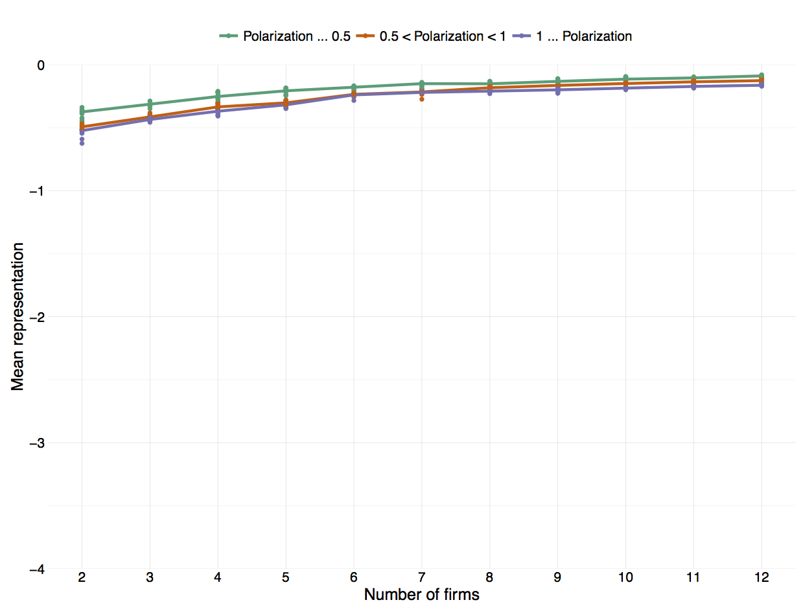

## A.1 Model overview

The following subsection contains an overview of the various models. In addition arguments for the underlying process of a *run* is provided. We abbreviate time-homogenous Markov chain as THMC

* **All-sticker:** The underlying process is a non-ergodic deterministic THMC. The firms never move so the initial state space distribution, $\pi_0$, is stationary and solves $\pi_{t+1} = \pi_t$. The process is fixed in a single state, which depends the initial position of the firm, thus the process is non-ergodic.
* **All-aggregator:** The underlying process is a non-ergodic deterministic THMC. The process does not contain a random component, since firms always locating at the centroid of their current market. When all firms use the *aggregator*-rule then a *repetition* is an implementation of the Lloyd-algorithm, which always leads to a *centroidal Voronoi tessellation* (CVT). Thus the process converges to a single state. There is no guarantee that the CVT is unique, a different initial position of the firms might result in a different CVT, which implies that the process is non-ergodic.
* **All-hunter:** The underlying process is a ergodic stochastic THMC. Whenever a *hunter* firm experiences a decrease in its market share, the firm turns around and heads in a randomly drawn opposite direction. This random component, makes the underlying process ergodic. With a random component every state in the state space has strictly positive probability of being reached in a finite number of iterations. Thus the process, figuratively speaking, avoids getting stuck in a blind alley. Eventually the process will converge to its unique distribution vector, $\pi_\infty$. In the model with a symmetric distribution of consumers the *time average* provides a representative estimate of $\psi$, i.e. for all output variables the R-hat statistic is below 1.05. The model with an asymmetric and bimodal distribution of consumers contains two additional free parameters. In this model we find that several R-hat statistics that are above 1.05 — even when executing the test repetitions with 20.000 iterations. For this model we conclude that the *time average* does not provides a representative estimate of $\psi$, and we instead use the *ensemble average*. 
* **All-maxcov:**  The underlying process is a non-ergodic deterministic THMC. The process does not contain a random component, since firms always locating at the centroid of the largest Delaunay triangle. Unlike the other deterministic THMC, this process does not converge to a single state, since firms often oscillate between different locations. Furthermore we observe that different initial locations of firms converge to different locations (or converge to different oscillation patterns, i.e. different sets of locations). So the process is non-ergodic, i.e. the stationary state space distribution, $\pi_\infty$ depends on the initial state space distribution, $\pi_0$. The paper assumes that firms oscillate between a few locations that are not too far apart. It also assumes different initial position only lead to minor differences in the location which firms converge to. With these assumptions in mind we use the *ensemble average* to estimate $\psi$ (see discussion in subsection _[##]_).
* **All-maxcovrnd:** The underlying process is a ergodic stochastic THMC. The process contains a random component, since the speed parameter is randomly drawn. Instead of the firm moving 0.1 standard deviations, the move is drawn uniformly random from the range [0,0.2]. This insures that every state in the state space has strictly positive probability of being reached in a finite number of iterations. The process will eventually converge to the unique distribution vector, $\pi_\infty$. Every *stochastic THMC* with a finite state space is *ergodic* (Laver and Sergenti, 2011, chapter 4, p. 64). We estimate $\psi$ using the *ensemble average*, and compare the results with the *all-maxcov* model to see if our assumption in that model regarding oscillation and the steady state distributions are reasonable.
* **Maxcov-inductor:** The underlying process does not fulfil the Markov property. The *trending bits* and *oscillation bits* calculate respectively the moving average and the autocorrelation using the location history of the firm. And so the probability of the future state will depend on past states, and only the current state, which violates the Markov property. Furthermore since the firm updates the accuracy of it hypotheses the transition probability is not stationary. The transition probability depends on the experience of the firm, and since the experience evolves so will the transition probabilities. Even without the *trending bits* and *oscillation bits* the underlying process would not constitute a THMC. While it has not yet been proven if the *ensemble average* provides a representative estimate of $\psi$, this is none the less the method used in previous papers, and will therefore all be the method employed in this paper.
* **Maxcov-inductor-GA:** The underlying process does not fulfil the Markov property either. The reason is the same as in the *maxcov-inductor* model. The genetic algorithm which the firm uses to construct new hypotheses with random mutation and crossover, means that there is a random competent in the underlying process.

## A.2 Extension of *maxcov* decision rule with random component

To test our assumptions and see if it is reasonable to use the *ensemble average* to estimate $\psi$ in the *maxcov* model we create a new decision rule *maxcovrnd*. Firms using the *maxcovrnd* decision rule will not move 0.1 standard deviations, but uniformly random draw the speed parameter from the range [0, 0.2]. On average the two decision rules have the same speed parameter. By randomly drawing the speed parameter we introduce a random component into the process. In the model where all firms use the *maxcovrnd* rule, the random component in the process, insures that the *ensemble average* provides a representative estimate of $\psi$. We execute both models and estimate using the *ensemble average*. If the two models provide similar estimates, then firms only oscillate between a few similar locations in the *maxcov* model, and different initial position only leads to slightly differences in the locations which firms converge to. If this is the case we conclude that our assumptions are reasonable, and we feel confident using the *ensemble average* in the *maxcov* model. Figures _[##]_ and _[##]_ plots the estimates from the models with respective a symmetric unimodal distribution and an asymmetric bimodal distribution of consumers. The difference between the *maxcov* and *maxcovrnd* model is minuscule.

![Estimates from market with asymmetric and bimodal distribution of consumers ($\mu \in [0,1.5]$ and $n_l/n_r \in [1,2]$). Solid lines is *maxcov* model and the dashed line is the *maxcovrnd* model. a) Mean eccentricity. b) Effective number of firms. c) Mean representation.](Graphics/temp_maxcovrnd_asym.png)

## A.3 Further details on condition/forecast rules and genetic algorithm

This subsection provides further details —  such as equations, parameter values and probability values — used in relation to the *condition/forecast* rules and the genetic algorithm.

Each firm holds a set of $M$ hypotheses or *condition/forecast* rules. While each hypothesis might only be relevant to a narrow set of situations, together the array of hypotheses cover a wide range of different situations. We follow Arthur (2014, chapter 3) and set the number of hypotheses to one hundred, i.e. $M=100$.

**Accuracy:**
The firm predicts the future location using the hypothesis it finds most probable given the current state of the competing firm. If the condition part of the rule is satisfied by the current state descriptor, $J_j$, of competing firm $j$, then that rule is said to be active. Several *condition/forecast* rules may match the current state of competing firm $j$ and the firm uses the same set of $M$ *condition/forecast* rules for all competing firms, so in any given iteration multiple *condition/forecast* rules are likely to be active. The accuracy of all the active condition/forecast rules is updated once the firms relocate and the actual location of each competing firm is revealed. The forecast error of each active rule is the difference between its predicted location and the actual location. To update the accuracy of *condition/forecast* rules we use an inverse moving average of squared forecast errors (Arthur, 2014, chapter 3). We update the forecast error variance of a given active *condition/forecast* rule $m$ at iteration $t$ using:

$$e^2_{t,i,m} = \alpha_a e^2_{t-1,i,m} + (1-\alpha_a) d\left( X_{t+1,j}, E_{t,i,m} [X_{t+1,j}] \right)^2$$

where firm $i$ uses rule $m$ to make the forecast $E_{t,i,m} [X_{t+1,j}]$ about the future location of competing firm $j$. The actual future location of competing firm $j$ is $X_{t+1,j}$. The forecast error, $d(\cdot,\cdot)$, is the Euclidean distance between the actual and the predicted location. We assume that all firms use the same memory parameter $\alpha_a$ to update the accuracy. If the *condition/forecast* rule $m$ is not active at iteration $t$, then the forecast error variance is unchanged: 

$$e^2_{t,i,m} = e^2_{t-1,i,m}$$

We choose to smooth out the accuracy and therefore set a high memory parameter; $\alpha_a = 74/75$. Thus new information has a relatively low impact on the accuracy of the *condition/forecast* rule, and we avoid that one bad prediction suspends the future use of the rule.

### Genetic algorithm

Every $\tau$ number of iterations the firm discards the 20% least fit *condition/forecast* rules and replaces these with new *condition/forecast* rules created using a genetic algorithm through a process of mutation and crossover of the non-discarded rules. We set choose a quick exploration rate and set $\tau = 50$.

**Fitness:**
The fitness of each *condition/forecast* rules is based on the accuracy and the specificity of the rule. The specificity of a rule is calculated as the number of ones and zeros in the condition part of the rule (i.e. all the #’s are not counted). We calculate the fitness of rule $m$ at iteration $t$ using:

$$f_{t,i,m} = M - e^2_{t,i,m} - c s_m$$

where firm $i$ hold rules $m$. The total number of *condition/forecast* rules held by firm $i$ is $M$. This is constant and identical across firms, so the term can be left out. The forecast error variance of rule $m$ is $e^2_{t,i,m}$. The specificity of rule $m$ is $s_m$, and $c$ is the cost levied on the specificity. Inaccurate rules have a higher forecast error variance which reduces the fitness of the rule. A more specific rule also reduces the fitness of the rule. Thus accounting for the specificity of the rule creates a drift towards more generally applicable rules that fit a wider range of situations (i.e. rules with more #’s in the condition). The condition consists of 13 positions and the average forecast error is below 0.1 so we set the cost of specificity to $c = 0.0005$ creating a slight drift towards more general rules.

**Crossover:**
Each new hypothesis is based on two “parent” hypotheses. The pair of parent *condition/forecast* rules are randomly selection from the set of non-discarded rules, i.e. the 80% most fit *condition/forecast* rules. A new *condition/forecast* rule is created by either the mutation procedure or crossover procedure. For each new rule the procedure is randomly selected. The crossover procedure is selected with probability $p$, and mutation procedure with probability $1-p$. This paper follows Arthur (2014, chapter 3) by using $p = 0.3$. With crossover the new *condition/forecast* rule is a mix of both parents. The condition part is mixed by randomly selecting a donor parent for each of the 13 positions. Crossover of the forecast parameter values happens by either 1) component-wise crossover of each value, 2) using the weighted average of the parents or 3) randomly picking a parent that passes on all parameter values. The three methods are randomly selected with equal probability.

**Mutation:**
With mutation the new hypothesis only inherits traits from the most fit of the two parents. Each position in the condition part is mutated with probability 0.03 and takes the value of the most fit parent with probability 0.97. The position is mutated by flipping its value. The probability that a `0` or a `1` is flipped to a `#` is 2/3. The probability that `0` is flipped to `1`, or visa versa, is 1/3. The probability that a `#` is flipped to a `1` or `0` is 1/3 respectively, where the remaining 1/3 is the probability that `#` is not flipped. These flip-probabilities can also be written as a matrix:

$$P = \left[ {\begin{array}{*{20}{c}} 0&{\frac{1}{3}}&{\frac{2}{3}} \\ {\frac{1}{3}}&0&{\frac{2}{3}} \\ {\frac{1}{3}}&{\frac{1}{3}}&{\frac{1}{3}} \end{array}} \right]$$

Taking the limit of $P^x$ for $x \to \infty$ reveals that the mutation of bits does not lead to a drift in the specificity of the rules:

$$\mathop {\lim }\limits_{x \to \infty } {P^x} = \left[ {\begin{array}{*{20}{c}} {0.25}&{0.25}&{0.5} \\ {0.25}&{0.25}&{0.5} \\ {0.25}&{0.25}&{0.5} \end{array}} \right]$$

Repeatedly flipping a value in the condition will lead to a 50% chance of it taking the value `1` or `0`, and 50% chance of it taking the value `#`. A steady drift in the specificity of the *condition/forecast* rules occurs because we levy a positive cost, i.e. $c > 0$. The forecast parameter values are also mutated. Each value is either replaced or modified, each with probability 0.2. The forecast parameter takes the same value as the most fit parent with probability 0.6. If the value is replaced, then the new parameter value is drawn randomly from the same ranges as the initial parameter values (see _[page ##]_). A modified value is equal to the value of the most fit parent, altered with a randomly drawn amount in the range $[-0.5\%, 0.5\%]$ times the length of the respective initial parameter range. For example let $A_1$ be the third forecast parameter value of the parent ($A_1$ has been drawn from the range $[0.99, 1.01]$ which has a length of 0.02) — if the randomly drawn amount is -0.5%, then the new modified value becomes: $A_1 - 0.5\% \times 0.02 = A_1 - 0.0001$.

## A.4 Mean representation in maxcov-inductor model

