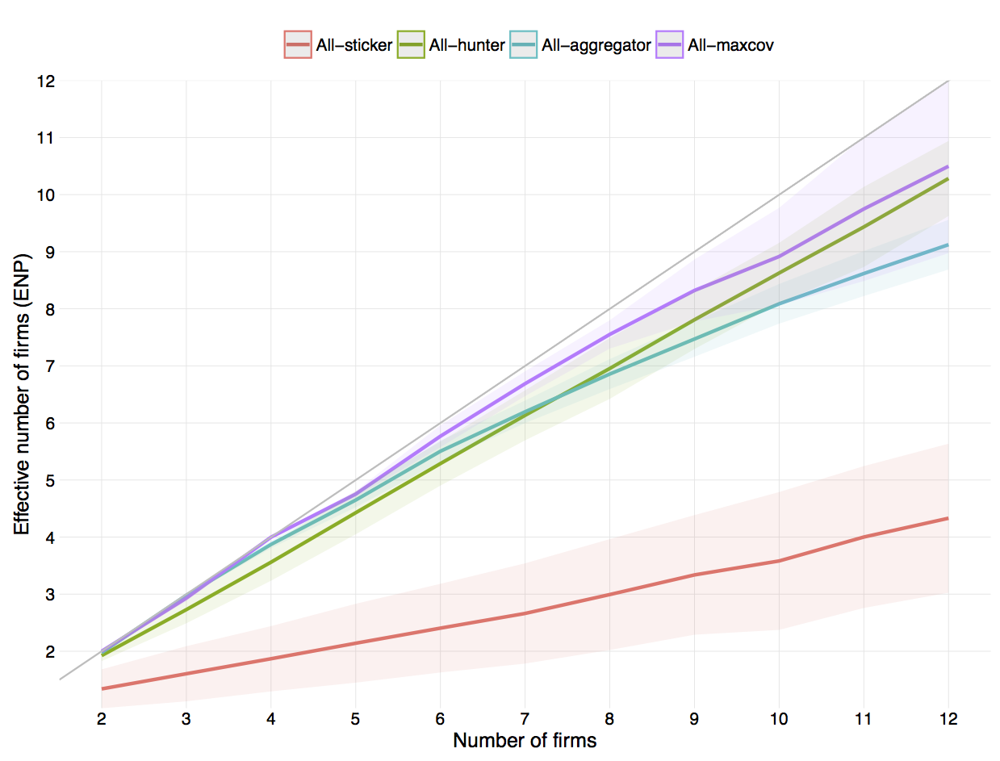
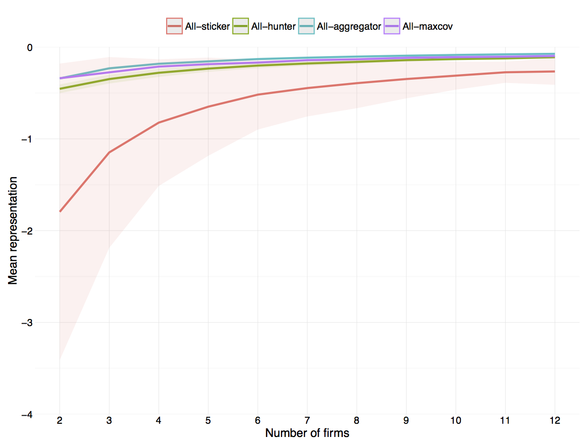

# Draft

## Purpose:
Reintroducing strategic considerations into the competitive location behaviour of firms. 

Monopoly, duopoly and *perfect competition* are undoubtedly the most studied market settings in the literature. Nonetheless most markets lay somewhere in-between the extreme case of 1-2 firms and the other extreme case of infinitely many firms. In addition the markets between the two extremes give rise to new and interesting phenomenas _that cannot be analysed under assumptions such as *monopolistic competition*_. Phenomenas such as niche markets, clustering of firms and [...].

Does a firm set out to occupy a niche market, or is it the output of a competitive process among several firms that drive the firm into a niche market? When is it a competitive advantage to occupy a niche market, rather than engage in direct and fierce competition with other firms? Why do firms tend to cluster or agglomerate in some markets, while they are dispersed in other?

Competitive location models investigates how firms choose to locate in a market with competing firms. The strategic aspects were the bedrock of the first competitive location models. Expanding the competitive location model to include more firms or multiple dimensions has proven difficult. Previous attempts to solve these models have used decision rules that rely on heuristics or rules of thumb. This simplifies the problem. And the rules provide a good first approximation. But these rules disregard any strategic considerations in the decision process of firms. The implicit assumption when a firm has to choose its position is that all competing firms will maintain their current position. In addition to being unrealistic this assumption heavily influences the results and conclusions of the location model. This paper is a first attempt at reintroducing strategic considerations back into the competitive location model with two dimensions and multiple firms.

-----

# 1. INTRODUCTION

# 2. LITERATURE REVIEW

aka. MAXCOV.
Voronoi diagrams and Delaunay Triangulation.
Different distance metrics. Manhattan, Euclidian, etc.

# 3. METHODOLOGY

…[^computation]

[^computation]: All the models in this paper are build and run in MATLAB (R2015a) on a MacBook Pro with a 2.6 GHz quad-core Intel Core i7 processor. In addition several models use MATLAB’s Parallel Computing Toolbox with 4 local workers taking advantage of the quad-core processor structure to process several runs in parallel.

### Consumers

The scope of this paper is limited to one side of the market -- the firms and their decision-making behaviour. For this reason simplifying assumptions are used with regard to the other side of the market; the consumers and their purchasing behaviour. For one thing consumers are static; they do not shift position, they maintain preferences, they are obliques to trends, and are in no way influenced by changes in the market. Secondly consumers behave non-strategically and demand inelastically; they always purchase a single unit from the closest firm, regardless of the distance to the firm. And finally all firms are identical in the eyes of the consumer; there is no brand recognition and no loyalty -- the customer purchase from the closest firm regardless of previous purchasing history.

Every consumer has an ideal point in the market. This is the point where the consumer wants a firm to locate. All points are second to the ideal point. And the further away from the ideal point that the firm locates, the less attractive it becomes. Consumers have *single peaked preferences*. Essentially this paper reduces consumers to being merely their ideal points. 

Viewed in terms of geography the ideal point would be the consumer's physical location and the distance is the bee-line distance to firms. Alternatively the market can be views in terms of product characteristics. Then the ideal point of the consumer is her desired product characteristic along the the two dimensions. [Fore instance salty-sweetness of chips and the thickness of chips. / mobile screen size]

- [Characteristics are non-ordinal, such consumers do agree that more of a characteristic is better to less, ie. quality would be a ordinal characteristic, on which all consumer agree that better quality is preferable to lower quality.]
- [Characteristics are continuous and infinitely divisible.]

The utility function for each consumer is the negative distance from her ideal point and to the position of the firm. The Euclidean distance metric is used, which is equivalent to a quadratic loss function. The utility of customer $i$ is the negative squared distance between customer $i$ and firm $j$:

$$ U_i(j) = -d(i,j)^2 $$

**Distribution of customers**
The above described simplification of consumer behaviour allows focused attention on firm behaviour. As previously discussed in the literature review section the distribution of consumers in the market fundamentally changes the behaviour of firms. We would like to capture and analyse these effects -- in particular the effects from asymmetric and multimodal distributions. We follow the method used by Laver and Sergenti (2011) and assume two consumer subpopulations in our market. When the two subpopulations have the same mean ideal point then the aggregated distribution of consumers will be symmetric and unimodal. While subpopulations with vastly different mean ideal points and different sizes will lead to an aggregated distribution of consumers that is asymmetric and bimodal. Thus this method of using two subpopulations is able to capture several different types of aggregate distributions using only two parameters; the polarisation of subpopulation ideal points, and the relative size of the two subpopulations. 

The market is two-dimensional, so we use the two-dimensional equivalent of the *normal distribution* -- the *bivariate normal distribution*. Both subpopulations follow a bivariate normal distribution. Using different mean values in the distribution imply that the subpopulations disagree over the ideal point. Without further restrictions it also implies that the subpopulations disagree on both dimensions. _[saltyness-sweetness and thickness]_. To simplify the analysis, and without lose of generality, we assume that the subpopulations have a common ideal point along one dimension and only disagree over the ideal point along the other dimension. This is equivalent to rotating the market space or coordinate system until disagreement only appear along one of the dimensions. Ie. rotating the market space such that the line going through the mean ideal points of subpopulations is parallel to an axis. One can always rotate the coordinate system without loss of information, and similarly this simplifies our analysis without any loss of generality. This is similar to the orthogonal transformation underlying a *principal component analysis*. We start out with two dimensions or components, and end up with two new dimensions; the disagreement dimension (x-axis) and the agreement dimension (y-axis). The two subpopulations -- from now on referred to as 'left' and 'right' -- follow a *bivariate normal distribution* with mean $(-\mu,0)$ and mean $(\mu,0)$ respectively, and both with standard deviation (0.5, 0.5).[^covarmatrix]. Where parameter $\mu$ measures the ideal point polarisation. The parameter measuring the relative size of the left subpopulation is $n_l/n_r$. The aggregated consumer distribution is a *mixed bivariate normal distribution* with weights based on the relative size of the subpopulations.

The mean ideal point on the y-axis is 0 for both subpopulations hence no disagreement along this dimension. The mean ideal point on the x-asis is $-\mu$ for the left subpopulation and $\mu$ for the right subpopulation. For $\mu > 0$ there is a disagreement along the x-asis. I will analysis the polarisation parameter in the range $\mu \in [0, 1.5]$ --  a that range spans both unified and split market. At the lower bound of the range there is no disagreement and the market consists of one unified customer base. At the upper bound there is essentially no overlap between the subpopulations and the customer base is split. With no overlap we are at the edge of what constitutes a single market[^singlemarket], and it might be more appropriate to describe this setting as two separate markets, at least in terms of the customers. The range of the relative subpopulation size is $n_l/n_r \in [1, 2]$. The subpopulations are equally large when the $n_l/n_r = 1$, while $n_l/n_r = 2$ indicates that the left subpopulation is twice the size of the right subpopulation. 

The default unit of measure troughout this paper will be standard deviations. This unit of measure will refer to the standard deviation measurement used in the bivariate normal distributions. E.g. if this paper reports that the distance betweeen two points is 1 standard deviation then this is equivilant to twice the standard deviation in the subpopulation distribution.

[^covarmatrix]: We further assume no correlation among the two dimensions. The correlation coefficient $\rho$ is zero and the covariance matrix is $\left[ \begin{array} 0.5^2 & 0\\ 0 & 0.5^2 \end{array} \right]$.

[^singlemarket]: _[Definition of market. When is it a single market and when is it two separate markets.]_

| Rel. size | Polarisation   | Pop. x-mean   | Pop. x-stddev   | 
| $n_l/n_r$ | $\mu_r=-\mu_l$ | $\mu_{xpop}$  | $\sigma_{xpop}$ | 
|:--------- |:-------------- |:------------- | :-------------- |
| 1         | 0.5            | 0             | 0.70711         |
| 1         | 1.0            | 0             | 1.118           |
| 1         | 1.5            | 0             | 1.5811          |
| 2         | 0.5            | -0.16667      | 0.68718         |
| 2         | 1.0            | -0.33333      | 1.0672          |
| 2         | 1.5            | -0.5          | 1.5             |

_[table: population statistics]_

Given the aggregated consumer distribution one approach would be to randomly draw a finite number of consumers from the distribution. Market shares can then be calculated by counting the number of consumers. Like Laver and Sergenti (2011) this paper will not employ this approach. Instead the consumer distribution are carried though and market shares are calculated by aggregating probability mass. Similarly the centroid of the market is weighted by probability mass rather than the number of consumers. Although the approaches will yield the same results on average, the latter is independent of particular draws, thus we save computational power not having to run repetitions to obtain the average values.

## 3.1 Agent-based modelling

### Firm behaviour

The underlying basis is that each firm chooses the location that maximises its market share, given the location of the other firms. However all firms choose their location simultaneously, and thus when a firm has to choose its own location, the location of other firms is unknown. Instead of having a direct objective to maximise market share, firms may use heuristics or rules of thumb when they choose location. The literature review provided an overview of the many different decision rules previously considered. This paper will use the three heuristic decision rules laid out by Laver and Sergenti (2011) as the base to which other decision rules are compared. These rule are described in detail below. _[rational vs. rule of thumb]_
_[Why the three exactly? No exploration, social optimum, and high on exploration.]_

**Sticker:**
The simplest decision rule a firm can use is the *sticker*-rule. With this decision rule the firm sticks to its initial position regardless of what happens. This could be a firm that is either unwilling to change or incapable of change. The management of the firm may have an unyielding belief in the long-run superiority of the firms position, discouraging it from any change, even in times of despair. Ie. a belief that the market share of the firm will always recover and excel in and of itself. The firm might also be unable to change, due to financially constraint such as the fixed cost of relocating or investments that cannot be recuperated. And finally, given the  task of predicting the future location of all other firms, the firm might see its current position the less risky than any new location based on these uncertain predictions.

**Aggregator:**
Firms using the *aggregator*-rule constantly seeks to please its own customer base. The firm does not try and predict the future. Instead it takes its current market area and locates at the centre of it. More specifically the centre or *centroid* is the mean ideal point of all customers of the firm. Thus the centroid takes into account the population density within the market area -- it is drawn to the centre of mass.

The future landscape of competing firms may change and with it the market areas. So there is no guarantee that the current centroid is also the centroid of the future. Nonetheless firms using the *aggregator*-rule continually pursue the mean ideal point of their customer base. Likewise there is no guarantee that the firm’s relocation will increase market shares, or even maintain current shares. Market shares are in a sense a secondary priority for the firm. The management of the firm may reason that they can retain and recruit new customers by pleasing their current customers[^loyalty]. 

[^loyalty]: Noted that customer loyalty is not incorporate in the models. Customers always choose the closest firm regardless of previous purchasing history. And this possibly understates the efficiency of firms using the *aggregator*-rule.

When all firms in the market use the *aggregator*-rule then the model is an implementation of the *Lloyd’s algorithm* and the location of firms will converge to the stable *Centroidal Voronoi Tessellation* (Laver and Sergenti, 2011, chapter 3 pp. 48-49). The *Centroidal Voronoi Tessellation* (CVT) is a special geometric construction where each firm is located at the centroid of its own market area. *Aggregator* firms located at the centroid will not relocate. Hence when all firms use the *aggregator*-rule the CVT is stable -- no firm relocates. The CVT has the useful property that the distance between all customers and their closest firm is minimised. It is an optimal arrangement of firms that minimises the overall distance. This will prove useful later on when comparing the social welfare of the different decision rules. The all-aggregator model will maximise our social welfare measure. _[Any CVT is optimal, but not necessarily unique. Given fore instance 2 firms there are several CVTs; the firms could locate left-right splitting the market in half vertically, the firms could locate up-down such that they split the market in half horizontally, etc. In each case the overall distance to firms is minimised and constitutes and optimum.]_

The underlying requirement for a firm using the *aggregator*-rule is that it has perfect knowledge of its current customer base. The firm knows the span of its current market area and the distribution of customers within the area, such that the firm can correctly determine the mean ideal point of its customers.

The *aggregator* firm never relocates outside its current market area. But otherwise there is no limit as to how far an *aggregator* firm can move at each iteration. The firm nonetheless tends to move in relatively small steps if the market is not too unstable. 

**Hunter:**
The *hunter*-rule is a trial-and-error type of decision rule. The firm continues in the same direction, if it previously proved fruitful, and otherwise the firm heads in the opposite direction. At each iterations the firms move what corresponds to 0.1 standard deviation of the population distribution. If the previous move did not increase the market share then the firm turns around and heads in a random direction drawn from the 180 degree arc in front of it. 

Firms using the *hunter*-rule never settle down. The firm endlessly hunts higher market shares with the same speed and intensity. For a firm with this decision rule there is no comfortable threshold share of the market that suffice or slow exploration. In the trade-off between exploration and exploitation the firm always chooses the first option. 

The only information used in the decision process of a *hunter* firm is the current relative change in its market share and its current direction. No information going further into the passed is used. The firm may lack memory, or may emphasis the present to such a degree that information going further back is seen as worthless. The behaviour of a *hunter* firms is most suited for a fast evolving market with high unpredictability.

The *hunter* firm moves 0.1 standard deviations each iteration. This is the *speed of adaption*. It is beyond the scope of this paper to investigate the effects of changing the speed parameter. However Laver and Sergenti (2011, chapter 7, pp. 150-151) find evidence that a speed parameter of 0.1 standard deviations results the in largest shares when using the *hunter*-rule. They argue that this speed strikes the balance between quickly reaching better locations without overshooting these location when moving around. 

-----

The above described heuristic decision rules are good first approximation on how firms might choose to locate. Especially in  a simultaneous multi-agent location model where the future location of other firms is unknown. Later on we would like to investigate how *inductive* reasoning and location forecasts affect our results. But before doing this we need to return to the deliberate process of maximising market share. That is, before we can answer how a firm locates given the *predicted* locations of competing firms, we need a new decision rule on how the firm locates given *any* location of competing firms. And none of the above mentioned decision rule take the location of competing firms into consideration. We will start with a decision rule that assumes that the other competing firms stay at their current location. Later on we will extend the decision rule so it includes location predictions and learning. _[In the end we will have reintroduced strategic behaviour into the simultaneous location model.]_

Let us assume that competing firms stay at their current location. We would like to know where the firm should relocate to maximise its market share. When a firm relocates it gains new customers and loses others. Thus there is a trade-off between the market area it gains and the area that it loses. To simplify matters even further we only focus on the first. This problem is equivalent to a new firm entering a market and choosing the location that will maximise its share. The firm itself is not part of the existing market and the market is populated with competing firms. There is extensive research on competitive location models such as the Hoteling model and the Voronoi game, and on the geometry behind Voronoi diagrams. Yet only a couple of papers provide methods on how to find the location that will maximises the area of a firm. Cabello, Díaz-Báñez, Langerman, Seara and Ventura (2010) use the *reverse nearest neighbour* method to find the position that maximises the number associated points or customers. However their method requires a finite number of points, and thus this method is not applicable. We assume an infinitely continuous number of consumers by using the consumers distribution. The remaining three papers use continuous distributions, but they assume the distribution is uniform, which also make them unsuited for our needs. Averbakh, Berman, Kalcsics and Krass (2015) use a method that partitions the solution space into smaller regions. The partition is done in such a way the structure of the Voronoi diagram is unaffected by how the firm locates within each region. The structure is only affected by which of the regions the firm locates in. The partition simplifies the problem to a *search problem* over all regions. Their method uses the *Manhattan* distance metric. The partitioning also work with *Euclidian* distance metric. However it might be impossible to obtain exact solutions with this distance metric, because of the complexity that the *Euclidian* norm introduces in the object function (Averbakh, Berman, Kalcsics and Krass, 2015, pp. 409-410). The models in this paper uses the *Euclidian* distance metric. Cheong, Efrat and Har-Peled (2007) note the difficulties in finding analytical solutions to the problem and develop an algorithm that approximates the maximum of the object function. Their method finds the largest circle within each existing market area that does not contain any of the existing firms. They construct squares with lengths equal to the radius of the largest empty circles. These squares are partition into grids and they use a *$\epsilon$-approximation* to pick the cell in the grid that maximises the market area. As previously mentioned Cheong, Efrat and Har-Peled (2007) assume a uniform distribution of customers. When working with non-uniform distributions the largest empty circles is a poor criteria to use to narrow the search for maximum. The last paper by Dehne, Klein and Seidel (2002) proves that if the location of neighbouring firms span a convex hull, then there exists a unique local maximum inside this convex hull. They use Newton’s method to calculate these local maxima within each of the Delaunay circles (that is the smallest circles covering the triangles in the Delaunay Triangulation). In addition they check for corner solutions, ie. locating on top of existing firms. The optimal location for the new firm is then maximum of all these local maxima. The case where the neighbouring firms do not span a convex hull is left open. There is nothing in the following models that prevent neighbouring firms from locating such that they do not span a convex hull, and thus this method is not suitable either. 

None of the currently existing methods are applicable to the models used in this paper. This is due to the non-uniform infinitely continuously distribution of consumers, where neighbouring firms may not form convex hulls, and because we use the Euclidian distance metric. Nonetheless I draw on the commonalities of these papers when constructing the decision rule that explicitly tries to maximise the market share of the firm.

**Maxcov:**
Firms using the *maxcov* decision rule aims at the location that covers a maximum of customers. 

The ideal firm location is in the gaps between competing firms. The firm considers all the gaps and picks the one with the most customers. Each gap is a triangle in the Delaunay Triangulation. The Delaunay Triangulation is constructed using the competing firms and it includes the boundary points. The latter insures that the firm can also locate outside the area spanned by competing firms (Cheong, Efrat and Har-Peled 2007 p. 556). The triangle with most customers is selected, and the ideal firm location is the mean ideal point of all customers within that triangle.[^mostcustomers] 

[^mostcustomers]: _[The triangle with the most customers is a proxy of the actual market share obtained. The firm number of customers will not be the one ones in the triangle. And it may not always be the triangle that gives the firm the largest market share. Its correct 40-90% of the cases depending on the parameter settings and the number of firms. Compared to randomly picking triangle which would be correct 4-16% of all cases.]_

The *maxcov* firm does not move directly to the ideal position, but moves 0.1 standard deviations in the direction. This gradual adjustment is chosen for two reasons: first, it makes the speed at which the *maxcov* firm moves comparable to the speed of the other decision rules. The *hunter* firm moves 0.1 standard deviations, and the *aggregator* does not move outside its current market area. _[Secondly, the ideal position of the firm is sensitive to changes in the position of competing firms. Even minor changes to the position of competing firms can change which triangle contains the most customers, and thus significantly change the ideal position. The gradual adjustments counteracts the sensitivity.]_

When the *maxcov* firm chooses its location it explicitly assumes that competing firms remain at their current position. _[The *maxcov* firm faces the same problem: when choosing location the location of the other firms is unknown. Not knowing how the other firms will move and without any predictions it may be reasonable to use the firms current position as the point of reference.]_

In determining its location the *maxcov* firm uses information on the location of competing firms. Additionally I assume that the firm has perfect knowledge of the consumer distribution such that it can determine which of the gaps contain the largest number of customers[^knowdist].

[^knowdist]: Alternatively -- and perhaps more realistically -- the firm could approximate which gaps contained the largest number of customers by using the market share of the surrounding firms (Fowler and Laver, 2008 p.75). However to avoid effects arising from such approximation I assume the *maxcov* firm have perfect knowledge of the distribution of customers.

## 3.3 Markov Chain Monte Carlo

_[convergence / burn in]_
_[Initial position of firms]_
_[(Visually show the movement / iterations over time to the reader)]_
_[runs, repetitions, iterations.]_

### Monte Carlo parameterisation

_[Grid sweep.]_

### Summary variables

There are three main perspectives we want to analyses in this competitive location model. One perspective is the location of the firms. Do firms agglomerate or cluster at particular locations or do firms disperse across the market space? Another perspective is the competitive environment. Is competition a *winner-take-all* game in which one firms is able to capture a predominant share of customers, or are customers evenly shared among firms? The last perspective concerns *social welfare*. How does the competition among firms affect the wellbeing of customers? To investigate these perspectives we construct three summary variables. These variables aggregate the state of the market into a single measure that is comparable across parameter settings and models.

**Mean Eccentricity:**
To summarise the position of firms we use the mean eccentricity. Eccentricity measures the distance from a firm to the mean ideal point of all customers. Eccentricity has the desired properties of a summary variable. It is a single measure as opposed to the coordinates of the firm that are two dimensional. It is a relative measure that is naturally interpretable as the distance to the population centre. And since we use the mean ideal point which changes with the parameters, eccentricity is comparable across different parameter settings. _[Had we used the origin of the coordinate system this would not change with the parameters and our distance would thus dependent on the specific parameter setting. In addition the origin is an arbitrary location and thus not easily interpretable.]_ We take the average of all firms to get the mean eccentricity in each stage.

**Effective number of firms (ENP):**
I use a relative measure of the market shares of the firms to summarise the competitive environment. The measure is known as the *effective number of parties* (ENP), but will in this paper be referred to as the *effective number of firms*. It measures the concentration of market shares among firms. The measure goes from 1 and up to the number of firms in the market (N). In a market with four firms where all firms have an equal share of the market the effective number of firms is four (ENP=N), while the effective number of firms is one (ENP=1) if a single firm captures the entire market. 

$$ENP = \frac{{\left( \sum\limits_j^N s_j \right)^2}}{{\sum\limits_j^N s_j^2 }}$$

The ENP is the inverse of the Herfindahl-Hirschman Index (Laakso and Taagepera 1979, p.4). Thus ENP and the index measures the same thing, but ENP is easier to interpret than the index across our parameter settings where we change the number of firms.

**Mean Representation:**
It is straight forward to create a measure that summarises the consumer welfare given our utility function (see equation _[...]_). By taking the average over all customers we get the mean representation in every stage.

# 4. ANALYSIS

## 4.1 Baseline model and decision rules

We are now ready to investigate the first models. We start with the all-sticker, all-aggregator, all-hunter and all-maxcov models. In each of these models all the firms use the same decision rule. We compare the decision rules by comparing the results across models. We start with a symmetric unimodal distribution of customers. There is no polarisation of the ideal point of the two subpopulations and the subpopulations are equally large ($\mu=0$ and $n_l/n_r=1$). Thus there is the only one free parameter of the models; the number of firms $N$. We use the grid sweep method to set the parameter value.

In the all-sticker model the firms remain at thier initial position. They never relocate. Figure _[##]_ plots the mean eccentricity for each model. As expexted we see that the average distance to the population center is 1.5 standard deviation in the all-sticker model. This result reflects how the initial positions of firms are drawn. The initial position of firms are drawn uniformly from a circle with radius of 3 standard deviations and center at (0,0). And thus we find that on average a *sticker* firm will be located 1.5 standard deviations from the population center -- irrespectively of the number of firms in the market.

In the three remaining models mean eccentricity is significantly lower. The initial position of the firms in these models are drawn from excatly the same distribution, but the firms clearly moved towards the population center. 

In the all-aggregator model the firms aim to please their current customer base. The firms choose to locate 0.4-0.8 standard deviations away from the population center with the distance increasing with number of firms in the market. In the all-hunter model, where all firms constantly seek higher market shares, the firms choose to locate in closer proximity to the population center than in the all-aggregator model. Around 0.2 standard deviation closer to the center.

Dispite the fact that the population center has the largest density of consumers of any point in the market, firms consistently locate at a distance to this point. Even *hunter* firms that constantly seek larger market shares. This suggests that locating too close to the population center is suboptimal (Laver and Sergenti 2011 chapter 5). By moving closer to the population center the firm can gain the high density point, but the losses clearly outweight this gain. _[A firm that attempts to wedge its market area closer to the center will often find as a result that the backend of its wedge/market area becomes increasingly thinner. This is the lost market.]_ _[Furthermore the long run dynamics come into play / vote share maximum ... ]_

_[fig median spline: vote share vs. mean eccentricity]_

_[Compare results to Eaton and Lipsey (1975)]_

In the all-maxcov model the firms deliberately attempt to maximize thier market share. They do not rely on heuristics. The firm take into account the position of competing firms, assuming that they will not move. Firms in the all-maxcov and all-hunter model locate a similar distance to the population center. The main exception is with two firms in the market, in this case the *maxcov* firms locate at the same distance as *aggregator* firms. Therefore in the all-maxcov model there is only a slight tendency for firms to locate furthur away from the population center as the number of firms increase. On average the firms locate 0.4-0.5 standard deviations away from the population center.

In the models the actual number of firms in the market is an endogenous variable. Our experimental design allows us to investigate the models when there is anywhere from 2 to 12 firms in the market. To analyses the competitive enviroment we use a measure call the effective number of firms (ENP). The ENP takes into account the relative size of the firms -- that is their share of the market. The ENP tells how many firms would be in the market if they all had identical shares of the market. If the actual number of firms and the effective number of firms is the same (thin 45 degree line in figure _[##]_), then the firms in the market will have split the market evenly. If the effective number of firms is less than the actual number, then one or several of the firms will have a disproportionate share of the market.

The effective number of firms is low in the all-sticker model, ranging from around 1.5 and up to 4.5. The initial position of firms gives some firms a clear advantage over the other firms in the market. And since *sticker* firms do not relocate the uneven concentration of customers persisits.

In the last three models the market is fairly evenly split among the firms. This is the result of homogenous firms competing among themselves. Since all firms use the same decision rule, no one firm has a long-run advantage over its competitors. And thus the firms end up with approximately the same long-run share of the market. More firms in the market make it increasingly harder to maintain a perfectly even split among the firms. And we see that the ENP is slightly below the actual number of firms in the all-hunter, all-aggregator and all-maxcov model when there are many firms in the market.

We use mean representation to measure the satisfaction of the customers. This social welfare measure calculates the average utitily of all customers. The utility of the customer increases when the distance to the closest firm decreases. From earlier we known that the all-aggregator model will result in firm locating along a *Centroidal Voronoi Tessellation* (CVT). The CVT minimises the average distance of all customers and therefore maximises our social welfare measure. Thus mean representation is maximised in the all-aggregator model.

In both the all-hunter and all-maxcov model where firms aim to maximises their market share, they manange to archive almost the same mean representation as in the all-aggregator model, where firms actively aim to please thier customer base. Unsurprisingly the all-sticker model scores lowest on our social welfare measure, since this model has the largest customer-firm distance. 

## 4.2 Asymmetric and multimodal population distribution

Above we got a sense of the different models and how firms react when using different decision rules. Our results have so far assumed a symmetric unimodal distribution of consumers, where there was no disagreement over the average ideal point along any of the two dimensions. There was a single peak in the distribution where the density of consumers was greater than any other point. Despite this firms generally choose to locate at a distance to this point. The literature review showed that different distribution of customer have had significant impact on the results of previous competitive location models. We now want to investigate how firms locate when there is not a single peak in the distribution? How the dynamics change when the subpopulations disagree over the average ideal points? And whether our results generealise to other distributions -- asymmetric and multimodal distributions? 

In the following models there are three free parameters; The number of firms in the market $N$ which takes integer values between 2 and 12. The polarisation of the subpopulations $\mu$ which can take any value between 0 and 1.5. And finally the relative size of the subpopulation $n_l/n_r$ which takes any value between 1 and 2. To parameterise our models we use the Monte Carlo parametersation method. For each run of the model the parameter values are uniformly random drawn from their respective ranges. And we run the models repeatedly to map out the entire parameter space.

In each model there is still just one decision rule present. Firms are competing againts other firms using the same decision rule. Since firms using the *sticker*-rule do not relocate running this model with asymmetric consumer distribution would not provide additional insights. Thus we have left out the *sticker*-firms of this subsection.

![Mean eccentricity for respectively (a) all-aggregator, (b) all-hunter, and (c) all-maxcov model. Where $\mu \in [0, 1.5]$ and $n_l/n_r \in [1, 2]$.](Graphics/temp_mcp_meaneccentricity.png)

The decision rules are presented in seperate panels and three bands are used to summerise the results from different degrees of polarisation among the subpopulations. The first band summerises the results from the models where there is a low degree of polarisation ($\mu \le 0.5$). The second band is for a medium degree of polarisation ($0.5 < \mu < 1$). And the last band is for a high degree of polarisation ($\mu \ge 1$).

The firms using the *hunter*-rule still locate in closer proximity to the population center than the firms using the *aggregator*-rule for any level of polarisation. However the difference in proximity between the *hunter*-firms and *aggregator*-firms is much less prononced in markets with a high degree of polarisation and many firms. Here the average distance to the population center is around 1.2-1.4 standard deviations for both type of decision rules.

In the highly polarised setting we see significant difference between the market with 4 or more *hunter*-firms and then the market with 2 or 3 *hunter*-firms. For one we see that the average distance to the population center increases swiftly when going from two to three firms or four firms. While going beyond four firms in the market has negligible effect on the average distance to the population center. This is due to firms seperating when there is four or more firms in the market. Here we typically see that the firms split into two crowds. With each crowd of firms fiercely competiting for the customers in the respective subpopulation. In the model with a symmetric distribution of customers the *hunter* firms choose to locate around the peak of the customer distribution. Similar behaviour is observed in the models with a high degree of polarisation amoung the subpopulation. However these models have two peaks which the firms tend to locate around. Firms locate close to the center of one of the subpopulations, rather than in between the two subpopulations. The firm loses market shares when it moves too far away from the center of a subpopulation. Thus this acts as a punishment for the *hunter* firm discouraging it from locating between the subpopulations and close to the average ideal point of all customers. On the other hand with only two *hunter* firms in the market, the firms tend to locate in between the two subpopulations. Thus they locate close to the average ideal point of all customers, but simultanouesly they locate in an area with a low density of consumers. Later we show that this has great impact on the average utility of consumers.

Laver and Sergenti (2011, chapter 5) discover the change when going from 2-3 *hunter* firms and into the realm of four or more *hunter* firms. Yet they seem unaware of an earlier and related discovery by Eaton and Lipsey (1975). Eaton and Lipsey (1975) also analyse asymmetric distributions admittedly in a slightly different setting, namely the bounded one-dimensional space (line market). They show analytically that an equilibrium only exists if the number of firms is less or equal to twice the number of modes in the density distribution, ie. $N \le 2M$ where $M$ is the number of modes in the consumer density function. When the number of firms is exactly twice the number of modes then the firms locate in pairs around the quantiles of the distribution. While with less firms than twice the number of modes there is some leeway as to how firms locate. Both the pairing of firms in two and the $2M$ limit is due to the single dimensional. In a one-dimensional line market the only option is which side of a point you locate on (left or right). Using this and equlibirium conditions Eaton and Lipsey (1975) show the limit of $N \le 2M$. In the two-dimensional market firms can locate all the way around a point, and thus firms need not be paired. In the *hunter* model firms still crowd together although not nessarily in pairs of two. Additionally the number of modes does not create an upper limit on the number of firms -- again since firms can locate all around a point. But the number of modes does seem to influence how firms locate. There is a single mode in the model with symmetric distribution, and two modes in models with highly polarised subpopulations. Only when the number of firms is equal or greater than the number of modes do the *hunter* firms form crowds around the peaks of the distribution. When the number of firms is less than the modes, then there is leeway as to how firms locate and we see that *hunter* firms locate between the peaks of distribution.

The symmetric distribution showed that *maxcov* and *hunter* firms locate at similar distance to the population center, except with two firms in the market. We see similar pattern with the asymmetric distribution of customers. The *maxcov* and *hunter* firms locate a similar distance to the population center irrespectively of the polarisation of the subpopulations. The exception is when there are only a few firms in the market. With the *maxcov* decision rule there is no abrupt change when going from 2-3 firms and to 4 or more firms as with the *hunter* decision rule. The *maxcov* firms always seperate, also with two or three firms in the market. The firms locate around the center of each subpopulation when consumers are polarised. Furthermore the *maxcov* firms seperate even in the case with no polarisation of the subpopulations. The two *maxcov* firms will not agglomerate at the population center but instead locate at a distance to the center. This contrasts starkly with the two *hunter* firms that agglomerate around the population center at both low and medium degrees of polarisation.

![Effective number of firms (ENP) for respectively (a) all-aggregator, (b) all-hunter, and (c) all-maxcov model. Where $\mu \in [0, 1.5]$ and $n_l/n_r \in [1, 2]$.](Graphics/temp_mcp_enp.png)

The asymmetric distribution reiterates the conclusions of the symmetric distribution regarding the effective number of firms (ENP). Both the model with *aggregator* and *hunter* firms show that the market is relatively even split among the firms in the market. When there are many firms then the ENP is slightly lower in the *aggregator* model than the *hunter* model. However this difference completely disappears as the polarisation of the subpopulations increase. With many firms the center of the symmetric distribution easily overcrowds. In the *aggregator* model where firms locate to please their current customer base overcrowding leads to firms locating on different orbits around the center. Firms located on the inner orbits attact a larger share of the customers than the firms located on the orbits further away from the center. Polarisation of the subpopulations spreads the ideal points over a greater area which in turn reduce the overcrowding of firms. This is why in the *aggregator* model with many firms the ENP increases when going from low polarisation to medium or high degree of polarisation.

The market is also relatively even split among the firms in the *maxcov* model. When there are many firms then a high degree of polarisation results in a slightly lower ENP. As earlier noted the firms split into two crowds in the *maxcov* model. The crowd compete for the customers in each subpopulation. However in the *maxcov* model the number of firms in each crowd is not necessarily the same. It often happens that a minority of the firms manage to capture one-half of the market and this results in the lower ENP. The ENP would be 3.6 if a single firm out of 12 firms captured half the market[^ENPcalculation]. However with 12 firms  in the market we observe an ENP around 10. This tells us that a single firm is unable to capture and maintain half the market by itself in the long-run -- it has to be a group of firms.

[^ENPcalculation]: With N=12 and the market split in two halves the ENP is $\frac {(0.5+0.5)^2}{\left(\frac{0.5}{11}\right)^2 \times 11 + 0.5^2} = 3.6$ when 1 firm has 50% of market alone and the 11 other firms share the remaining 50% equally. 

![Mean representation for respectively (a) all-aggregator, (b) all-hunter, and (c) all-maxcov model. Where $\mu \in [0, 1.5]$ and $n_l/n_r \in [1, 2]$.](Graphics/temp_mcp_meanrepresentation.png)

The *aggregator* model also results in the CVT when the distribution of consumers is asymmetric. And thus this model maximises our social welfare measure -- the mean representation. The difference between the mean representation in the *aggregator* model and the *maxcov* model is minuscule.

In the *hunter* model we once again see that the asymmetric distribution of consumers give rise to significant changes when going from 2-3 firms and to 4 or more firms. This is particularly pronounced in the models with a high degree of polarisation. With two or three *hunter* firms the mean representation is around -2, while with four or more firms the mean representation is between -0.5 and -0.2. As earlier noted this is the result of *hunter* firms locating in between the centers of the subpopulations when there are 2-3 firms in the market. Although the firms locate close the average ideal point of all customers they also locate in an area with a low density of consumers. Because firms locate far from the densely populated areas it significantly reduecs the average utility of customers. On the other hand firms seperating into crowds that locate around the centers of the subpopulation when there are four or more firms in the market. Laver and Sergenti (2011, chapter 5, p. 102) refer to this as the *“sea change”* in mean representation when reaching four or more firms.

We are now at the point where we have an understanding of the baseline decision rules; *sticker*, *aggregator*, *hunter* and *maxcov*. The first three rules rely on heuristics, while the last rule deliberately and directly maximises the market share of the firm. We know how firms that use these rules choose to locate -- both when the distribution of consumers is symmetric and when it is asymmetric. We know which type of competitive enviroment arises from the location behaviour of the firms. And we know how this behaviour affects the overall welfare of consumers. The following section looks at how firms locate when they take the predicted location of competing firms into considerations.

## 4.2 Decision rules with foresight

When a firm chooses its own location, the location of the other competing firms is unknown. The firm may try to predict the location of the other firms. However if multiple firms use this approach then the location outcome that each firm is trying to predict will depend on predictions that the firm and the other firms form. As Arthur (2014, p.175) writes *”predictions are forming a world those predictions are trying to forecast”*. This self-referential loop leads to logical indeterminacy. _[...]_ Because of this logical indeterminacy the maximisation problem of the firm is ill defined and cannot be solved by means of deductive reasoning. 

_[ ... simultaneous ... hetrogenous agents ... infinite regress ... Note that the lack of a solution to the maximisation problem is not the result of bounded rationality, ie. mental capacity of the agents need to calculate the correct solution. We have make no such restriction. Agents have unbounded rationality. ... ]_

The two decision rules discussed in this section use inductive reasoning or inductive rationality. The firm holds several hypotheses and uses these to make predictions on how the other firms will locate. A hypothesis consists of a proposition that might not hold true and so contrary evidence weakens the hypothesis. The firm tests its hypotheses by comparing the predicted location of the other firms against the observed locations. Thereby the firms learns which hypotheses 
are plausible and thus applicable moving forward. Predictions are made using the hypothesis that worked best in the past. The firm locates -- like the *maxcov* firm -- such that it maximises its market share, but uses the predicted location of all competing firms rather than their current location. In the first decision rule the firm is endowed with a set of hypotheses. These hypotheses are exogenously given and do not change over time. Only the accuracy of each hypothesis changes in pace with its predictions being tested. I refer to this decision rule as *maxcov-inductor* or simply *inductor*, since the firm uses inductive reasoning. The second decision rule is an expansion of the *maxcov-inductor* rule, but the firm gradually discards poorly performing hypotheses and forms new hypotheses. If possible new hypotheses should perform at par or better than the exsisting hypotheses. Therefore new hypotheses are formed though a evolutionary process that mutates and fuses the best exsisting hypotheses. Replacing old hypothesis is another way in which learning takes place -- leading firms to make better predictions. Hypotheses are endogenous in this decision rule. I refer to this rule as the *maxcov-inductor-GA* or *inductor-GA*, since a genetic algorithm generates the new hypotheses. I use two decision rules such that I can seperate the effects from respectively inductive reasoning and endogenous hypotheses. With two decision rules these effects can be analysised in turn.

The following method is a modified version of the method first developed for *The Santa Fe Institute Artificial Stock Market Model* and described by Arthur (2014, chapter 3) and Arthur, Holland, LeBaron, Palmer and Tayler (1996). In the stock market model multiple agents try to predict the stock price. Each agent faces one unknown factor. The agent’s demand for shares depends on the agent’s predicted stock price, ie. the agent’s action depends on a single prediction. And the actual stock price rely upon the aggregated demand of all agents. In this paper an agent or a firm attempts to predict the behaviour of all other firms. Each agent faces $N-1$ unknown factors. The firm locates based on its predicted location of competing firms, ie. the action of the firm depends on multiple predictions. Thus the most significant modification of the method is going from a many-to-one prediction to a many-to-many prediction. Additionlly the stock price is one-dimensional -- it can go up or down. Whereas the position of the firm is two-dimensional. The firm can relocate in any 360 degree direction. This however only requires a slight modification to the forecasting model used in the method.

**Maxcov-Inductor:**
A firm with the *maxcov-inductor* decision rule maintains several hypotheses on how competing firms locate. The firm uses the hypothesis that fits the current state and that previously proved most accurate to forcast the future location of a competing firm. When the firm chooses its own location it relys on the predicted location of all competing firms.

The firm is endowed with $M$ number of hypotheses. While each hypothesis might only be relevant to a narrow set of situations, together the array of hypotheses cover a wide range of different situations. At every iteration the firm only considers the hypotheses specific to the current state and ignores the remaining hypotheses. This makes the firm capable of ‘recognising’ different situations and applying the appropriate forecast.

Each hypothesis consists of two parts jointly forming a *condition/forcast* rule. The condition part specifies which situations trigger the forecast. And the forecast part contains the spefic estimates used to make a prediction about the future location.

To describe the current state we use a 13-bit descriptor. The descriptor $J_j$ summarises the location behaviour of firm $j$. Eg. the fourth bit in $J_j$ relays wether or not *firm $j$ is more than 0.6 standard deviations away from the population center*. The tenth bit in $J_j$ relays whether or not *firm $j$ position along the agreement dimension (y-axis) is above the average of the last 16 periods*. Etc. These bits take the value 1 if the state occured, and takes the value 0 if the state is absent. The current state of firm $j$ could fore instance be summerised by the following descriptor: `1110010011010`. 

We will refer to the first 5 bits as the *fundamental bits*. They relay whether or not the distance from the firm to population center is greater than respectively 0.1, 0.25, 0.4, 0.6, or 1.2 standard deviations. These bits measure the degree to which the location of the firm is fundamentally different from the ideal point of all consumers. Bits 6-11 are the *tendency bits*. The bits 6-8 relay whether or not the position of the firm along the disagreement dimension (x-axis) is above the average of the last respectively 4, 16 and 64 periods. And the bits 9-11 relay whether or not the position of the firm along the agreement dimension (y-axis) is above the average of the last respectively 4, 16 and 64 periods. Thus these bits measure trends in the relocation pattern of the firm. The last two bits are respectively always on and always off. These are experimental controls. By construction they contain no infomation about the current state, and thus they tell to what degree firms act on useless information. 

Each *condition/forcast* rule attempts to ‘recognise’ the current state. Therefore the condition consists of 13 corresponding positions each taking the value 1, 0, or #. The condition is met if the ones and zeros match the current state descriptor. The # is a wildcard character that matches either case. Eg. The condition `###1#####0###` is satisfied if the state described by the fourth bit occured and the state described by the tenth bit did not occure. In other words the condition will match any state where *the firm $j$ is more than 0.6 standard deviations away from the population center while its position along the agreement dimension (y-axis) is not above the average of the last 16 periods*. The condition `###1#####0###` is not satisfied if the current state descriptor is `1110010011010`, but the condition is satisfied if the current state is `1111000010010`. More ones and zeros in the *condition/forecast* rule imply that the hypothesis is more specific, while a *condition/forecast* rule with many #s will match more states and is thus a more general hypothesis.

All the *condition/forcast* rules that matches the current state of firm $j$ are said to be active. Among these active *condition/forcast* rules the rule with the best accuracy is used to forecast the future location of firm $j$. In the case where several rules tie for the best accuracy one of the rules is selected randomly and used to forecast. The accuracy of the active *condition/forcast* rules is updated once all the firms relocate and the actual location of each competing firm is revealed. The accuracy measurement is based on the forecast error variance -- a lower forecast error variance imply better accuracy. The accuracy is updated using the inverse of the moving average of squared forecast errors (see details in appendix). Over time the firm learns which hypothesis work well in a given situation. Thus the continuous updating of the accuracy of the *condition/forcast* rules facilitates learning. We will refer to this as *learning through experience / learning by using (Rosenberg 1982) / learning by doing (but non deductive (Arrow 1971))*.

_[... vs. using the market share/profit forecast error as accuracy measure of the c/f rule ... ]_
_[... why these is this method used rather than fore instance neural net/machine learning method? ... easy to expand to include the evolutionary proceess used in next decision rule ... clear to see which infomation is used to make forecasts / how firms make forecast (neural net is a black box) ... ]_

The firm forecasts the future location of the competing firm $j$ using a linear forcasting model. 

$$\left( \begin{array}{*{20}{c}} {{x_{t + 1,j}}}\\ {{y_{t + 1,j}}} \end{array} \right) = \left( {\begin{array}{*{20}{c}} {{C_1}}\\ {{C_2}} \end{array}} \right) + \left( {\begin{array}{*{20}{c}} {{A_1}}&{{B_1}}\\ {{A_2}}&{{B_2}} \end{array}} \right)\left( {\begin{array}{*{20}{c}} {{x_{t,j}}}\\ {{y_{t,j}}} \end{array}} \right)$$

The six parameters of this model come from the most accurate active *condition/forcast* rule and take the form ($C_1$ $C_2$ $A_1$ $B_1$ $A_2$ $B_2$) Eg. the full *condition/forcast* rule might look like `###1#########` / (0.1 0 1.2 0 0 0.5). The rule  in this example states that if *firm $j$ is more than 0.6 standard deviations away from the population center, then the predicted location along the x-axis is 20% further right and along the y-axis 50% less north relative to the current position shifted 0.1 standard deviation right along the x-axis.*

The *maxcov-inductor* firm makes predictions on the future location of all competing firms. Each competing firm $j$ has a unique current state descriptor $J_j$. But the *maxcov-inductor* firm uses the same set of $M$ *condition/forcast* rules on all its competing firms. Thus in the model we make the assumption that the *condition/forcast* rules are not tied to any competing firm. The hypotheses of the firm are not specific to the location behaviour of a particular competing firm, but generally applicable to any competing firms that exhibit a perticular location behaviour. 

The *maxcov-inductor* firm is endowed with $M$ hypotheses. All but one hypothesis is randomly generated by the following procedure. Each position in the condition is randomly set to 1 or 0 both with probability 0.1, or set to # with probability 0.8. The forcasting parameters are drawn uniformly random from distributions with mean value 0. The parameters $C_1$ and $C_2$ are drawn from a uniform distribution with range [-1.5 1.5]. The parameters $A_1$ and $B_2$ are drawn from the range [-1.2 1.2]. And $A_2$ and $B_1$ are drawn from [-0.2 0.2]. The initial accuracy or forecast error variance of each *condition/forcast* rules is set to zero. The last hypothesis is the default. This *condition/forcast* rule consists of only #’s so it matches any state and insures that the firm always make a prediction. Each of the forecast parameters for this special rule is set to the average parameter values of the other $M-1$ *condition/forcast* rules.

**Maxcov-Inductor-GA:**
A firm with the *maxcov-inductor-GA* decision rule behave as described above. The firm is still endowed with $M$ decision rules, most of which are randomly generated. But every $\varphi$ iteration the firm replaces the 20% least accurate hypotheses. The new hypotheses are created using a *genetic algorithm* (GA). This algorithm mimicks an evolutionary process, ie. hypotheses are developed from earlier hypotheses with randomly occuring mutations and by crossbreeding parents. The genetic algorithm uses respectively *mutation* and *crossover* to create the new hypotheses. The appendix contains the values, equations and specific probabilies used. Each new hypothesis requires two parent hypotheses. These parent hypotheses are randomly drawn from the set of hypotheses not discarded, ie. the 80% most accurate hypotheses. 

With mutation the new hypothesis only inherits traits from the most fit parent. The fitness is based on the accuracy and the specificity of the *condition/forecast* rule. Accounting for the specificty implies that parent rules with wider applicability are evaluated as more fit, and thus more likely to form the basis of the new hypothesis. This implies that the model will have a slight drift towards more general *condition/forecast* rules. The method mutates the condition of the parent by randomly fliping the 1, 0 and #s, and by randomly replaceing or altering the forecast parameters. 

With crossover the new *condition/forecast* rule is a mix of both parents. The condition part is mixed by randomly selecting a donor parent of each of the 13 positions. Eg. The value of the first position might come from one parent, and three following positions might come from the other parent, etc. This way the 13 positions are passed on from one of the two parrents, and for each position the donor parent is randomly selected. Crossover of the forecast parameter values happens by either 1) component-wise crossover of each value, 2) using the weighted average of the parents or 3) randomly picking a parent that passes on all parameter values. The method used is randomly selected, and the three methods have equal probability of being selected. In the component-wise crossover the 6 parameter values are passed on from one of the parents, and for each value the donor parent is selected randomly. The weighted average of the parents parameter values uses the accuracy as weights.

To insure that the new hypotheses have a reasonable chance of being used, each new *condition/forecast* rule inherits the average accuracy of its parents. In case the parent rules have never matched a state -- and thus not never been active -- then the new hypothesis takes the median accuracy of all the non-discarded hypotheses. The firm always maintains the special *condition/forecast* rule that only consisting of #s. However its parameter values are updated such that these equal the weigted average of all new and non-discarded rules, where accuracy is used as weight.

The process of discarding the poorly performing hypotheses and formning new hypotheses based on the most accurate is another way in which the firm learns. The firm learns to make better predictions by gradually refining its hypotheses. I will refer to this as *learning through adaptation*. 

### 4.2.1 Results

_[Maxcov-inductor:]_
Not locked into position. The average distance to the population center is about the same. Locates closer the the average ideal point along the dimension with no disagreement (that is closer to y=0).
Mean eccentricity: no change compared to *maxcov* model.
ENP: falls since some firms are endowed with more accurace condition/forecast rules.

_[Maxcov-inductor-GA:]_
Mean eccentricity: When there are few firms in the market then the firms locate further from the population center. [Closer to y=0. The location perimeter / boundary of where firms locate has along the x-axis has not changed. The firms will only locate out to a certain point/distance, that is not too far away from the centers of the subpopulations. Thus the mean eccentricity tells us that firms to a greater extend locate in between the subpopulations, and that this behaviour increases as the number of firms increase. This is why we see a decline in the mean eccentricity as the number of firms increase. This is not a stable location pattern, but instead it reflects that firms in transition --- relocating from one subpopulation to the other.]
ENP: low. The firms end up locating at the subpopulation center.  The firms seperate into two crowds: the crowds are uneven in size. => low ENP. When firms locate on top of each other ==> the firms very likely to lock into positon.

## 4.3 Entry/Exit

_[market share]_

_[number of surviving parties]_

_[mean age at death]_

# 5. CONCLUSION

_[decision rule with foresight]_

# A. APPENDIX 

-----

To **update the accuracy** of a *condition/forecast* rule we use the inverse of the moving average of squared forecast errors. The accuracy of firm $i$ using hypothesis $m$ at iteration $t$ is:

$$e^2_{t,i,m} = \alpha_a e^2_{t-1,i,m} + (1-\alpha_a) \left( X_{t+1,j} - E_{t,i,m} [X_{t+1,j}] \right)^2, \quad \forall j \ne i$$

where $\alpha_a$ is the mememory paramenter and $X_{t+1,j}$ is the future location of competing firm $j$. The mememory paramenter is set to $\alpha_a = 1-1/75 = 74/75$.

-----

**Fitness measure** of rule $m$ at iteration $t$ for firm $i$ is:

$$f_{t,i,m} = M - e^2_{t,i,m} - Cs_m$$

Where $M$ is the number of *condition/forecast* held by firm $i$, since this is constant and identical across firms the term can be left out. $e^2_{t,i,m}$ is the forecast error variance, and $C$ is the cost levied on the specificity. And $s_m$ is the specificity of rule $m$ calculated as the number of ones and zeros in the condition part of the rule (ie. the #s are not counted).

-----

It is randomly decided if crossover or mutation is used to creates the new condition/forecast rule. The crossover method is used with probability $p$, and mutation method with probability $1-p$. This paper uses $p=0.3$.

**Mutation method:**
Each position in the condition is mutated or flipped with probability 0.03. The probability that 0 or 1 is flipped to # is 2/3. The probability that 0 is flipped to 1 and visa versa is 1/3. The probability that # is flipped to 1 or 0 is 1/3 respectively, with the remainin 1/3 probability that # is not flipped. With these flip-probabilities on average maintain the number of 1, 0 and # in the rule. Each forecast parameter value is either replaced or changes, each with probability 0.2. Leaving 0.6 probability that the parameter value is unchanged. If replaced then the new parameter value is drawn randomly from the same ranges as the the initial parameter values (see _[page ##]_). If changed then the new parameter values altered with a random amount in the range plus/minus 0.5% of the initial parameter range.