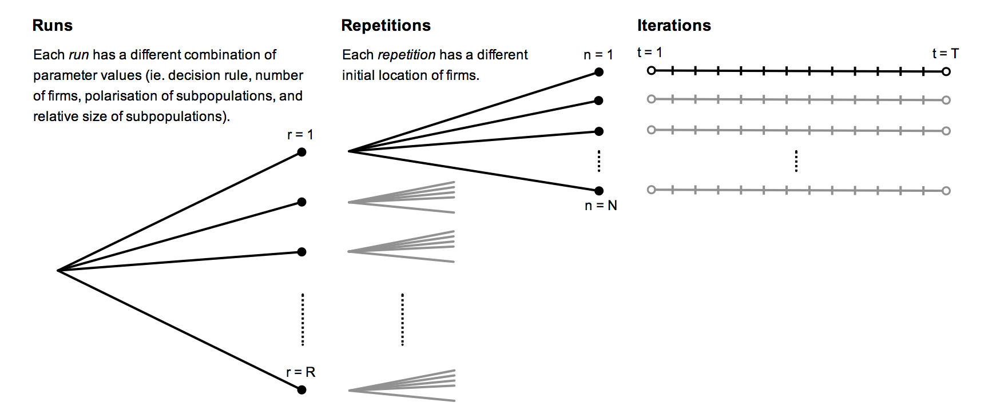
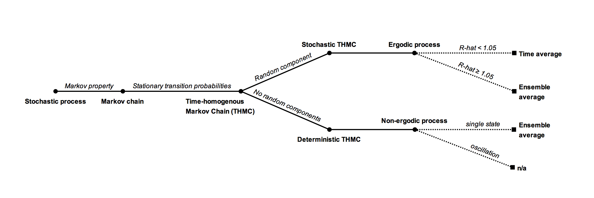

# Draft

_[Abstract: ... ]_

-----

<!--TOC-->

# 1. INTRODUCTION

{{Introduction.md}}

# 2. LITERATURE REVIEW

{{Literature review.md}}

# 3. MODEL & METHODOLOGY

To analyse the location behaviour of firms we construct an agent-based based model[^computation] akin to Laver and Sergenti (2011). We reformulate the model in terms of firms competing for customers when they choose their geographical location. It is simply shorter to write ‘firms’ and ‘relocate’ rather than ‘political parties’ and ‘shift policy position’ and it reads more naturally. The results of the model are still valid in a political context, as well as in the context where manufactures competing for customers though product differentiation when choosing product characteristic along two dimensions. 

[^computation]: All models in this paper have been programmed from the button up. The code is available at https://github.com/jsekamane/Positioning/tree/master/Models/ABM. All the models are build in MATLAB (R2015a) and run on a MacBook Pro with a 2.6 GHz quad-core Intel Core i7 processor. In addition several of the models use MATLAB’s Parallel Computing Toolbox with 4 local workers taking advantage of the quad-core processor structure to process several runs in parallel.

The decision rule of firms is exogenously determined. In each iteration the decision rule of the firm determines its location. All firms choose their location simultaneously. The model executes several iteration and analyses how the interaction of the firms affect the overall location of firms. The model assumes that all firms charge the same price, and thus this paper abstracts away price competition, and only considers location differentiation. Price competition greatly increases the complexity of the model, and is therefore beyond the scope of this paper. Furthermore firms can and do change prices more frequently than they change location. Thus price completion and location competition take place on two different time scales — a fast and a slow. It remains an open question how to appropriately incorporate the different time scales into an unified iterative model.

## 3.1 Consumers

The scope of this paper is limited to one side of the market -- the firms and their decision-making behaviour. For this reason simplifying assumptions are used with regard to the other side of the market -- the consumers and the purchasing behaviour of consumers. For one thing consumers are static. They do not shift position, they maintain preferences, they are obliques to trends, and are in no way influenced by changes in the market. Secondly consumers behave non-strategically and demand inelastically. They always purchase a single unit from the closest firm, regardless of the distance to the firm. And finally all firms are identical in the eyes of the consumer. There is no brand recognition and no loyalty -- the customer purchase from the closest firm regardless of previous purchasing history.

Every consumer has an ideal point in the market. This is the point where the consumer wants a firm to locate. All other points are second to the ideal point. And the further away from the ideal point that the firm locates, the less attractive it becomes. Consumers have *single peaked preferences*. Essentially this paper reduces consumers to being merely their ideal points. 

Viewed in terms of geography the ideal point would be the consumer's physical location and the distance is the bee-line distance to firms. Alternatively the model can be viewed in terms of product differentiation. Then the ideal point of the consumer is his or her desired product characteristic along the two dimensions. We assume *horizontal product differentiation* along both dimension, ie. product characteristic are non-ordinal. In addition we need to assume that product characteristics are continuous and infinitely divisible.

The utility function for each consumer is a function of the distance from the consumer’s ideal point and to the position of the firm. The utility function is equivalent to a quadratic loss function. The Euclidean distance metric is used. The utility of customer $i$ is the negative squared distance between customer $i$ and the closest firm $j$:

$$ U_i(j) = -d(i,j)^2 $$

### Consumer distribution

The simplification of consumer’s behaviour allows focused attention on the behaviour of firms. As discussed in the literature review the distribution of consumers can fundamentally change the behaviour of firms. We would like to capture and analyse these changes -- in particular the effects from asymmetric and multimodal distributions. We follow the method used by Laver and Sergenti (2011) and assume two consumer subpopulations in our market. When the two subpopulations have the same mean ideal point then the aggregated distribution of consumers will be symmetric and unimodal. While subpopulations with vastly different mean ideal points and different sizes will lead to an aggregated distribution of consumers that is asymmetric and bimodal. Thus this method of using two subpopulations is able to capture several different types of aggregate distributions using only two parameters; the polarisation of subpopulation ideal points, and the relative size of the two subpopulations. 

The market is two-dimensional, so we use the two-dimensional equivalent of the *normal distribution* -- the *bivariate normal distribution*. Both subpopulations follow a bivariate normal distribution. Using different mean values in the distribution imply that the subpopulations disagree over the ideal point. Without further restrictions the subpopulations would disagree on both dimensions. To simplify the analysis, and without lose of generality, we assume that the subpopulations have a common ideal point along one dimension and only disagree over the ideal point along the other dimension. This is equivalent to rotating the market space or coordinate system until disagreement only appears along one of the dimensions. Ie. rotating the market space such that the line going through the mean ideal points of subpopulations is parallel to an axis. One can always rotate the coordinate system without loss of information, and so this simplifies our analysis without any loss of generality. This is similar to the orthogonal transformation underlying a *principal component analysis*. We start out with two dimensions or components, and end up with two new dimensions; the disagreement dimension (x-axis) and the agreement dimension (y-axis). The two subpopulations -- from now on referred to as 'left' and 'right' -- follow a *bivariate normal distribution* with mean $(-\mu,0)$ and mean $(\mu,0)$ respectively, and both with standard deviation (0.5, 0.5).[^covarmatrix]. Where the parameter $\mu$ measures the ideal point polarisation. The parameter measuring the relative size of the left subpopulation is $n_l/n_r$. The aggregated consumer distribution is a *mixed bivariate normal distribution* with weights based on the relative size of the subpopulations (Weisstein 2002b, Balakrishnan and Lai 2009):

$$f(x,y) = \frac{n_l/n_r}{1+n_l/n_r} f^{(l)}(x,y) + \frac{1}{1+n_l/n_r} f^{(r)}(x,y), \quad f^{(i)}(x,y) = \frac{e^{-\frac{(x-\mu_{x,i})^2}{2(\sigma_{x,i})^2} - \frac{(y-\mu_{y,i})^2}{2(\sigma_{y,i})^2}}}{2\pi\sigma_{x,i}\sigma_{y,i}}$$

The mean ideal point on the y-axis is 0 for both subpopulations hence no disagreement along this dimension. The mean ideal point on the x-axis is $-\mu$ for the left subpopulation and $\mu$ for the right subpopulation. For $\mu > 0$ there is disagreement along the x-axis. I will analysis the polarisation parameter in the range $\mu \in [0, 1.5]$ -- a range that spans both a unified and a split market. At the lower bound of the range there is no disagreement and the market consists of one unified customer base. At the upper bound there is essentially no overlap between the subpopulations and the customer base is split. The range of the relative subpopulation size is $n_l/n_r \in [1, 2]$. The subpopulations are equally large when the $n_l/n_r = 1$, while $n_l/n_r = 2$ indicates that the left subpopulation is twice the size of the right subpopulation. See figure _[##]_.

The default unit of measure throughout this paper will be standard deviations. This unit of measure will refer to the standard deviation measurement used in the bivariate normal distributions. E.g. when this paper reports that the distance between two points is 1 standard deviation then this is equivalent to twice the standard deviation in the subpopulation distribution. The unit of measure is independent of the space and the coordinate system, making it easier to compare results with other studies.

[^covarmatrix]: We further assume no correlation among the two dimensions. The correlation coefficient $\rho$ is zero and thus the covariance matrix is $\left[ \begin{array} 0.5^2 & 0\\ 0 & 0.5^2 \end{array} \right]$.

Given the aggregated consumer distribution one approach would be to randomly draw a finite number of consumers from the distribution. Market shares can then be calculated by counting the number of consumers. Like Laver and Sergenti (2011) this paper will not employ this approach. Instead the consumer distribution is carried through and market shares are calculated by aggregating probability mass. Similarly the centroid of the market is weighted by the probability mass rather than the number of consumers (centroid shown in figure _[##]_). Although the approaches will yield the same results on average, the latter is independent of particular draws, thus we save computational power not having to execute several repetitions to obtain average values.

We will now evaluate the consumer distribution function, with particular focus on the combinations of the parameter values that give rise to a single peak in the distribution, and the combinations which give two peaks. This information will help us interpret the results of the model later on. The consumer distribution function is a mixed bivariate normal distribution. The distribution is symmetric along the y-axis, so the peaks and saddle points of the distribution will all have coordinate zero, $y^p = y^p_r = y^p_l = y^s =0$. We need only focus on determining the coordinates of the peaks and saddle points along the x-axis. Because of the symmetry and zero covariance between x and y, we can determine the x-coordinates using the marginal probability function $f_x$. This function is equivalent to a mixed univariate normal distribution (Weisstein 2002a, Weisstein 2002b, Balakrishnan and Lai 2009). We express the function in terms of the free parameters; polarisation of the ideal points of the subpopulation, $\mu$, and the relative size of the subpopulation $n_l/n_r$:

$$f_x(x,\mu,n_l/n_r) = \frac{n_l/n_r}{1+n_l/n_r} \frac{ e^{-\frac{(x+\mu)^2}{2\left(\frac{1}{2}\right)^2}}}{\sqrt{2\pi}\sqrt{\frac{1}{2}}} + \frac{1}{1+n_l/n_r} \frac{ e^{-\frac{(x-\mu)^2}{2\left(\frac{1}{2}\right)^2}}}{\sqrt{2\pi}\sqrt{\frac{1}{2}}}$$

To find extrema points we differentiate with respect to $x$:

$$\frac{\partial f_x(x,\mu,n_l/n_r)}{{\partial x}}  = \frac{n_l/n_r}{1+n_l/n_r} \frac{ e^{-2(x+\mu)}}{\sqrt{\pi}}\left(-4(x+\mu)\right) + \frac{1}{1+n_l/n_r} \frac{ e^{-2(x-\mu)}}{\sqrt{\pi}}\left(-4(x-\mu)\right)$$
$$= \frac{-4e^{-2(x+\mu)} \left((x+\mu)n_l/n_r + (x-\mu)e^{8x\mu} \right) }{(1+n_l/n_r)\sqrt{\pi}}$$

Setting the derivative equal to zero and rearranging gives:

$$\frac{\partial f_x(x,\mu,n_l/n_r)}{{\partial x}} = 0 \Leftrightarrow (x+\mu)n_l/n_r + (x-\mu)e^{8x\mu} = 0$$
$$\Leftrightarrow n_l/n_r = - \frac{x-\mu}{x+\mu} e^{8x\mu}$$

It is not possible to solve for x, so instead we plot the equation in a $(\mu, x)$ diagram to evaluate the expression, see figure _[##]_. The curve splits into several branches revealing the bifurcation, ie. for specific combinations of $\mu$ and $n_l/n_r$ our x takes on multiple values (Strogatz 1994). As $\mu \to 0$ implies $x \to 0^-$ when approaching from the negative side. However as $\mu \to 0$ and $x > 0$ we will observe a jump between $\mu \simeq 0.657$ and $\mu = \frac{1}{2}$. The bifurcation implies that all the models in this paper are non-linear.

![Bifurcation diagram. The curves indicate the extrema points of the population density function along the x-axis. The left subpopulation is respectively twice as large (yellow curve), half as large (red curve) and just as large (blue curve) as the right subpopulation. The grey dotted lines indicates the mean ideal points of each subpopulation. The solid black line separates the right peak of the distribution from the saddle point at different relative sizes of the subpopulations. The dots indicate the breaking point between the unimodal distribution and the bimodal distribution.](Graphics/Bifurcation.png)

Unsurprisingly we see that with no polarisation, $\mu = 0$, the distribution is unimodal with a single peak at $x^p=0$ regardless of the relative size of the subpopulation $\left(\forall n_l/n_r\right)$. With a low degree of polarisation, $\mu \in \left(0,\frac{1}{2}\right]$, the distribution remains unimodal with a unique peak in between the origin and the mean ideal point of the left-subpopulation, $x^p \in (0,{\bar x_l})$, where the mean ideal point is ${\bar x_l} = -\mu$. The relative size of the subpopulation determines the exact value of $\mu$, for which the distribution becomes bimodal. With subpopulations of equal size, $n_l/n_r=1$, the distribution is bimodal for $\mu > \frac{1}{2}$. In addition the peaks of the distribution are located at equal distance to the origin, while the saddle point is located at the origin, $x^s = 0$. As the relative size of the subpopulation increases so does the value of $\mu$, for which the distribution becomes bimodal. To determine this breaking point, we can differentiate equation _[###]_ with respect to $x$[^break]. As the polarisation of the subpopulation, $\mu$, increases the peaks of the distribution converges towards the mean ideal points of each subpopulation, $x^p_r \to {\bar x_r} = \mu$ and $x^p_l \to {\bar x_l} = -\mu$. With an unequal sized subpopulations, $n_l/n_r > 1$, the saddle point lies slightly to the right of the origin, $x^s > 0$. The asymmetric bifurcation diagram arises, because we choose to model the left subpopulation larger than the right, by choosing the range $n_l/n_r \in [1,2]$.

[^break]: $\frac{\partial n_l/n_r}{{\partial x}} = - \frac{2 \mu e^{8x\mu} \left(4\mu^2-4x^2-1\right)}{(\mu+x)^2} = 0$ $\Leftrightarrow x_{max} = \frac{1}{2} \sqrt{4{\mu}^2-1} \Leftrightarrow \mu_{max} = \frac{1}{2} \sqrt{4x^2+1}$ where $x_{max}$ (or $\mu_{max}$) is the breaking point between the right peak and the saddle point of the distribution. By substituting $x_{max}$ into _[##]_ we get an expression for the breaking point in terms of combinations of $\mu$ and $n_l/n_r$: $n_l/n_r = - \frac{\sqrt{4{\mu}^2-1} -2\mu}{\sqrt{4{\mu}^2-1} +2\mu} e^{4\sqrt{4{\mu}^2-1}\mu}$. Further note that if $n_l/n_r$ is lower than the right-hand side of the equation, then the distribution is bimodal, and visa versa. At the upper limit of our range, when the left subpopulation is twice as large as the right ($n_l/n_r=2$), we have that $\mu \simeq 0.657$, ie. for any $\mu > 0.657$ the distribution is bimodal. Table _[##]_ provide descriptive statistics on the consumer distribution and the coordinates for the peaks of the distribution.

{{popstat.md}}

## 3.2 Firm behaviour

We now turn our attention to the behaviour of firms. Below we present the decision rules, the underlying rational for each rule, and the assumptions and information necessary for each rule. Only the decision rules for the baseline models are presented. Once we have analysed the model with these rules and gotten a better understanding of each rule, we will extend the model to include foresight and inductive reasoning. All firms choose their location simultaneously, and in each iteration the decision rule of the firm determines the location of the firm.

Ideally we would want each firm to choose the location that maximises its share of the market, given the location of the other firms. However all firms choose their location simultaneously, and thus when a firm has to choose its own location, the location of other firms is unknown. The firm can use the predicted location of the other firms. But the location outcome that each firm is trying to predict, depends on predictions that the firm and other firms form. This self-referential loop leads to logical indeterminacy and so the maximisation problem is ill defined. Instead of solving for the optimal location that maximise market share, firms may use heuristics or rules of thumb when they choose location. The literature review provided an overview of the many different decision rules previously considered. This paper will use three of the heuristic decision rules laid out by Laver and Sergenti (2011) as the base to which other decision rules are compared. We use the *sticker*, *aggregator* and *hunter*-rule since they represent respectively no exploration of the space, the social optimal and unceasing exploration for better locations.

### Sticker-rule

The simplest decision rule a firm can use is the *sticker*-rule. With this decision rule the firm sticks to its initial position regardless of what happens. This could be a firm that is either unwilling to change or incapable of change. The management of the firm may have an unyielding belief in the long-run superiority of the position of the firm, discouraging it from any change, even in times of despair. Ie. a belief that the market share of the firm will always recover and excel in and of itself. The firm might also be unable to change, due to financially constraint such as the fixed cost of relocating or investments that cannot be recuperated. And finally, given the  task of predicting the future location of all other firms, the firm might see its current position as less risky than a new location based on uncertain predictions.

### Aggregator-rule

Firms using the *aggregator*-rule constantly seeks to please its own customer base. The firm does not try and predict the future. Instead it takes its current market area and locates at the centre of it. More specifically the centre or *centroid* is the mean ideal point of all customers of the firm. Thus the centroid position takes into account the population density within the market area, drawing the firm towards the centre of mass (see figure _[##]_).

The future landscape of competing firms may change and with it the market areas. So there is no guarantee that the current centroid is also the centroid of the future. Nonetheless firms using the *aggregator*-rule continually pursue the mean ideal point of their customer base. Likewise there is no guarantee that the relocation of the firm will increase market shares, or even maintain current shares. Market shares are in a sense a secondary priority for the firm using the *aggregator*-rule. The management of the firm may reason that they can retain and recruit new customers by pleasing their current customers[^loyalty]. 

[^loyalty]: Noted that customer loyalty is not incorporated in the models. Customers always choose the closest firm regardless of previous purchasing history. And this might understate the efficiency of firms using the *aggregator*-rule in markets with high degree of customer loyalty.

When all firms in the market use the *aggregator*-rule then the model is an implementation of the *Lloyd’s algorithm* and the location of firms will converge to the stable *Centroidal Voronoi Tessellation* (Laver and Sergenti, 2011, chapter 3 pp. 48-49). The *Centroidal Voronoi Tessellation* (CVT) is a special geometric construction where each firm is located at the centroid of its own market area. *Aggregator* firms located at the current centroid will not relocate. Hence when all firms use the *aggregator*-rule the CVT is stable -- no firm relocates. The CVT has the useful property that the distance between all customers and their closest firm is minimised. The location of firms is socially optimal when the average distance to consumers is minimised. This will prove useful later on when comparing the social welfare of the different decision rules. The all-aggregator model will maximise our measure of social welfare.

The underlying requirement for a *aggregator* firm is that it has perfect knowledge of its current customer base. The firm knows the span of its current market area and the distribution of customers within the area, such that the firm can correctly determine the mean ideal point of its customers.

The *aggregator* firm never relocates outside its current market area. But otherwise there is no limit as to how far an *aggregator* firm can move at each iteration. The firm nonetheless tends to move in relatively small steps, unless the market is extremely unstable. 

### Hunter-rule

The *hunter*-rule is a trial-and-error type of decision rule. The firm continues in the same direction, if it previously proved fruitful, and otherwise the firm heads in the opposite direction. At each iterations the firms move what corresponds to 0.1 standard deviation of the population distribution. If the previous move did not increase the market share, then the firm turns around and heads in a random direction drawn from the 180 degree arc now in front of it. 

Firms using the *hunter*-rule never settle down. The firm endlessly hunts higher market shares with the same speed and intensity. For a firm with this decision rule there is no comfortable threshold share of the market that suffice or slows exploration. In the trade-off between exploration and exploitation the firm always chooses the first option. 

The only information used in the decision process of a *hunter*-firm is the current relative change to its market share and its current direction. No information going further into the passed is used. The firm may lack memory, or may emphasis the present to such a degree that information going further back is seen as worthless. The behaviour of a *hunter*-firm is most suited for a fast evolving market with high unpredictability.

The *hunter*-firm moves 0.1 standard deviations each iteration. This is the *speed of adaption*. It is beyond the scope of this paper to investigate the effects of changing the speed parameter. However Laver and Sergenti (2011, chapter 7, pp. 150-151) find evidence that a speed parameter of 0.1 standard deviations results the in largest market shares for a *hunter*-firm. They argue that this speed strikes the balance between quickly reaching better locations without overshooting these location when moving around. 

### Deliberate reaction to competitors

The above described heuristic decision rules are good first approximation on how firms might choose to locate. Especially in  a simultaneous multi-agent location model where the future location of other firms is unknown. Later on we would like to investigate how foresights affects our results. But before doing so, we need to return to the deliberate process of maximising market share. Ie. before we can answer how the firm locates given the *predicted* locations of competing firms, we need a new decision rule that determines how the firm locates given *any* location of competing firms. None of the above mentioned decision rule take the location of competing firms into consideration. In this section we develop a decision rule that assumes that competing firms stay at their current location. Later on we extend the decision rule so it includes location predictions and learning. In the end we will have reintroduced strategic considerations into the simultaneous location model.

For now assume that competing firms stay at their current location. We want to know where the firm should relocate to maximise its market share. When a firm relocates it gains new customers and loses others. Thus there is a trade-off between the areas of the market that it gains and the areas that it loses. To simplify matters even further we only focus on the first effect. The problem is then equivalent to a new firm entering a market — populated with competing firms — and choosing the location that will maximise its share. There is extensive research on competitive location models such as the Hoteling model and the Voronoi game, and on the geometry behind Voronoi diagrams. Yet only four papers provide methods on how to find the location that maximises the market of a firm in two-dimensional space. The methods all concern the location of newly entering firms. None consider the optimal location of an existing firm that relocates. Cabello, Díaz-Báñez, Langerman, Seara and Ventura (2010) use the *reverse nearest neighbour* method to find the position that maximises the number associated points or customers. However their method requires a finite number of points. Thus this method is not applicable, since we assume an infinitely continuous number of consumers by using the distribution of consumers. The remaining three papers use continuous distributions, but they assume the distribution is uniform, which also make them unsuited for our needs, since we have a mixed bivariate normal distribution. Averbakh, Berman, Kalcsics and Krass (2015) use a method that partitions the solution space into smaller regions. The partition is done in such a way that the structure of the Voronoi diagram is unaffected by how the firm locates within each region. The structure is only affected by which of the regions the firm locates in. The partition simplifies the problem to a *search problem* over all regions. Their method uses the *Manhattan* distance metric. The partitioning also work with *Euclidian* distance metric. However it might be impossible to obtain exact solutions with this distance metric, because of the complexity that the *Euclidian* norm introduces in the object function (Averbakh, Berman, Kalcsics and Krass, 2015, pp. 409-410). The models in this paper uses the *Euclidian* distance metric. Cheong, Efrat and Har-Peled (2007) note the difficulties in finding analytical solutions to the problem and develop an algorithm that approximates the maximum of the object function. Their method finds the largest circle that is contained within each existing market area and that does not contain any of the existing firms. They construct squares with lengths equal to the radius of the largest empty circles and with the same centre as the circles. These squares are partitioned into grids and they use an *$\epsilon$-approximation* method to pick the cell in the grid that maximises the market area. As previously mentioned Cheong, Efrat and Har-Peled (2007) assume a uniform distribution of customers. When working with non-uniform distributions the largest empty circles is a poor criteria to narrow down the search for maximum, since there is no guarantee that a dominant part of the density mass falls within the circle. The last paper by Dehne, Klein and Seidel (2002) proves that if the location of neighbouring firms span a convex hull, then there exists a unique local maximum inside this convex hull. They use a Newton method to calculate these local maxima within each of the Delaunay circles (that is the smallest circles covering the triangles in the Delaunay Triangulation). In addition they check for corner solutions, ie. locating on top of existing firms. The optimal location for the new firm is then maximum of all these local maxima. The case where the neighbouring firms do not span a convex hull is left open. And so they only provide a partial solution to the problem. There is nothing that prevent neighbouring firms from locating such that they do not span a convex hull in the models of this paper, and thus this method is not suitable either. 

None of the currently existing methods are applicable to the models used in this paper. This is due to the non-uniform infinitely continuously distribution of consumers, where neighbouring firms may not form convex hulls, and because we use the Euclidian distance metric. Since there does not exist any methods capable of finding the optimal solution, we are forced to develop a method that roughly approximates the solution. I draw on the commonalities of these papers when constructing the decision rule that explicitly tries to find the location that maximise the market share of the firm.

### Maxcov-rule

Firms using the *maxcov* decision rule aims for the location that maximises the number of customers. The firm assumes that the ideal location lies in the gaps between competing firms. The firm considers all the gaps and picks the one with the most consumers. Each gap is a triangle in the Delaunay Triangulation. The Delaunay Triangulation is constructed using only the location of competing firms, and the boundary points of the space, see figure _[##]_. The latter insures that the firm also considers locations that lie outside the area spanned by competing firms (Cheong, Efrat and Har-Peled 2007 p. 556). The triangle with most consumers is selected[^mostcustomers]. The ideal location is the weighted mean ideal point of all customers within that triangle. We use the density of consumers as weights.

[^mostcustomers]: The triangle with the most consumers is a proxy for the actual market share obtained by the firm once it locates within the triangle. The triangle and the actual market or Voronoi set (obtained once the firm locates) differs in shape and size. The triangle with most consumers may not always be the triangle that results in the highest market share for the firm. However in 40-90% of the cases the triangle with most consumers is also the triangle that results in the highest market share. If the firm did not locate in the triangle with most consumers, but select any one of the Delaunay triangles with equal probability, it would picked the triangle that results in the highest market share in only 4-16% of all cases. Although this approach is not perfect, it is sufficient and computationally fast. The problem is reduced to a *search problem* over all the $2+2(N-1)$ Delaunay triangles, where $N-1$ is the number of competing firms.

Rather than move directly to the ideal position, the *maxcov*-firm, moves 0.1 standard deviations in the direction of the ideal position. There are two reasons for this gradual adjustment. First, it makes the speed at which the *maxcov*-firm moves comparable to the speed of the other decision rules. Recall that the *hunter*-firm moves 0.1 standard deviations, and  that the *aggregator* never moves outside its current market area. Secondly, the ideal position of the firm is sensitive to changes in the position of competing firms. Even minor changes may alter which of the triangles contain the most customers, and thus lead to significantly different ideal position. The gradual adjustments leads to less volatile variation in the relocation pattern of the firm, which is necessary later on when firms attempt to predict the future location of the firm.

When a *maxcov*-firm chooses its location it explicitly assumes that competing firms remain at their current position. When the firm chooses its location the location of the other firms is unknown. Not knowing how the other firms will move and without predictions it may be reasonable to use the current position of the firm as the best point of reference.

In determining its location the *maxcov* firm uses information on the location of competing firms. Additionally it is assumed that the firm has perfect knowledge of the consumer distribution such that it can determine which of the gaps contain the largest number of consumers[^knowdist].

[^knowdist]: Alternatively -- and perhaps more realistically -- the firm could approximate which gaps contained the largest number of customers by using the market share of the three surrounding firms (Fowler and Laver, 2008 p.75). However to avoid the effects arising from this approximation I assume the *maxcov*-firm have perfect knowledge of the distribution of customers.

## 3.3 Summary variables

There are three main perspectives we want to analyses in the competitive location model. One perspective is the location of the firms. Do firms agglomerate or cluster at particular locations or do firms disperse across the market space? Another perspective is the competitive environment. Is competition a *winner-take-all* game in which one firms is able to capture a predominant share of customers, or are customers evenly shared among firms? The last perspective concerns *social welfare*. How does the competition among firms affect the wellbeing of customers? To investigate these perspectives we construct three summary variables. All these variables aggregate the state of the market into a single measure that is comparable across parameter settings and models.

**Mean Eccentricity:**
To summarise the position of firms we use the mean eccentricity. Eccentricity measures the distance from a firm to the mean ideal point of all customers. Eccentricity has the desired properties of a summary variable. It is a single measure as opposed to the coordinates of the firm that are two dimensional. It is a relative measure that is naturally interpretable as the distance to the population centre. And since we use the mean ideal point which changes with the parameters, eccentricity is comparable across different parameter settings. Had we used the origin of the coordinate system instead, this would not change with the parameters and our distance would thus dependent on the specific parameter setting. In addition the origin is an arbitrary location and thus not easily interpretable. We take the average of all firms to get the mean eccentricity in each iteration.

**Effective number of firms (ENP):**
To summarise the competitive environment we use a relative measure of the market shares of the firms. This measure is known as the *effective number of parties* (ENP), but will in this paper be referred to as the *effective number of firms*. It measures the concentration of market shares among firms. The measure goes from 1 and up to the number of firms in the market (N). In a market with four firms where all firms have an equal share of the market the effective number of firms is four (ENP=N), while the effective number of firms is one (ENP=1) if a single firm captures the entire market. The ENP tells us how many firms would be in the market if they all had identical shares.

$$ENP = \frac{{\left( \sum\limits_j^N s_j \right)^2}}{{\sum\limits_j^N s_j^2 }}$$

The ENP is the inverse of the Herfindahl-Hirschman Index (Laakso and Taagepera 1979, p.4). The ENP and the index measures the same thing. However the ENP is the easiest to interpret across our parameter settings, since we change the number of firms in the market.

**Mean Representation:**
It is straightforward to create a measure that summarises the consumer welfare given our utility function (equation _[##]_). By taking the average over all customers we get the mean utility or mean representation in every stage. This measure tells us how well the location of firms represent the ideal points of consumers. The social optimal location of firms is the one that minimises the average distance to customers. This is equivalent to maximising mean representation.

## 3.4 Executing the model

We have now gone through the basic setup of the economic model. We have discussed the economical rational underlying consumers and the behaviour of firms. We have specified the variables of interest and how these should be interpreted. The following section gets slightly more technical as we delve into the methodology for solving the model and estimating the variables.

The decision rule of the firm determines how the firm chooses to locate in each *iteration*. We execute the model with several *iterations*, observe how the location of firms converges, and analyse how the decision rules and parameter values of the model affect the location of firms. Figure _[##]_ provides an example of the location of firms at different iterations.

![Trajectory plots for five hunter-firms in a market with an highly asymmetric and bimodal distribution of consumers ($\mu=1.5$, $n_l/n_r=2$). The dots indicate the location of each firm after 10, 20, … 100 iterations respectively, and the lines show the location in the ten preceding iterations. The location of the firms gradually converge to a limited set of locations surrounding the mean ideal points of the two subpopulations, with a majority locating around the largest of the two. The scales for the axis are shown in first and last panel, while the black cross indicates the mean ideal point of all consumers.](Graphics/figm.png)

Analytical models are solved mathematically. Results, sensitivity to parameter changes and verification of the procedure follows directly from the derivation of key equations. Whereas computer simulated models such as agent-based models requires some pre-planning and multiple executions in order to analyse results and insure trustworthy results. This type of pre-planning resembles what takes place in an experimental study and therefore the following outline of the procedure is also known as the *experimental design*.

### 3.3.1 Model parameterisation

To initiate the models we need to set the initial position of firms. The credibility of the results hinges on results that are independent of the initial positions. The model should produce similar end-results regardless of the initial position of firms. First of, we draw the initial positions randomly[^initpos]. Secondly, we execute several *repetitions* of the model with identical parameter values, but with varying randomly selected initial positions. We compare the results across *repetitions* to insure that the location of firms converge to the same limited set of locations. This will be the case in all our models, and thus we satisfy that end-results are independent of the initial position of firms.

[^initpos]: The position of a firm is drawn uniformly random from a disc centred at (0,0) and with a 3 standard deviation radius.

We want an *experimental design* such that we can evaluate how the parameters of the model affect results. So each model is executed with different combinations of parameter values and subsequently compared. To set the parameter values we employ two different methods. In the first set of models with symmetric consumer distribution, all firms use the same decision rule, and the model only has two parameters — the decision rule and number of firms. There are 4 decision rules and the number of firms can take on 11 different values, since $N \in [2, 12]$. The parameter values are integer numbers and the entire parameter space spans 44 cells or 44 combinations, so for these models we use the simple *grid sweep* method. This method *runs* through the entire parameter space executing each combination of parameters in turn. The last set of models have two additional parameters — the polarisation of the subpopulations $\mu \in [0, 1.5]$ and the relative size of the subpopulations $n_l/n_r \in [1, 2]$. The full parameter space is huge and these parameter values are real numbers with no “natural” increments. And so there is no intrinsic reason for a grid representation to be a fair representation the full parameter space, and even less so considering the nonlinearity of the models (see figure _[##]_). This makes the *grid sweep* method unsuitable, instead we use the *Monte Carlo parameterisation* method. For every *run* this method draws the values of parameters uniformly random. With sufficiently many *runs* the method is able to map out results spanning the entire parameter space.

To summarise we execute several *runs* to evaluate the effect of the different parameters. In each *run* we execute several *repetitions* with the same parameter values, but with varying randomly drawn initial positions. In every *repetition* the model goes through numerous *iterations* enabling the location of firms to converge. And at each *iteration* the decision rule of the firm determines how the firm locates. See outline of the experimental design in figure _[##]_.

### 3.3.2 Markov chain

We have laid out the specifications of our model and will shortly turn to the methods used to estimate the output variables of the model. But first we take a look at the underlying process of a *run* of the model. We show that a *run* of the model constitutes a *stochastic process*. Laver and Sergenti (2011) note that most computational models can be represented by a particular *stochastic process* known as the *time-homogenous Markov chain*. We present the necessary conditions for a *time-homogenous Markov chain*. When the model satisfy these conditions we have prior knowledge of the dynamics of the process — in particular convergence and steady state. Knowing the dynamics of the process lets us construct methods that give accurate estimates of the output variables.

#### Stochastic process

The model generates a vector with the values for all output variables at each iteration in every repetition. The values of the vector could fore instance be the coordinates of the firm, the market share of firms, a measure of the effective number of firms (ENP), a measure of the eccentricity of locations and a measure of the firms representation of consumers’ ideal points. We follow Laver and Sergenti (2011) and use the following notation; $y_t^{(n)}$, where $y$ is the vector of values, $t$ is the iteration number and $n$ the repetition number. One repetition of the model with ten iterations would produce a series of ten vectors; $( y_1^{(1)}, y_2^{(1)}, … y_{10}^{(1)} )$. Because of the randomly drawn initial positions of firms, the exact values of these ten vectors depend on the *random seed*[^pseudorandom] and another *repetition* with a different random seed returns different values of the vectors. We can use this to our advantage if we use a different random seed for each repetition. Then the vector $y_t^{(n)}$ represents a single realisation of a *random vector* $Y_t$, where $Y_t$ is all possible realisations of $y$ at iteration $t$. That is $y_1^{(1)}$ is a realisation of $Y_1$ associated with repetition 1. Similarly the series of vectors $( y_1^{(1)}, y_2^{(1)}, … y_{10}^{(1)} )$ is a realisation of $( Y_1, Y_2, … Y_{10} )$ associated with repetition 1. The series of random vectors $( Y_1, Y_2, … Y_{10} )$ represents a *stochastic process*. And so one *repetition* gives a series of vectors, eg. $( y_1^{(1)}, y_2^{(1)}, … y_{10}^{(1)} )$. While a *run*, which consists of multiple *repetitions*, constitutes a *stochastic process*.

[^pseudorandom]: Computers are deterministic machine incapable of generating truly random numbers. Instead they use a pseudorandom number generator that approximates random numbers. The pseudorandom numbers are completely determined by the *random seed*. The random seed is the number used to initialise the pseudorandom number generator. Initiating the generator with the same random seed will produce the same sequences of random numbers. While initiating the generator with different random seeds produce different sequences of random numbers. Further note that the different sequence of numbers are independent and identically distributed (IID) across the random seeds. Although the numbers stemming from a pseudorandom number generator are not truly random, they are sufficiently random for most applications including the models in this paper.

There are three factors that distinguish different stochastic processes. One factor is the range of all the possible values that the random vector might take. This is also known as the *state space*. Another factor is the iteration *index set*. In the example above with ten iterations the index set is $\{1, 2, … 10\}$. This paper will only focus on discrete-time processes. The last factor is the dependency between the random vectors, $Y_t$, in the process.

#### Time-homogenous Markov chain

The Markov process is a particular stochastic process that satisfies the Markov property. The Markov property restricts the dependencies of the random vectors in the process, namely that the future state of the process may depend on the current state, but cannot depend on any of the previous states of the process. In other words the Markov process, with a vector of the state space, $X_t$, satisfies the Markov property if:

$$Prob\left[ {X_{t+1} = j} \left| {X_t = i, X_{t-1} = i_{t-1}, ... X_0 = i_0} \right. \right] = Prob\left[ {X_{t+1} = j} \left| {X_t = i} \right. \right] \quad \forall t$$

for all states of the process $i_0, ... i_{t-1}, i$, and $j$. In this paper the state of the process simply summarises the location of all firms. Eg. state $i$ refers a specific and unique location of all firms, this could be the initial position of firms. If one or more firms change location then the process enters a different state $j$. If all firms returned to their respective initial positions, then the process would once again be in state $i$. The state space contains all possible states of the process. With a finite state space, we can write the one-step transition probability as $P_{ij}^{t,t+1} = Prob\left[ {X_{t+1} = j} \left| {X_t = i} \right. \right]$, which is the probability for $X_{t+1}$ being in state $j$, given that $X_t$ is in state $i$. A time-homogenous Markov chain further requires that the transition probabilities are independent of the iteration parameter; $P_{ij}^{t,t+1} = P_{ij}$. This is also known as a Markov chain with *stationary transition probabilities*. Only the current state affects the probability of the next state in the process and probabilities stay constant over time. Figure _[##]_ provides stylised examples of different time-homogenous Markov chains. We use matrix notation to shorten the equations describing the evolution of the process[^dimension]. We can represent all the stationary *one-step transition probabilities* using the *transition probability matrix*, $\rm P$. The *state space distribution vector*, $\pi_t$, represents the unconditional probability distribution of the state space at time $t$. Each element $i$ in the vector describes the probability that the process will be in state $i$ at iteration $t$. The *state space distribution* then evolves as given by $\pi'_{t+1} = \pi'_t \rm P$. From this equation it follows that if we know the initial state space distribution, $\pi_0$, we can derive the state space distribution vector, $\pi_t$, using $\pi'_t = \pi'_0 {\rm P}^t$.

[^dimension]: We let $s$ denote the dimension of the state space, that is the number of possible states. The transition probability matrix $\rm P$ is a $s \times s$ sized matrix. The size of the *state space distribution vector* $\pi_t$ is $s \times 1$.

![Stylised examples of time-homogenous Markov chains. Each arrow has a corresponding positive one-step transition probability, $P_{ij}$ (no arrow indicates that the one-step transition probability is zero). The process or *run* starts with an initial state space distribution $\pi_0$, where each element $i$ in the vector $\pi_0$ is the probability of the process starting in state $i$. The process converges to the stationary state space distribution, $\pi_\infty$ (states within the shaded area have positive probability, while states outside have zero probability). The random component in the all-hunter model insures that all one-step transition probabilities between different states are strictly positive. A hunter-firm never settles down and thus there are no self-loops (the diagonal in the *transition probability matrix*, $\rm P$, consists of zeroes). However the process is ergodic so it converges to a unique stationary state space distribution, $\pi_\infty$, regardless of the initial state space distribution. The all-sticker and all-aggregator model are deterministic THMC, thus all one-step transition probabilities equal 1. Both models converge to a single state rather than a distribution of states, since there is no oscillation. However the processes are non-ergodic, and thus the single state depends on the specific probabilities in initial state space distribution $\pi_0$.](Graphics/Markov2.png)

We have argued how a *run* of our model constitutes a stochastic process and linked it to the dynamics of Markov chains. We are now at a point where we can look closer at convergence and steady state. The state space distribution vector is *stationary* when $\pi_{t+1} = \pi_t$. Because of the randomly drawn initial location of firms the initial state space distribution, $\pi_0$, is seldom stationary and several iterations are need. The process reaches steady state once the state space distribution becomes stationary. That is $\lim_{t \to \infty} \pi_t = \pi_\infty$, where the stationary state space distribution, $\pi_\infty$, solves $\pi_{t+1} = \pi_t$. All time-homogenous Markov chains converge to at least one steady state distribution. A process that converges to a unique distribution vector, $\pi_\infty$, regardless of the initial distribution vector, $\pi_0$, is known as an *ergodic* process. There are two types of time-homogenous Markov chains (THMC); *stochastic THMC* that contain a random component (besides the randomly drawn initial positions), and *deterministic THMC* that do not contain any random component and where the probability that the random vector, $Y_t$, takes on a particular values is 1. This distinction is useful since not all THMC are *ergodic*, but as Laver and Sergenti (2011, chapter 4, p. 64) note all *stochastic THMC* with a finite state space are *ergodic*. With a random component in the process each state has strictly positive probability of being reached in a finite number of iterations, thus the process avoids “getting stuck” and eventually converges to the unique distribution vector (Laver and Sergeant, 2011 chapter 4, p. 71). Recall that a hunter-firm turns around and heads in a randomly selected direction. A random component such as this insures that the process is *ergodic*. We know that this process will converge to a unique state space distribution, $\pi_\infty$, and that this distribution is independent of the initial state space distribution. There is no guarantee that a *deterministic THMC* converges to a single state, since it might oscillate between several states. The deterministic process underlying the all-maxcov model — where all firms use the *maxcov* decision rule — may oscillate between several states. We will deal specifically with this special case in section _[##]_ — all other deterministic process in this paper converge to a single state. And all the *deterministic THMC* in this paper are non-ergodic. The arguments for these assertions are provided in appendix _[###]_. This means that although the process converges to a single state, this state is not unique, but depends on the initial position of firms. The method used to estimate the values of the output variables takes this into account, so our end-results are independent of the initial location of firms.

It is often possible to construct several Markov representations. When choosing the vector of the state space, $X_t$, one need to insure that the output variables, $Y_t$, can be derived from the vector of the state space, ie. $Y_t = f(X_t)$. In addition the vector of the state space, $X_t$, has to satisfy the Markov property. In most of the models in this paper the vector of the state space only needs to contain the coordinates of the firms, since we can calculate the remaining output variables from the coordinates[^discretecoord]. Once the vector of the state space, $X_t$, reaches steady state so will the output variables, $Y_t$.

[^discretecoord]: Although the coordinates take on real numbers in theory, in practice when executed on any computer there is a limit to the precision of the coordinates. Matlab stores values using up to 64-bits ([MathWorks 2016](http://se.mathworks.com/help/matlab/matlab_prog/floating-point-numbers.html)). This limited precision is enough for us to say that the coordinates are discrete (to a high level of precision), and thus the state space is finite (although very large).

#### Estimating output variables

We calculate a mean estimate for each of the values in the output variable. Ie. we calculate the mean estimate of the effective number of firms (ENP), the mean eccentricity and the mean representation. We want an accurate estimate of the output variable in steady state, and so none of the output variables obtained in transient states can be used to estimate the steady state. We discard all *burn-in* iterations, that is the iterations needed to reach the steady state. In the subsequent section we return to the empirical issue of determining the number of *burn-in* iterations, but for now assume that the process has burnt in.

Define $\psi_t^{(n)}$ as the expected value of the output variable $Y_t$ at repetition $n$ and iteration $t$. We know that in steady state the state space distribution vector is *stationary*. Thus in steady state the expected values of any of the output variables, $Y_t, Y_{t+1}, Y_{t+2}$, et cetera, must also be stationary, $\psi_t^{(n)} = \psi_{t+1}^{(n)} = \psi_{t+2}^{(n)}$ and so forth, for repetition $n$. Removing the time subscript we have that $\psi^{(n)}$ is the expected value of $Y_t$ for repetition $n$ over all iterations $t$ in steady state. Using this we can define the process of the output variable as the sum of expected value and disturbance term, 

$$Y_t = \psi^{(n)} + \varepsilon_t$$

The disturbance term, $\varepsilon_t$, is serially correlated across iterations and therefore indexed with $t$. We execute several repetitions not just repetition $n$. For each repetition we may have a different expected value, ie. a different value of $\psi^{(n)}$. So we model $\psi^{(n)}$ as the realised value of a random variable, where $\psi^{(n)}$ is drawn from a distribution with mean $\psi$ and standard deviations $\sigma_\psi$. Consequently $\psi$ is the expected value of $Y_t$ over all repetitions and all iterations in steady state. 

To estimate $\psi$ we can use the *ensemble average*. This entails executing several repetitions of a run, up until a pre-specified iteration $t$ that is within the steady state. And then taking the average over all repetitions of the realised values, $y_t^{(n)}$, of the output variable, $Y_t$, at iteration $t$:

$$\mbox{Ensemble Average}_t \mbox{ of } Y_t = \sum\limits_{n = 1}^N {\frac{ y_t^{(n)} }{ N }}$$

where $N$ is the total number of repetitions. The ensemble average converges to $\psi$ as the total number of repetitions go to infinity:

$$\psi = \mbox{plim} \sum\limits_{n = 1}^N {\frac{ y_t^{(n)} }{ N }}$$

The disadvantage of using the *ensemble average* to estimate $\psi$ is that we discard a lot of *burn-in* iterations. Fore instance if we determine that it takes 251 iterations for the process to burn in and we execute 100 repetitions. Then the first 250 *burn-in* iterations in each repetition are of no use when estimating the output variables in steady state. In total we discarding 250.000 iterations and only use information from 100 iterations (the last iteration in each repetition) in our estimate. By any stretch this is a highly ineffective use of computational resources. For this reason, when possible, we would prefer to use the *time average* to estimate $\psi$. This entails executing a single repetition of a run, up until a pre-specified number of post-burn-in iteration. And then taking the average of $y_t^{(n)}$ over all post-burn-in iterations:

$$\mbox{Time Average}^{(n)} \mbox{ of } Y_t = \sum\limits_{t = 1}^T {\frac{ y_t^{(n)} }{ T }}$$

where $T$ is the total number of post-burn-in iterations and all iterations, $t \in \{1,2, … T\}$, are within the steady state. As the total number of iterations go to infinity, the time average converges to $\psi^{(n)}$, ie. the expected value of $Y_t$ for repetition $n$. Recall that an *ergodic* process converges to the same unique state space distribution regardless of the initial distribution. And since the only difference between different repetitions within the same run is the initial positions of firms, it implies that the limiting state space distribution is independent of the particular repetition when the process is *ergodic*. So for a *ergodic* process we have that $\psi^{(n)}$ is equal to $\psi$, in which case:

$$\psi = \mbox{plim} \sum\limits_{t = 1}^T {\frac{ y_t^{(n)} }{ T }}$$

Recall the example from above where it takes 251 iterations for the process to burn in. We further assume that the process is ergodic and execute 100 post-burn-in iterations. Using the time average we execute a single repetition with an overall of 351 iterations. In total we only discard 250 *burn-in* iterations, and use information from the last 100 iterations to estimate $\psi$. In this example we reduced the number of discarded iterations by a factor 1.000 when using the *time average* instead of the *ensemble average*. However with a high degree of autocorrelation in the process it might not be possible to use the *time average* — which is what we show below. Further note that all our *deterministic time-homogenous Markov chains* are non-ergodic, so for these processes we have no other option, but to use the *ensemble average* to estimate $\psi$.

The disturbance term in equation [##] is independent and identically distributed (IID) across repetitions, because we use a different random seed for each repetition. As previously noted different random seeds give different sequences of numbers, and these sequences are IID, which in turn produce disturbance terms that at any given iteration are IID across repetitions. So when executing several repetitions the observed values at iteration $t$ will be reasonably equally spread around the true mean, and the *ensemble average* gives a representative mean estimate of $\psi$. The *time average* may not give a reasonably representative estimate, because the disturbance term is serially correlated across iterations. While an ergodic process will eventually map out the entire steady state distribution vector, $\pi_\infty$, the process is slow to map out the distribution if there is a high degree of autocorrelation. A fully mapped out distribution assures that the *time average* gives a representative estimate of $\psi$. To check whether enough observations have been collected to map out the steady state distribution vector we run several test repetitions. For each output variable we calculate the *R-hat statistic*[^rhat] (Laver and Sergenti 2011, Brooks and Gelman 1998). The R-hat statistic is a relative measure of the between-repetition variance and the total within-repetition variance. And thus the measure reveals whether there is potential to trim the state space distribution further by increasing the number of iterations. A low R-hat statistic indicates less potential to trim. In the limit the statistic tends to 1. This paper uses the typical cutoff level of 1.05. If the R-hat statistic for every output variable is lower than 1.05, then we feel confident that the steady state distribution has been mapped out and proceed to using the *time average* in the final execution of the model. If the R-hat statistic is above 1.05 we can try to increase the number of iterations and re-run the test, or we will determine that the speed of converges is prohibitively slow and resort to using the *ensemble average* in the final execution of the model. In the following section we distinguish between *stochastic THMC* where the *time average* provides a representative estimate of $\psi$ and those that do not. Ie. whether the R-hat statistic is below the cutoff level for all the output variables, or not. 

[^rhat]: The *R-hat statistics* is also known as the *potential scale reduction factor*. When running our test repetitions we calculate the *R-hat statistic* using the second half of all iterations. 

#### Determining burn in

![Example of trace plots. (a) A single repetition from a deterministic THMC. This repetition burns in after 12 iterations, where mean eccentricity flatlines. (b) A single test repetition from a stochastic THMC. Solid black line is the time-average estimate of $\psi$, calculated using the second half of all iterations. The dotted black lines indicate ± one standard deviation. This repetition burns in after 61 iterations, where the mean eccentricity first falls within one standard deviation of the estimate.](Graphics/temp_burn1.png)

We want to an estimate of our output variables in steady state. So for each model we need to empirically determine the number of *burn-in* iterations. For a deterministic THMC this is fairly straightforward, since the process converges to a single state. The process has burnt in once the values no longer change, ie. once the process becomes stationary. Empirically we set the *burnin* period to the maximum number of iterations it takes before the output variables flatline, see figure _[##1a]_[^deterburn]. A stochastic THMC converges to a distribution of states rather than a single state (see example in figure _[##1b]_), which make it slightly more difficult to empirically determine burn in. In the processes where the *time average* provides a representative estimate of $\psi$ we first identify the runs that require most iterations to converge — so called extreme cases. This is done by executing a few repetitions from different runs (ie. different parameter values) of the model and then visually inspecting the trace plots of the output variables[^traceplot]. Secondly, we execute several test repetitions with many iterations of these extreme cases. We focus on the extreme cases, since we want to find the number of *burn-in* iterations where all runs of the model have burnt in. For each test repetition we calculate the *time average* and corresponding standard deviation using the second half of all iterations[^secondhalf]. And finally, with our estimate of $\psi$ we determine that a particular test repetition has burnt in once the output variable is within one standard deviation of the estimated $\psi$, see figure _[##1b]_. We set the *burn-in* period to the maximum number of iterations it takes for each of the test repetitions to burn in. In the stochastic THMC where the *time average* does not provide a representative estimate of $\psi$, the first two steps are unchanged; first identify runs that require most iterations to converge, and secondly execute several test repetitions. However since we cannot use the *time average* to calculate a representative estimate of $\psi$ we must rely on a less rigorous method to determine the number of *burn-in* iterations. For every test repetition we inspect the trace plots of each of the output variables to determine when the test repetition appears to have reached steady state, see example in figure _[##2]_. We set the *burn-in* period to the maximum number of iterations it takes for each of the test repetitions to burn in. In the final execution of all our models we err on the side of caution and set the *burn-in* period slightly higher — often rounding up to the nearest fifty, ie. 50, 100, 150, etc.

. The tool displays all repetition in the same trace plot, with the option to highlight a specific repetition or all repetitions with a specific combination of parameter values. As well as the option to standardise the series. These figures are derived from the tool. (a) Multiple test repetitions from different runs, and hence with different parameter values. Highlighted in red and blue are repetitions with respectively 2 and 3 firms in the market. (b) Multiple test repetitions from different runs, where the mean eccentricity is standardised around the mean of the second half of all iterations. Standardising helps when having to determine burn in, especially when considering different runs with different combination of parameter values. Clearly the repetitions with 2 and 3 firms require most iterations to burn in. This model appears to have reached steady state after approximately 150 iterations.](Graphics/temp_burn2.png)

[^deterburn]: For each repetition we find the first iteration where the value of the output variable is equal to the value at the last iteration. From all the repetitions we select the largest of these iterations. This is then the number of iterations needed for all the repetitions in the model to burn in.

[^traceplot]: A trace plot displays the iterative history of a repetition, ie. the time series of one value of the vector $y_t^{(n)}$ by iteration, such as mean eccentricity by iterations or ENP by eccentricity, etc.

[^secondhalf]: The second half procedure is a sufficient although not a necessary condition for the process to burn in (Laver and Sergenti 2011, chapter 4, page. 73). We use this procedure to get a representative estimate of $\psi$, when we have yet to determine the actual number of *burn-in* iterations.

#### Oscillation in all-maxcov model 

The all-maxcov model, where all firms use the *maxcov* decision rules is a deterministic THMC. However unlike the other discrete THMC, this process does not necessarily converge to a single state. For certain parameter values and initial locations of the firm the process oscillates between several states. If the process oscillates between many vastly different states, then calculating the ensemble-average at iteration $t$ is unlikely to provide a representative estimate of $\psi$. And because the process is non-ergodic — the distribution vector, $\pi_\infty$ depends on the initial distribution vector, $\pi_0$ — the time-average will not provide a representative estimates of $\psi$ either. Instead we assume that the process oscillates between a few states where the location of firms only differ slightly, and then calculate the ensemble average. We create a new decision rule *maxcovrnd* with one slight modification: instead of moving 0.1 standard deviation, the firm randomly draws the speed parameter for a uniformly distribution with range $[0,0.2]$. On average the firm moves 0.1 standard deviation. But more importantly the process contains a random component, and so it constitues a *stochastic THMC*, where we know with certainty that the ensemble average provides a representative estimate of $\psi$. When we compare the results of the all-maxcov model to the all-maxcovrnd model we find that the results are indistinguishable (see appendix _[##]_). This confirms that the deterministic process does in fact oscillates between a few slightly different states. And so we feel confident that using the ensemble-average in the all-maxcov model provides representative mean estimates of our output variable. We prefer to use the *maxcov*-rule, rather than the *maxcovrnd*-rule, since we are going to extend the model with firms that try to predict the future location of the other firms. Evaluating predictions makes less sense when the location of firms contains a stochastic component.

### Recap

In sum we have constructed an experimental design that allows us to evaluate the effect of parameter changes, and insures that results are independent of the initial position of firms. We have identified the appropriate methods to estimate the our summary variables. The appropriate method depend on the underlying process, see outline in figure _[##]_. Understanding the underlying process of the run provides us with prior knowledge on how we should go about solving the model. However it still requires some effort and test repetitions to determine the number of *burn-in* iterations and to determine whether the *time average* provides representative estimates. Once this has been determined the final execution of the model is straight forward.

# 4. ANALYSIS

We are now ready to investigate the first models. We start with the all-sticker, all-aggregator, all-hunter and all-maxcov models. In each of these models all the firms use the same decision rule. Unlike Fowler and Laver (2008) that run a tournament to determine the best preforming decision rules, we want analyse the underlying dynamics of each decision rule and how these different decision rules affect the location behaviour of firm. By comparing results across the four different models we see how the location behaviour of the decision rules differ. We start with a symmetric unimodal distribution of consumers. The peak of the consumer distribution function coincides with the mean ideal point of all consumers. There is no polarisation of the mean ideal points of the two subpopulations and the subpopulations are equally large ($\mu=0$ and $n_l/n_r=1$). Thus there is the only one free parameter in each model; the number of firms $N$. We use the grid sweep method to set this parameter value.

## 4.1 Baseline model and decision rules

In the all-sticker model the firms remain at their initial position. They never relocate. Figure _[##]_ plots the mean eccentricity for each of the models. As expected we see that the average distance to the population centre is 1.5 standard deviation in the all-sticker model. This result reflects how the initial positions of firms are drawn, ie. uniformly random from a circle with radius of 3 standard deviations and centre at (0,0). And thus we find that on average a *sticker* firm will be located 1.5 standard deviations from the centre of the population -- irrespective of the number of firms in the market. 

In the three remaining models mean eccentricity is significantly lower. The initial position of the firms in these models are drawn from exactly the same distribution, but the firms clearly moved towards the population centre. 

In the all-aggregator model the firms aim to please their current customer base. The firms choose to locate 0.4-0.8 standard deviations away from the population centre with the distance increasing along with number of firms in the market. In the all-hunter model, where all firms constantly seek higher market shares, the firms choose to locate in closer proximity to the population centre than in the all-aggregator model. Hunter firms locate around 0.2 standard deviation closer to the centre than aggregator firms.

Despite the fact that the population centre has the largest density of consumers of any point in the market, firms consistently locate at a distance to this point — even *hunter* firms that constantly seek larger market shares. This suggests that locating too close to the population centre is suboptimal (Laver and Sergenti 2011 chapter 5). For a *hunter*-firm there is a short-run gain by moving closer to the high density population area. However the response from competing firms quickly erodes this gain, leading to the long-run location that lies at a distance to the population centre. Our estimate of mean eccentricity for five hunter firms is 0.44. Compare this to figure _[##]_, where we for each of the five *hunter* firms plot eccentricity against market share. When the individual firm locates 0.44 standard deviations from the population centre, its share of the market is around 21%. Locating closer to the population centre is associated with a higher share of the market for each individual firm, ie. a short-run gain. However all firms use the same disunion rule and thus no one firm has a long-run competitive advantage over its competitors. In the long-run the firm cannot sustain the larger market share, leading to the long-run location at a distance to the population centre.

_[Compare results to Eaton and Lipsey (1975) / equilibrium predictions (two firms).]_

In the all-maxcov model the firms deliberately attempt to maximise their market share. And the firm takes the location of competing firms into account, although it assumes that competing firms maintain their current position. Firms in the all-maxcov and all-hunter model locate at similar distance to the population centre. The main exception is in the market with two firms. In this case the *maxcov* firms locate at the same distance as *aggregator* firms. In the all-maxcov model there is only a slight tendency for firms to locate further away from the population centre as the number of firms increase. On average the *maxcov*-firms locate 0.4-0.5 standard deviations away from the population centre.

In the models the actual number of firms in the market is an endogenously determined parameter. Our experimental design allows us to investigate the models when there is anywhere from 2 to 12 firms in the market. To analyses the competitive environment we use a measure call the effective number of firms (ENP). The ENP takes the relative market shares of the firms into account. The ENP tells how many firms would be in the market if they all had identical shares of the market. If the actual number of firms and the effective number of firms is the same (thin 45 degree line in figure _[##]_), then the firms in the market split the market evenly. If the effective number of firms is less than the actual number, then one or several of the firms will have a disproportionate share of the market.

The effective number of firms is low in the all-sticker model, ranging from around 1.5 and up to 4.5. The initial position of firms gives some firms a clear advantage over the other firms in the market. And since *sticker* firms do not relocate the uneven concentration of customers persists.

In the last three models the market is fairly evenly split among the firms. This is the result of firms with identical decision rules competing among themselves. Since all firms use the same decision rule, no one firm has a long-run advantage over its competitors. And thus the firms end up with approximately the same long-run share of the market. With many firms in the market make it is increasingly harder to maintain the perfectly even split among the firms. And so we observe that the ENP is slightly below the actual number of firms in the all-hunter, all-aggregator and all-maxcov model when there are many firms in the market.

In the all-aggregator model with many firms the effective number of firms is slightly lower than the all-hunter and all-maxcov model. The reason for this is that with many firms the centre of the distribution easily overcrowds. *Aggregator*-firms locate to please their current customer base. And so overcrowding leads the firms to locate on different orbits around the centre. Firms located on the inner orbits attract a larger share of the consumers than the firms located on the orbits further away from the centre. And the unequal market share of firms reduces the effective number of firms (ENP) measure.

The mean representation measures the satisfaction of consumers. This social welfare measure calculates the average utility of all consumers. The utility of the consumer increases when the distance to the closest firm decreases. From earlier we known that the all-aggregator model will result in the location of firms that constitute a *Centroidal Voronoi Tessellation* (CVT). The CVT minimises the average distance of to all customers and therefore maximises our social welfare measure. The all-aggregator model provide a benchmark, since the location of firms is socially optimal.

In both the all-hunter and all-maxcov model where firms aim to maximise their market share, they manage to achieve almost the same mean representation as in the all-aggregator model, where firms actively aim to please their customer base. And this despite *hunter* and *maxcov*-firms locating closer to the population centre than *aggregator*-firms. We also see that as the number of firms in the market increases the mean representation converges towards the social optimal level. Unsurprisingly the all-sticker model scores lowest on our social welfare measure.

## 4.2 Asymmetric and multimodal population distribution

In the section above we got a sense of the different models and how firms react when using different decision rules. Our results have so far assumed a symmetric unimodal distribution of consumers, with no disagreement over the average ideal point along any of the two dimensions. There was a single peak in the distribution where the density of consumers was greater than any other point, and the peak corresponded to the mean ideal point of all consumers. We observed that firms choose to locate at a distance to mean ideal point of consumers. The literature review showed that different distributions of consumers have had significant impact on the results of previous competitive location models. We now want to investigate how firms locate when there is not a single peak in the distribution? How the location dynamics of firms change when the subpopulations disagree over the mean ideal point? And to what extend our results so fare generalise to other distributions, such as the asymmetric and multimodal distributions? 

We continue to investigate models where all firms use the same decision rule. Firms are competing against other firms using the same decision rule. Since firms using the *sticker*-rule do not relocate executing the all-sticker model with an asymmetric consumer distribution would not provide further insights. Thus we leave the *sticker*-firms out of this subsection. 

In the following models there are three free parameters; The number of firms in the market $N$ which takes integer values between 2 and 12. The polarisation of the subpopulations $\mu$ which can take any value between 0 and 1.5. And finally the relative size of the subpopulation $n_l/n_r$ which takes any value between 1 and 2. To parameterise our models we use the Monte Carlo parameterisation method. For each run of the model the parameter values are uniformly random drawn from their respective ranges. We execute many *runs* of the models to map out the entire parameter space. For each run we obtain a mean estimate of our summary variables. In the following figures each dot represents the estimate from one run. We present the results from the different decision rules in separate panels. We use three bands to summarise the results from different degrees of polarisation among the subpopulations. The first band summarises the results from the runs where there is a low degree of polarisation ($\mu \le 0.5$). We know from earlier that this implies the distribution of consumers contain a single peak, and that the degree of asymmetry depends on the relative size of the subpopulation. The second band is for a medium degree of polarisation ($0.5 < \mu < 1$). And the last band is for a high degree of polarisation ($\mu \ge 1$). In this range we know that the distribution is bimodal and that the peaks of the distribution almost coincide with the mean ideal points of the two subpopulations. In addition the mean ideal point of all consumers lies in the low density area in between the two peaks.

![Mean eccentricity for respectively (a) all-aggregator, (b) all-hunter, and (c) all-maxcov model. Where $\mu \in [0, 1.5]$ and $n_l/n_r \in [1, 2]$.](Graphics/temp_mcp_meaneccentricity.png)

Firms using the *hunter*-rule still locate closer to the mean ideal points of consumers than the firms using the *aggregator*-rule for any degree of polarisation. However the differences in proximity between *hunter*-firms and *aggregator*-firms is much less pronounced in markets with a high degree of polarisation and many firms. Here the mean eccentricity is approximately 1.2-1.4 for both decision rules.

In the highly polarised setting we see significant differences between the market with 4 or more *hunter*-firms and then the market with 2 or 3 *hunter*-firms. For one we see that the distance to the mean ideal point of consumers increases swiftly when going from two to three and from three to four firms. While going beyond four firms in the market has negligible effect on the average distance to the population centre. This happens because firms separate when there is four or more firms in the market. In these cases we typically see that firms split into two crowds. Each crowd locates close one of the peaks of the consumer distribution function. The number of firms in each crowd is roughly proportional to the relative size of the subpopulation. There is little competition between firms from different crowds, while the firms in each crowd compete fiercely with one another for the customers in the respective subpopulation. In the symmetric all-hunter model with with four or more firms in the market, we observed that firms locate 0.4–0.6 standard deviations away from the peak of the distribution. Similar behaviour is observed in the models with a high degree of polarisation, however here we have two peaks rather than one. And the firms tend to locate around a peak, rather than in between the two peaks. See an example of this split in a market with five firms in figure _[##]_. Each individual *hunter* firm experiences a short-run loss when it moves away from a peak. This discourages the firm from switching between the crowds. Thus the composition of the crowd is fairly stable, and the firm sees no long-run advantage in locating between subpopulations and close to the mean ideal point of all consumers. On the other hand with two or three *hunter*-firms in the market, the firms tend to move in unity[^dancing]. Two *hunter* firms tend to locate in between the two subpopulations.  Thus they locate close to the average ideal point of all customers, but simultaneously they locate in an area with a low density of consumers. Later we show that this has great impact on the average utility of consumers. With two firms and little to no polarisation, all decision rules show that the firms locate close within 0.6 standard deviation of the mean ideal point of all consumers. However only *hunter*-firms continue to locate like this when the polarisation among the subpopulation increases. This effect shows the interplay between decision rule and the distribution of consumers.

[^dancing]: Because *hunter* firms cannot leaf-frog to the perimeter, but move with constant speed, we don’t observe the *dancing equilibrium* described Eaton and Lipsey (1975) in the market with three *hunter*-firms. Instead the three firms move in unity and the location of the unit bounces back and fourth between the two peaks of the distribution.

Laver and Sergenti (2011, chapter 5) discovered the change when going from 2-3 *hunter* firms and into the realm of four or more *hunter* firms. Yet they seem unaware of an earlier and related discovery by Eaton and Lipsey (1975). Eaton and Lipsey (1975) also analyse asymmetric distributions admittedly in a slightly different setting, namely the bounded one-dimensional space (line market). They show analytically that an equilibrium only exists if the number of firms is less or equal to twice the number of modes in the density distribution, ie. $N \le 2M$ where $M$ is the number of modes or peaks in the consumer density function. They find that when the number of firms is exactly twice the number of modes then the firms locate in pairs around the quantiles of the distribution. While with fewer firms (than twice the number of modes) there is some leeway as to how firms locate. Both the pairing of firms in groups of two and the $2M$ limit stems from the single dimensionality of the space. In a one-dimensional line market the only available option is which side of a given point you locate on (left or right). Using this and equilibrium conditions Eaton and Lipsey (1975) show the limit of $N \le 2M$. In the two-dimensional market firms can locate 360 degrees around a given point, and thus firms need not pair in twos And this is what we observe in the all-hunter model where firms crowd together although not necessarily in pairs of two. Additionally in two-dimensional space the number of modes does not create an upper limit on the number of firms in the crowd -- once again because firms can locate all the way around a given point. But the number of modes does seem to influence how firms locate. There is a single mode in the model with a symmetric distribution, and two modes with highly polarised subpopulations. Only when the number of firms is equal or greater than the number of modes do the *hunter* firms form crowds around the peaks of the distributions. When the number of firms is less than the modes, then there is some leeway as to how firms locate and thus we see that *hunter* firms locate between the peaks of distribution.

The symmetric distribution showed that *maxcov* and *hunter* firms locate at similar distance to the population centre, except with two firms in the market. We see similar pattern with the asymmetric distribution of customers. The *maxcov* and *hunter* firms locate a similar distance to the population centre irrespectively of the polarisation of the subpopulations. The exception is when there are only a few firms in the market. With the *maxcov* decision rule there is no abrupt change when going from 2-3 firms and to 4 or more firms, as is the case with the *hunter* decision rule. *Maxcov*-firms separate in two crowds even in the case with low or no polarisation of the subpopulations. Two *maxcov* firms will not agglomerate at the average ideal point of all customers, but instead locate at a distance to the centre. This contrasts starkly with the two *hunter* firms that agglomerate around the population centre.

![Effective number of firms (ENP) for respectively (a) all-aggregator, (b) all-hunter, and (c) all-maxcov model. Where $\mu \in [0, 1.5]$ and $n_l/n_r \in [1, 2]$.](Graphics/temp_mcp_enp.png)

The asymmetric distribution reiterates the conclusions from the symmetric distribution regarding the effective number of firms (ENP). Both the model with *aggregator* and *hunter* firms show that the market is relatively even split among the firms in the market. When there are many firms and a low degree of polarisation then the ENP is slightly lower in the *aggregator* model than the *hunter* model. As mentioned when discussing the symmetric model, with many firms in the market the area around the single peak easily overcrowds, and thus *aggregator* firms locate at different orbits around the peak. This gave rise to the slightly lower ENP in the *aggregator* model. When the degree of polarisation increases the density of consumers is dispersed across a larger area, which leads to less overcrowding. Consequently *aggregator* firms are no longer forced to locate at different orbits, which implies that the market is more evenly split among firms. This is why the difference in ENP completely disappears as the polarisation of the subpopulations increase.

The market is also relatively even split among the firms in the *maxcov* model. In the market with many firms and a high degree of polarisation the ENP is slightly lower. As earlier noted the firms split into two crowds in the *maxcov* model. However in the *maxcov* model the number of firms in each crowd is not necessarily proportional to the relative size of the subpopulations. Often a few firms manages to capture one-half of the market and this results in the lower ENP. The ENP would be 3.6 if a single firm out of 12 firms captured half the market[^ENPcalculation]. However with 12 firms in the market we observe an ENP around 10. This tells us that a single firm is unable to capture and maintain half the market by itself in the long-run -- it has to be a group of firms.

[^ENPcalculation]: With N=12 and the market split in two halves the ENP is $\frac {(0.5+0.5)^2}{\left(\frac{0.5}{11}\right)^2 \times 11 + 0.5^2} = 3.6$ when 1 firm has 50% of market alone and the 11 other firms share the remaining 50% equally. 

![Mean representation for respectively (a) all-aggregator, (b) all-hunter, and (c) all-maxcov model. Where $\mu \in [0, 1.5]$ and $n_l/n_r \in [1, 2]$.](Graphics/temp_mcp_meanrepresentation.png)

In *aggregator* model where the distribution of consumers is asymmetric, the location of firms still constitute a CVT. And thus this model maximises our social welfare measure -- the mean representation. Once again we can use the *aggregator* model as a benchmark. The difference between the mean representation in the *aggregator* model and the *maxcov* model is minuscule.

In the *hunter* model we see that the asymmetric distribution of consumers give rise to significant changes when going from 2-3 firms and to 4 or more firms. This is particularly pronounced in the models with a high degree of polarisation. With two or three *hunter* firms the mean representation is around -2, while with four or more firms the mean representation is between -0.5 and -0.2. As earlier noted this is the result of *hunter* firms locating in between the centres of the subpopulations when there are 2-3 firms in the market. Although the firms locate close the average ideal point of all customers they also locate in an area with a low density of consumers. Because firms locate far from densely populated areas it significantly reduces the average utility of customers. On the other hand firms separating into crowds that locate around the centres of the subpopulation when there are four or more firms in the market. Laver and Sergenti (2011, chapter 5, p. 102) refer to this as the *“sea change”* in mean representation when reaching four or more firms. The effect is a result of a bimodal distribution of consumers.

We are now at the point where we have an understanding of the baseline decision rules; *sticker*, *aggregator*, *hunter* and *maxcov*. The first three rules rely on heuristics, while the last rule deliberately and directly tries to maximises the market share of the firm. We know how firms that use these rules choose to locate -- both when the distribution of consumers is symmetric and when it is asymmetric. We know which type of competitive environment arises from the location behaviour of the firms. And we know how this behaviour affects the overall welfare of consumers. The following section looks at how firms locate when they take the predicted location of competing firms into considerations.

## 4.3 Decision rules with foresight

When a firm chooses its own location, the location of the other competing firms is unknown. The firm may try to predict the location of the other firms. However if multiple firms use this approach then the location outcome that each firm is trying to predict will depend on predictions that the firm and the other firms form. As Arthur (2014, p.175) writes *”predictions are forming a world those predictions are trying to forecast”*. This self-referential loop leads to logical indeterminacy and the maximisation problem of the firm is ill defined and cannot be solved by means of deductive reasoning. 

The two decision rules discussed in this section rely on inductive reasoning. The firm holds several hypotheses and uses these to make predictions on how the other firms will locate. A hypothesis consists of a proposition that might not hold true and so contrary evidence weakens the hypothesis. The firm tests its hypotheses by comparing the predicted location of the other firms to the observed locations. Thereby the firm learns which hypotheses are plausible and thus applicable moving forward. Predictions are made using the hypothesis that worked best in the past. The firm locates -- like the *maxcov* firm -- such that it maximises its market share, but uses the predicted location of all competing firms rather than their current location. In the first decision rule the firm is endowed with a set of hypotheses. These hypotheses are exogenously given and do not change over time. Only the accuracy of each hypothesis changes in pace with its predictions being tested. I refer to this decision rule as *maxcov-inductor* or simply *inductor*, since the firm uses inductive reasoning. The second decision rule is an expansion of the *maxcov-inductor* rule, but the firm gradually discards poorly performing hypotheses and forms new hypotheses. If possible new hypotheses should perform at par or better than the existing hypotheses. Therefore new hypotheses are formed through an evolutionary process that mutates and fuses the best existing hypotheses. Replacing old hypothesis is another way in which learning takes place -- leading firms to make better predictions. Hypotheses are endogenous in this decision rule. I refer to this rule as the *maxcov-inductor-GA* or *inductor-GA*, since a genetic algorithm generates the new hypotheses. I use two decision rules such that I can separate the effects from respectively inductive reasoning and endogenously determined hypotheses. The two decision rules allow the effects to be analysed in turn.

The following method is a modified version of the method first developed for *The Santa Fe Institute Artificial Stock Market Model* and described by Arthur (2014, chapter 3) and Arthur, Holland, LeBaron, Palmer and Tayler (1996). In the stock market model multiple agents try to predict the stock price. Each agent faces a single unknown outcome. The agent’s demand for shares depends on the agent’s predicted stock price, ie. the agent’s action depends on a single prediction. And the actual stock price rely upon the aggregated demand of all agents. In this paper an agent or a firm attempts to predict the behaviour of all other firms. Each firm faces $N-1$ unknown outcomes. The firm locates based on its predicted location of competing firms, ie. the action of the firm depends on multiple predictions. Thus the most significant modification is going from a setting with many-to-one predictions to a setting with many-to-many predictions. Additionally the stock price is one-dimensional -- it can go up or down. Whereas the position of the firm is two-dimensional. The firm can relocate in any 360 degree direction. This however only requires a slight modification to the forecasting model used in the method.

**Maxcov-Inductor:**
A firm with the *maxcov-inductor* decision rule maintains several hypotheses on how competing firms locate. The firm uses the hypothesis that fits the current state and that previously proved most accurate to forecast the future location of a competing firm. When the firm chooses its own location it relies on the predicted location of all competing firms.

The firm is endowed with $M$ number of hypotheses. While each hypothesis might only be relevant to a narrow set of situations, together the array of hypotheses cover a wide range of different situations. At every iteration the firm only considers the hypotheses specific to the current state and ignores the remaining hypotheses. This makes the firm capable of recognising different location patterns and applying the appropriate forecast.

Each hypothesis consists of two parts jointly forming a *condition/forecast* rule. The condition part specifies which situations trigger the forecast. And the forecast part contains the specific estimates used to make a prediction about the future location.

To describe the current state we use a 13-bit descriptor. The descriptor $J_j$ summarises the location behaviour of firm $j$. Eg. the fourth bit in $J_j$ relays whether or not *firm $j$ is more than 0.6 standard deviations away from the mean ideal points of all consumers*. The tenth bit in $J_j$ relays whether or not *firm $j$ position along the agreement dimension (y-axis) is above the average of the last 16 periods*. Etc. These bits take the value 1 if the state occurred, and takes the value 0 if the state is absent. The current state of firm $j$ could for instance be summarised by the following descriptor: `1110010011010`. 

We will refer to the first 5 bits as the *fundamental bits*. They relay whether or not the distance from the firm to the mean ideal point of all consumers is greater than respectively 0.1, 0.25, 0.4, 0.6, or 1.2 standard deviations. These bits measure the degree to which the location of the firm is fundamentally different from the ideal point of all consumers. Bits 6-11 are the *tendency bits*. The bits 6-8 relay whether or not the position of the firm along the disagreement dimension (x-axis) is above the average of the last respectively 4, 16 and 64 periods. And the bits 9-11 relay whether or not the position of the firm along the agreement dimension (y-axis) is above the average of the last respectively 4, 16 and 64 periods. Thus these bits measure trends in the relocation pattern of the firm. The last two bits are respectively always on and always off. These are experimental controls. By construction they contain no information about the current state, and thus they allow us to analyse to what degree firms act on useless information. 

Each *condition/forecast* rule attempts to recognise the current state. Therefore the condition consists of 13 corresponding positions each taking the value 1, 0, or #. The condition is met if the ones and zeros match the current state descriptor. The # is a wildcard character that matches either case. Eg. The condition `###1#####0###` is satisfied if the state described by the fourth bit occurred and the state described by the tenth bit did not occur. In other words the condition will match any state where *the firm $j$ is more than 0.6 standard deviations away from the mean ideal points of all consumers, while its position along the agreement dimension (y-axis) is not above the average of the last 16 periods*. The condition `###1#####0###` is not fulfilled if the current state descriptor is `1110010011010`, but the condition is satisfied if the current state is `1111000010010`. More ones and zeros in the *condition/forecast* rule imply that the hypothesis is more specific, while a *condition/forecast* rule with many # will match more states and  thus represents a hypothesis that is more general.

All the *condition/forecast* rules that matches the current state of firm $j$ are said to be active. Among these active *condition/forecast* rules the rule with the best accuracy is used to forecast the future location of firm $j$. In the case where several rules tie for the best accuracy one of the rules is selected randomly and used to forecast. The accuracy of all active *condition/forecast* rules is updated once all the firms relocate and the actual location of each competing firm is revealed. The forecast error is the distance between the actual location of the firm and predicted location of the firm[^profiterror]. The accuracy measurement is based on the forecast error variance -- a lower forecast error variance imply better accuracy. The accuracy is updated using the inverse of the moving average of squared forecast errors (see details in appendix). Over time the firm learns which hypothesis work well in a given situation. Thus the continuous updating of the accuracy of the *condition/forecast* rules facilitates learning. We will refer to this as *learning through experience*.[^learning]

[^profiterror]: Instead of basing the forecast error on location, the forecast error could be based on the difference between predicted profit (or market share) and the actual profit. While the latter approach is appealing because it aligns with the objective of the firm, we opt for the former approach in this paper. My guess is that the precision of hypotheses improves fastest when using the location forecast errors, meaning that less computational resources are need to generate results.

[^learning]: *Learning through experience* is related to the concepts of *learning by using* (Rosenberg 1982) and *learning by doing*, although not the deductive part (Arrow 1971)*.

Using a neural network is an alternative to the *condition/forecast* approach by which firms could form predictions and learn from observations. The precision of forecasts generated by a neural network will be just as good, if not better, however the process by which a neural network generates predictions is a “black box” (Arthur 2014, chapter 3). Ie. we would not be able to see what type of information gave rise to specific predicts. Unlike the *condition/forecast* approach, where we can analyse the 13 positions in the condition to see if the *fundamental bits* or *trending bits* are most frequently activated and when the firms act on useless information. 

The firm forecasts the future location of the competing firm $j$ using a linear forecasting model. 

$$\left( \begin{array}{*{20}{c}} {{x_{t + 1,j}}}\\ {{y_{t + 1,j}}} \end{array} \right) = \left( {\begin{array}{*{20}{c}} {{C_1}}\\ {{C_2}} \end{array}} \right) + \left( {\begin{array}{*{20}{c}} {{A_1}}&{{B_1}}\\ {{A_2}}&{{B_2}} \end{array}} \right)\left( {\begin{array}{*{20}{c}} {{x_{t,j}}}\\ {{y_{t,j}}} \end{array}} \right)$$

The six parameters of this model come from the most accurate active *condition/forecast* rule and take the form ($C_1$ $C_2$ $A_1$ $B_1$ $A_2$ $B_2$) Eg. the full *condition/forecast* rule might look like `###1#########` / (0.1 0 1.2 0 0 0.5). The rule  in this example states that if *firm $j$ is more than 0.6 standard deviations away from the mean ideal point of all consumers, then the predicted location along the x-axis is 20% further right and along the y-axis 50% less north relative to the current position, and then shifted an extra 0.1 standard deviation right along the x-axis.*

The *maxcov-inductor* firm makes predictions on the future location of all competing firms. Each competing firm $j$ has its own unique current state descriptor $J_j$. But the *maxcov-inductor* firm uses the same set of $M$ *condition/forecast* rules on all the competing firms. Thus we make the assumption that the *condition/forecast* rules are not tied to any particular competing firm. The hypotheses of the firm are not specific to the location behaviour of a particular competing firm, but generally applicable to any competing firms that exhibit a particular location behaviour. 

The *maxcov-inductor* firm is endowed with $M$ hypotheses. All but one hypothesis is randomly generated by the following procedure. Each position in the condition is randomly set to 1 or 0 both with probability 0.1, or set to # with probability 0.8. The forecasting parameters are drawn uniformly random from distributions with a mean value of 0. The forecast parameters $C_1$ and $C_2$ are drawn from a uniform distribution with range [-1.5 1.5]. The parameters $A_1$ and $B_2$ are drawn from the range [-1.2 1.2]. And $A_2$ and $B_1$ are drawn from [-0.2 0.2]. The initial accuracy or forecast error variance of each *condition/forecast* rules is set to zero. The last hypothesis is the default or fallback option in case none of the other hypotheses match the state. This *condition/forecast* rule consists of only # so it matches any state and insures that the firm always is able to make a prediction. Each of the forecast parameters for this special rule is set to the average parameter values of the other $M-1$ *condition/forecast* rules. Because hypotheses are randomly drawn for each *maxcov-inductor* firm this implies heterogeneity. In the all-hunter, all-aggregator and all-maxcov models all firms where using the same decision rule. This meant that no firm had a long-run advantage of its competitors. This will not be the case in the all-maxcov-inductor model, since one firm might be endowed with a more competitively advantageous set of hypotheses, than its competitors. Additionally the information used to update the accuracy of hypotheses also differ from firm to firm, because it is based on their respective hypotheses. Firms are heterogeneous in terms of their expectation model and knowledge, and not just in terms of the location they choose.

**Maxcov-Inductor-GA:**
A firm with the *maxcov-inductor-GA* decision rule behave as described above. The firm is still endowed with $M$ hypotheses that are randomly generated. But every $\varphi$ iteration the firm replaces the 20% least accurate hypotheses. The new hypotheses are created using a *genetic algorithm* (GA). This algorithm mimics an evolutionary process, ie. hypotheses are developed from earlier hypotheses with randomly occurring mutations and by crossbreeding “parent” hypotheses. The genetic algorithm uses either *mutation* or *crossover* to create a the new hypothesis. The appendix contains the values, equations and specific probabilities used. Each new hypothesis requires two parent hypotheses. The pair of parent hypotheses are drawn randomly and with equal probability from the set of hypotheses not discarded, ie. from the 80% most accurate hypotheses. 

With mutation the new hypothesis only inherits traits from the most fit parent. The fitness is based on the accuracy and the specificity of the *condition/forecast* rule. Accounting for the specificity implies that parent rules with wider applicability are evaluated as more fit, and thus more likely to form the basis of the new hypothesis. This implies that the model will have a slight drift towards more general *condition/forecast* rules. The method mutates the condition of the parent by randomly flipping the 1, 0 and #s, and by randomly replacing or altering the forecast parameters. 

With crossover the new *condition/forecast* rule is a mix of both parents. The condition part is mixed by randomly selecting a donor parent for each of the 13 positions. Eg. The value of the first position might come from one parent, and three following positions might come from the other parent, etc. This way the 13 positions are passed on from one of the two parents, and for each position the donor parent is randomly selected. Crossover of the forecast parameter values happens by either 1) component-wise crossover of each value, 2) using the weighted average of the parents or 3) randomly picking a parent that passes on all parameter values. The method used is randomly selected, and the three methods have equal probability of being selected. In the component-wise crossover the 6 parameter values are passed on from one of the parents, and for each value the donor parent is selected randomly. The weighted average of the parents parameter values uses the accuracy as weights.

To insure that the new hypotheses have a reasonable chance of being used, each new *condition/forecast* rule inherits the average accuracy of its parents. In the case where the parent rules have never matched a state -- and thus never been active -- the new hypothesis takes the median accuracy of all the non-discarded hypotheses. The firm always maintains the default *condition/forecast* rule that only consists of #. However its parameter values are updated such that these equal the weighted average of all new and non-discarded rules, where the accuracy is used as weight.

The process of discarding the poorly performing hypotheses and forming new hypotheses based on the most accurate is another way in which the firm learns. The firm learns to make better predictions by gradually refining its hypotheses. I will refer to this as *learning through adaptation*. *Maxcov-inductor-GA* firms are heterogeneous, since their initial hypotheses are randomly drawn and because new hypotheses are formed based on the unique experiences of the firm.

### Results

**Maxcov-inductor:**

_[Not locked into position. The average distance to the population centre is about the same. Locates closer the the average ideal point along the dimension with no disagreement (that is closer to y=0).]_
_[Mean eccentricity: no change compared to *maxcov* model.]_
_[ENP: falls since some firms are endowed with more accurate condition/forecast rules.]_

**Maxcov-inductor-GA:**

_[Mean eccentricity: When there are few firms in the market then the firms locate further from the population centre. [Closer to y=0. The location perimeter / boundary of where firms locate has along the x-axis has not changed. The firms will only locate out to a certain point/distance, that is not too far away from the centres of the subpopulations. Thus the mean eccentricity tells us that firms to a greater extend locate in between the subpopulations, and that this behaviour increases as the number of firms increase. This is why we see a decline in the mean eccentricity as the number of firms increase. This is not a stable location pattern, but instead it reflects that firms in transition -- relocating from one subpopulation to the other.]]_
_[ENP: low. The firms end up locating at the subpopulation centre.  The firms separate into two crowds: the crowds are uneven in size. => low ENP. When firms locate on top of each other ==> the firms very likely to lock into position.]_

# 5. CONCLUSION

_[decision rule with foresight]_

# A. APPENDIX 

## A.1 Model overview

**Homogenous firms:**

* **All-sticker:** non-ergodic deterministic time-homogenous Markov chain. [The firms never move, so the process “converges” to a single state, which “depends”/is the initial position of the firm, thus the “process is non-ergodic.]
* **All-hunter:** ergodic stochastic time-homogenous Markov chain. [When market share of a hunter firm decreases the firm turns around and heads in a randomly drawn opposite direction. This random component, makes the underlying process ergodic. In the model with a symmetric distribution of consumers the *time average* provide a representative estimate of $\psi$, ie. the only free parameter in the model is the number of firms, N. While this is not the case in the model with an asymmetric distribution of consumers, thus the *ensemble average* is used. Several R-hat statistics are above 1.05 even when executing the test repetitions with 20.000 iterations.]
* **All-aggregator:** non-ergodic deterministic time-homogenous Markov chain. [Each repetition is an implementation of the Lloyd-algorithm, which always converges to a single state. However the state is not unique, a different initial position of the firms might result in a different CVT. Hence the process is non-ergodic.]
* **All-maxcov:** deterministic time-homogenous Markov chain. ergodic?? single state or oscillates?

**Hetrogenous firms:**

* **Maxcov-inductor:** Does not fulfil Markov property. In the *trending bits* we use the moving average, thus the probability of the future state will depend on past states, and only the current state. Random set of hypothesis (however this is not a random component in the process, but only affects the initial state space distribution $\pi_0$).
* **Maxcov-inductor-GA:** Does not fulfil Markov property. Random component (when forming new hypothesis).

## A.2 Maxcov vs maxcovrnd

![Maxcov vs maxcovrnd in market with asymmetric and bimodal distribution of consumers ($\mu \in [0,1.5]$ and $n_l/n_r \in [1,2]$).](Graphics/temp_maxcovrnd_asym.png)

## A.3 Hypothesis & GA

The number of hypotheses is set to $M=100$. 

-----

To **update the accuracy** of a *condition/forecast* rule we use the inverse of the moving average of squared forecast errors. The accuracy of firm $i$ using hypothesis $m$ at iteration $t$ is:

$$e^2_{t,i,m} = \alpha_a e^2_{t-1,i,m} + (1-\alpha_a) \left( X_{t+1,j} - E_{t,i,m} [X_{t+1,j}] \right)^2, \quad \forall j \ne i$$

where $\alpha_a$ is the memory parameter and $X_{t+1,j}$ is the future location of competing firm $j$. The memory parameter is set to $\alpha_a = 1-1/75 = 74/75$.

-----

**Fitness measure** of rule $m$ at iteration $t$ for firm $i$ is:

$$f_{t,i,m} = M - e^2_{t,i,m} - Cs_m$$

Where $M$ is the number of *condition/forecast* held by firm $i$, since this is constant and identical across firms the term can be left out. $e^2_{t,i,m}$ is the forecast error variance, and $C$ is the cost levied on the specificity. And $s_m$ is the specificity of rule $m$ calculated as the number of ones and zeros in the condition part of the rule (ie. all the # are not counted).

-----

It is randomly decided if crossover or mutation is used to create the new condition/forecast rule. The crossover method is used with probability $p$, and mutation method with probability $1-p$. This paper uses $p = 0.3$.

**Mutation method:**
Each position in the condition is mutated or flipped with probability 0.03. The probability that 0 or 1 is flipped to # is 2/3. The probability that 0 is flipped to 1 and visa versa is 1/3. The probability that # is flipped to 1 or 0 is 1/3 respectively, with the remaining 1/3 probability that # is not flipped. With these flip-probabilities on average maintain the number of 1, 0 and # in the rule. Each forecast parameter value is either replaced or changes, each with probability 0.2. Leaving 0.6 probability that the parameter value is unchanged. If replaced then the new parameter value is drawn randomly from the same ranges as the initial parameter values (see _[page ##]_). If changed then the new parameter values altered with a random amount in the range plus/minus 0.5% of the initial parameter range.