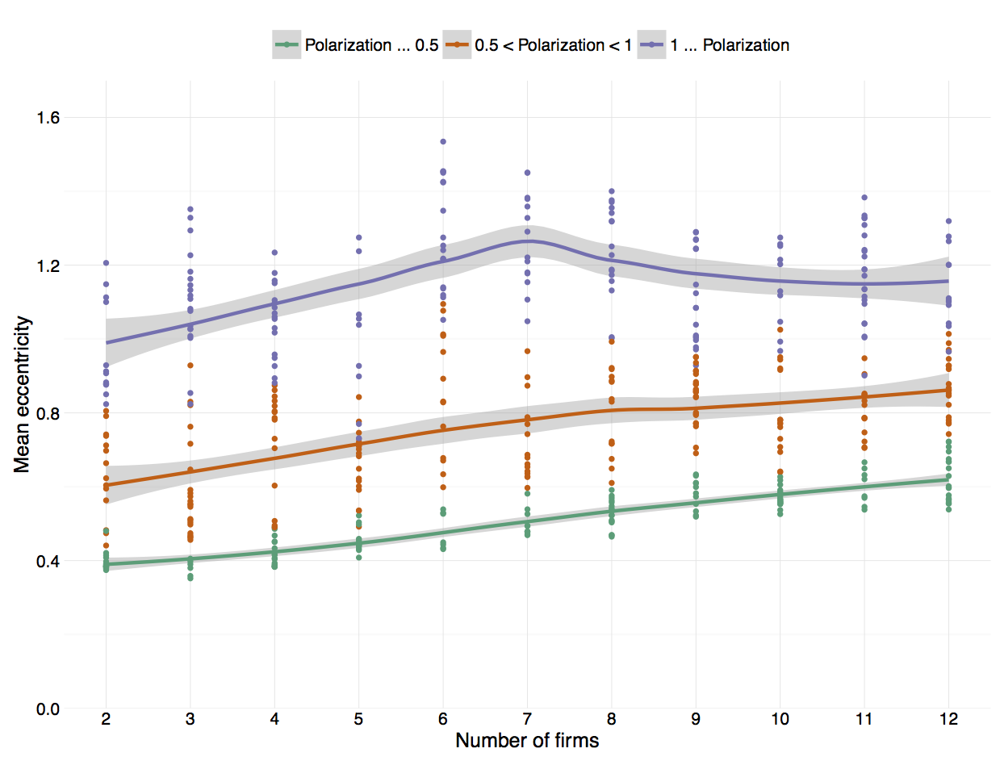

# Draft

_[Abstract: ... ]_

-----

<!--TOC-->

# 1. INTRODUCTION

{{Introduction.md}}

# 2. LITERATURE REVIEW

{{Literature review.md}}

# 3. MODEL & METHODOLOGY

{{Methodology.md}}

# 4. ANALYSIS

{{Analysis.md}}

## 4.3 Decision rules with foresight

When a firm chooses its own location, the location of the other competing firms is unknown. The firm may try to predict the location of the other firms. However if multiple firms use this approach then the location outcome that each firm is trying to predict will depend on predictions that the firm and the other firms form. As Arthur (2014, p.175) writes *”predictions are forming a world those predictions are trying to forecast”*. This self-referential loop leads to logical indeterminacy and the maximisation problem of the firm is ill defined and cannot be solved by means of deductive reasoning. 

The two decision rules discussed in this section rely on inductive reasoning. The firm holds several hypotheses and uses these to make predictions on how the other firms will locate. A hypothesis consists of a proposition that might not hold true and so contrary evidence weakens the hypothesis. The firm tests its hypotheses by comparing the predicted location of the other firms to the observed locations. Thereby the firm learns which hypotheses are plausible and thus applicable moving forward. Predictions are made using the hypothesis that worked best in the past. The firm locates -- like the *maxcov* firm -- such that it maximises its market share, but uses the predicted location of all competing firms rather than their current location. In the first decision rule the firm is endowed with a set of hypotheses. These hypotheses are exogenously given and do not change over time. Only the accuracy of each hypothesis changes in pace with its predictions being tested. I refer to this decision rule as *maxcov-inductor* or simply *inductor*, since the firm uses inductive reasoning. The second decision rule is an expansion of the *maxcov-inductor* rule, but the firm gradually discards poorly preforming hypotheses and forms new hypotheses. If possible new hypotheses should preform at par or better than the existing hypotheses. Therefore new hypotheses are formed through an evolutionary process that mutates and fuses the best existing hypotheses. Replacing old hypothesis is another way in which learning takes place -- leading firms to make better predictions. Hypotheses are endogenous in this decision rule. I refer to this rule as the *maxcov-inductor-GA* or *inductor-GA*, since a genetic algorithm generates the new hypotheses. I use two decision rules such that I can separate the effects from respectively inductive reasoning and endogenously determined hypotheses. The two decision rules allow the effects to be analysed in turn.

The following method is a modified version of the method first developed for *The Santa Fe Institute Artificial Stock Market Model* and described by Arthur (2014, chapter 3) and Arthur, Holland, LeBaron, Palmer and Tayler (1996). In the stock market model multiple agents try to predict the stock price. Each agent faces a single unknown outcome. The agent’s demand for shares depends on the agent’s predicted stock price, i.e. the agent’s action depends on a single prediction. And the actual stock price rely upon the aggregated demand of all agents. In this paper an agent or a firm attempts to predict the behaviour of all other firms. Each firm faces $N-1$ unknown outcomes. The firm locates based on its predicted location of competing firms, i.e. the action of the firm depends on multiple predictions. Thus the most significant modification is going from a setting with many-to-one predictions to a setting with many-to-many predictions. Additionally the stock price is one-dimensional -- it can go up or down. Whereas the position of the firm is two-dimensional. The firm can relocate in any 360 degree direction. This however only requires a slight modification to the forecasting model used in the method.

**Maxcov-Inductor:**
A firm with the *maxcov-inductor* decision rule maintains several hypotheses on how competing firms locate. The firm uses the hypothesis that fits the current state and that previously proved most accurate to forecast the future location of a competing firm. When the firm chooses its own location it relies on the predicted location of all competing firms.

The firm is endowed with $M$ number of hypotheses. While each hypothesis might only be relevant to a narrow set of situations, together the array of hypotheses cover a wide range of different situations. At every iteration the firm only considers the hypotheses specific to the current state and ignores the remaining hypotheses. This makes the firm capable of recognising different location patterns and applying the appropriate forecast.

Each hypothesis consists of two parts jointly forming a *condition/forecast* rule. The condition part specifies which situations trigger the forecast. And the forecast part contains the specific estimates used to make a prediction about the future location.

To describe the current state, we use a 13-bit descriptor. The descriptor $J_j$ summarises the location behaviour of firm $j$, e.g. the fourth bit in $J_j$ relays whether or not *firm $j$ is more than 0.6 standard deviations away from the mean ideal point of all consumers*. The tenth bit in $J_j$ relays whether or not *firm $j$ position along the agreement dimension (y-axis) is above the average of the last 16 periods*. Each of these bits take the value 1, if the state occurred, and takes the value 0, if the state is absent. The current state of firm $j$ could for instance be summarised by the following descriptor: `1110010011010`. 

We will refer to the first 5 bits as the *fundamental bits*. They relay whether or not the distance from the firm to the mean ideal point of all consumers is greater than respectively 0.1, 0.25, 0.4, 0.6, or 1.2 standard deviations. These bits measure the degree to which the location of the firm is fundamentally different from the ideal point of all consumers. Bits 6-11 are the *tendency bits*. The bits 6-8 relay whether or not the position of the firm along the disagreement dimension (x-axis) is above the average of the last respectively 4, 16 and 64 periods. And the bits 9-11 relay whether or not the position of the firm along the agreement dimension (y-axis) is above the average of the last respectively 4, 16 and 64 periods. Thus these bits measure trends in the relocation pattern of the firm. The last two bits are respectively always on and always off. These are experimental controls. By construction they contain no information about the current state, and thus they allow us to analyse to what degree firms act on useless information. 

Each *condition/forecast* rule attempts to recognise the current state. Therefore the condition consists of 13 corresponding positions each taking the value 1, 0, or #. The condition is met if the ones and zeros match the current state descriptor. The # is a wildcard character that matches either case, e.g. the condition `###1#####0###` is satisfied, if the state described by the fourth bit occurred, and the state described by the tenth bit did not occur. In other words the condition will match any state, where *firm $j$ is more than 0.6 standard deviations away from the mean ideal point of all consumers, while its position along the agreement dimension (y-axis) is not above the average of the last 16 periods*. The condition `###1#####0###` is not fulfilled if the current state descriptor is `1110010011010`, but the condition is satisfied, if the current state is `1111000010010`. More ones and zeros in the *condition/forecast* rule imply that the hypothesis is more specific, while a *condition/forecast* rule with many # will match more states and  thus represents a hypothesis that is more general.

All the *condition/forecast* rules that matches the current state of firm $j$, are said to be active. Among these active *condition/forecast* rules, the rule with the best accuracy is used to forecast the future location of firm $j$. In the case where several rules tie for the best accuracy, one of the rules is selected randomly and used to forecast. The accuracy of all active *condition/forecast* rules is updated once all the firms relocate and the actual location of each competing firm is revealed. The forecast error is the distance between the actual location of the firm and predicted location of the firm[^profiterror]. The accuracy measurement is based on the forecast error variance -- a lower forecast error variance imply better accuracy. The accuracy is updated using the inverse of the moving average of squared forecast errors (see details in appendix _[##]_). Over time the firm learns which hypothesis work well in a given situation. Thus the continuous updating of the accuracy of the *condition/forecast* rules facilitates learning. We will refer to this as *learning through experience*.[^learning]

[^profiterror]: Instead of basing the forecast error on location, the forecast error could be based on the difference between predicted profit (or market share) and the actual profit. While the latter approach is appealing because it aligns with the objective of the firm, we opt for the former approach in this paper. My guess is that the precision of hypotheses improves fastest when using the location forecast errors, meaning that less computational resources are needed to generate results.

[^learning]: *Learning through experience* is related to the concepts of *learning by using* (Rosenberg 1982) and *learning by doing*, although not the deductive part (Arrow 1971)*.

Using a *neural network* is an alternative to the *condition/forecast* approach by which firms could form predictions and learn from observations. The precision of forecasts generated by a neural network will be just as good, if not better, however the process by which a neural network generates predictions is a “black box” (Arthur 2014, chapter 3), i.e. we would not be able to see what type of information gave rise to specific predicts. Unlike the *condition/forecast* approach, where we can analyse the 13 positions in the condition to see if the *fundamental bits* or *trending bits* are most frequently activated and when the firms act on useless information. 

The firm forecasts the future location of the competing firm $j$ using a linear forecasting model. 

$$\left( \begin{array}{*{20}{c}} {{x_{t + 1,j}}}\\ {{y_{t + 1,j}}} \end{array} \right) = \left( {\begin{array}{*{20}{c}} {{C_1}}\\ {{C_2}} \end{array}} \right) + \left( {\begin{array}{*{20}{c}} {{A_1}}&{{B_1}}\\ {{A_2}}&{{B_2}} \end{array}} \right)\left( {\begin{array}{*{20}{c}} {{x_{t,j}}}\\ {{y_{t,j}}} \end{array}} \right)$$

The six parameters of this model come from the most accurate active *condition/forecast* rule and take the form ($C_1$ $C_2$ $A_1$ $B_1$ $A_2$ $B_2$), e.g. the full *condition/forecast* rule might look like `###1#########` / (0.1 0 1.2 0 0 0.5). The rule  in this example states that if *firm $j$ is more than 0.6 standard deviations away from the mean ideal point of all consumers, then the predicted location along the x-axis is 20% further right and along the y-axis 50% less north relative to the current position, and then shifted an extra 0.1 standard deviation right along the x-axis.*

The *maxcov-inductor* firm makes predictions on the future location of all competing firms. Each competing firm $j$ has its own unique current state descriptor $J_j$. But the *maxcov-inductor* firm uses the same set of $M$ *condition/forecast* rules on all the competing firms. Thus we make the assumption that the *condition/forecast* rules are not tied to any particular competing firm. The hypotheses of the firm are not specific to the location behaviour of a particular competing firm, but generally applicable to any competing firms that exhibit a particular location behaviour. 

The *maxcov-inductor* firm is endowed with $M$ hypotheses. All but one hypothesis is randomly generated by the following procedure. Each position in the condition is randomly set to 1 or 0 both with probability 0.1, or set to # with probability 0.8. The forecasting parameters are drawn uniformly random from distributions with a mean value of 0. The forecast parameters $C_1$ and $C_2$ are drawn from a uniform distribution with range [-1.5 1.5]. The parameters $A_1$ and $B_2$ are drawn from the range [-1.2 1.2]. And $A_2$ and $B_1$ are drawn from [-0.2 0.2]. The initial accuracy or forecast error variance of each *condition/forecast* rules is set to zero. The last hypothesis is the default or fallback option in case none of the other hypotheses match the state. This *condition/forecast* rule consists of only # so it matches any state and insures that the firm always is able to make a prediction. Each of the forecast parameters for this special rule is set to the average parameter values of the other $M-1$ *condition/forecast* rules. Because hypotheses are randomly drawn for each *maxcov-inductor* firm this implies heterogeneity. In the all-hunter, all-aggregator and all-maxcov models all firms use the same decision rule. So no firm had a long-run advantage of its competitors. This will not be the case in the all-maxcov-inductor model, since one firm might be endowed with a more competitively advantageous set of hypotheses, than its competitors. Additionally the information used to update the accuracy of hypotheses also differ from firm to firm, because it is based on their respective hypotheses. Firms are heterogeneous in terms of their expectation model and knowledge, and not just in terms of the location they choose.

**Maxcov-Inductor-GA:**
A firm with the *maxcov-inductor-GA* decision rule behave as described above. The firm is still endowed with $M$ hypotheses that are randomly generated. But every $\varphi$ iteration the firm replaces the 20% least accurate hypotheses. The new hypotheses are created using a *genetic algorithm* (GA). This algorithm mimics an evolutionary process, i.e. hypotheses are developed from earlier hypotheses with randomly occurring mutations and by crossbreeding “parent” hypotheses. The genetic algorithm uses either *mutation* or *crossover* to create a new hypothesis. The appendix contains the values, equations and specific probabilities used. Each new hypothesis requires two parent hypotheses. The pair of parent hypotheses are drawn randomly and with equal probability from the set of hypotheses not discarded, i.e. from the 80% most accurate hypotheses. 

With mutation the new hypothesis only inherits traits from the most fit parent. The fitness is based on the accuracy and the specificity of the *condition/forecast* rule. Accounting for the specificity implies that parent rules with wider applicability are evaluated as more fit, and thus more likely to form the basis of the new hypothesis. This implies that the model will have a slight drift towards more general *condition/forecast* rules. The method mutates the condition of the parent by randomly flipping the 1, 0 and #s, and by randomly replacing or altering the forecast parameters. 

With crossover the new *condition/forecast* rule is a mix of both parents. The condition part is mixed by randomly selecting a donor parent for each of the 13 positions, e.g. the value of the first position might come from one parent, and three following positions might come from the other parent etc. This way the 13 positions are passed on from one of the two parents, and for each position the donor parent is randomly selected. Crossover of the forecast parameter values happens by either 1) component-wise crossover of each value, 2) using the weighted average of the parents or 3) randomly picking a parent that passes on all parameter values. The method used is randomly selected, and the three methods have equal probability of being selected. In the component-wise crossover the 6 parameter values are passed on from one of the parents, and for each value the donor parent is selected randomly. The weighted average of the parents parameter values uses the accuracy as weights.

To insure that the new hypotheses have a reasonable chance of being used, each new *condition/forecast* rule inherits the average accuracy of its parents. In the case where the parent rules have never matched a state -- and thus never been active -- the new hypothesis takes the median accuracy of all the non-discarded hypotheses. The firm always maintains the default *condition/forecast* rule that only consists of #. However its parameter values are updated such that these equal the weighted average of all new and non-discarded rules, where the accuracy is used as weight.

The process of discarding the poorly preforming hypotheses and forming new hypotheses based on the most accurate is another way in which the firm learns. The firm learns to make better predictions by gradually refining its hypotheses. I will refer to this as *learning through adaptation*. *Maxcov-inductor-GA* firms are heterogeneous, since their initial hypotheses are randomly drawn and because new hypotheses are formed based on the unique experiences of the firm.

### Results

**Maxcov-inductor:**

_[Not locked into position. The average distance to the population centre is about the same. Locates closer the average ideal point along the dimension with no disagreement (that is closer to y=0).]_
_[Mean eccentricity: no change compared to *maxcov* model.]_
_[ENP: falls since some firms are endowed with more accurate condition/forecast rules.]_

**Maxcov-inductor-GA:**

_[Mean eccentricity: When there are few firms in the market then the firms locate further from the population centre. [Closer to y=0. The location perimeter / boundary of where firms locate has along the x-axis has not changed. The firms will only locate out to a certain point/distance, that is not too far away from the centres of the subpopulations. Thus the mean eccentricity tells us that firms to a greater extend locate in between the subpopulations, and that this behaviour increases as the number of firms increase. This is why we see a decline in the mean eccentricity as the number of firms increase. This is not a stable location pattern, but instead it reflects that firms in transition -- relocating from one subpopulation to the other.]]_
_[ENP: low. The firms end up locating at the subpopulation centre.  The firms separate into two crowds: the crowds are uneven in size. => low ENP. When firms locate on top of each other ==> the firms very likely to lock into position.]_

# 5. CONCLUSION

_[decision rule with foresight]_

# A. APPENDIX 

## A.1 Model overview

**Homogenous firms:**

* **All-sticker:** non-ergodic deterministic time-homogenous Markov chain. [The firms never move, so the process “converges” to a single state, which “depends”/is the initial position of the firm, thus the “process is non-ergodic.]
* **All-hunter:** ergodic stochastic time-homogenous Markov chain. [When market share of a hunter firm decreases the firm turns around and heads in a randomly drawn opposite direction. This random component, makes the underlying process ergodic. In the model with a symmetric distribution of consumers the *time average* provide a representative estimate of $\psi$, i.e. the only free parameter in the model is the number of firms, N. While this is not the case in the model with an asymmetric distribution of consumers, thus the *ensemble average* is used. Several R-hat statistics are above 1.05 even when executing the test repetitions with 20.000 iterations.]
* **All-aggregator:** non-ergodic deterministic time-homogenous Markov chain. [Each repetition is an implementation of the Lloyd-algorithm, which always converges to a single state. However the state is not unique, a different initial position of the firms might result in a different CVT. Hence the process is non-ergodic.]
* **All-maxcov:** deterministic time-homogenous Markov chain. ergodic?? single state or oscillates?

**Heterogeneous firms:**

* **Maxcov-inductor:** Does not fulfil Markov property. In the *trending bits* we use the moving average, thus the probability of the future state will depend on past states, and only the current state. Random set of hypothesis (however this is not a random component in the process, but only affects the initial state space distribution $\pi_0$).
* **Maxcov-inductor-GA:** Does not fulfil Markov property. Random component (when forming new hypothesis).

## A.2 Maxcov vs maxcovrnd

![Maxcov vs maxcovrnd in market with asymmetric and bimodal distribution of consumers ($\mu \in [0,1.5]$ and $n_l/n_r \in [1,2]$).](Graphics/temp_maxcovrnd_asym.png)

## A.3 Hypothesis & GA

The number of hypotheses is set to $M=100$. 

-----

To **update the accuracy** of a *condition/forecast* rule we use the inverse of the moving average of squared forecast errors. The accuracy of firm $i$ using hypothesis $m$ at iteration $t$ is:

$$e^2_{t,i,m} = \alpha_a e^2_{t-1,i,m} + (1-\alpha_a) \left( X_{t+1,j} - E_{t,i,m} [X_{t+1,j}] \right)^2, \quad \forall j \ne i$$

where $\alpha_a$ is the memory parameter and $X_{t+1,j}$ is the future location of competing firm $j$. The memory parameter is set to $\alpha_a = 1-1/75 = 74/75$.

-----

**Fitness measure** of rule $m$ at iteration $t$ for firm $i$ is:

$$f_{t,i,m} = M - e^2_{t,i,m} - Cs_m$$

Where $M$ is the number of *condition/forecast* held by firm $i$, since this is constant and identical across firms the term can be left out. $e^2_{t,i,m}$ is the forecast error variance, and $C$ is the cost levied on the specificity. And $s_m$ is the specificity of rule $m$ calculated as the number of ones and zeros in the condition part of the rule (i.e. all the # are not counted).

-----

It is randomly decided if crossover or mutation is used to create the new condition/forecast rule. The crossover method is used with probability $p$, and mutation method with probability $1-p$. This paper uses $p = 0.3$.

**Mutation method:**
Each position in the condition is mutated or flipped with probability 0.03. The probability that 0 or 1 is flipped to # is 2/3. The probability that 0 is flipped to 1 and visa versa is 1/3. The probability that # is flipped to 1 or 0 is 1/3 respectively, with the remaining 1/3 probability that # is not flipped. With these flip-probabilities on average maintain the number of 1, 0 and # in the rule. Each forecast parameter value is either replaced or changed, each with probability 0.2. Leaving 0.6 probability that the parameter value is unchanged. If replaced then the new parameter value is drawn randomly from the same ranges as the initial parameter values (see _[page ##]_). If changed then the new parameter values altered with a random amount in the range plus/minus 0.5% of the initial parameter range.