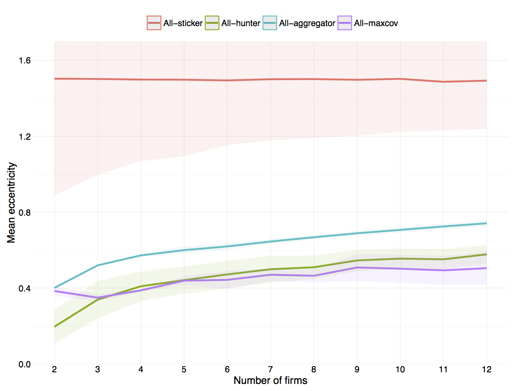

# Draft

## Purpose:
Reintroducing strategic considerations into the competitive location behaviour of firms. 

Monopoly, duopoly and *perfect competition* are undoubtedly the most studied market settings in the literature. Nonetheless most markets lay somewhere in-between the extreme case of 1-2 firms and the other extreme case of infinitely many firms. In addition the markets between the two extremes give rise to new and interesting phenomenas _that cannot be analysed under assumptions such as *monopolistic competition*_. Phenomenas such as niche markets, clustering of firms and [...].

Does a firm set out to occupy a niche market, or is it the output of a competitive process among several firms that drive the firm into a niche market? When is it a competitive advantage to occupy a niche market, rather than engage in direct and fierce competition with other firms? Why do firms tend to cluster or agglomerate in some markets, while they are dispersed in other?

Competitive location models investigates how firms choose to locate in a market with competing firms. The strategic aspects were the bedrock of the first competitive location models. Expanding the competitive location model to include more firms or multiple dimensions has proven difficult. Previous attempts to solve these models have used decision rules that rely on heuristics or rules of thumb. This simplifies the problem. And the rules provide a good first approximation. But these rules disregard any strategic considerations in the decision process of firms. The implicit assumption when a firm has to choose its position is that all competing firms will maintain their current position. In addition to being unrealistic this assumption heavily influences the results and conclusions of the location model. This paper is a first attempt at reintroducing strategic considerations back into the competitive location model with two dimensions and multiple firms.

-----

# 1. INTRODUCTION

# 2. LITERATURE REVIEW

aka. MAXCOV.
Voronoi diagrams and Delaunay Triangulation.
Different distance metrics. Manhattan, Euclidian, etc.

# 3. METHODOLOGY

…[^computation]

[^computation]: All the models in this paper are build and run in MATLAB (R2015a) on a MacBook Pro with a 2.6 GHz quad-core Intel Core i7 processor. In addition several models use MATLAB’s Parallel Computing Toolbox with 4 local workers taking advantage of the quad-core processor structure to process several runs in parallel.

### Consumers

The scope of this paper is limited to one side of the market -- the firms and their decision-making behaviour. For this reason simplifying assumptions are used with regard to the other side of the market; the consumers and their purchasing behaviour. For one thing consumers are static; they do not shift position, they maintain preferences, they are obliques to trends, and are in no way influenced by changes in the market. Secondly consumers behave non-strategically and demand inelastically; they always purchase a single unit from the closest firm, regardless of the distance to the firm. And finally all firms are identical in the eyes of the consumer; there is no brand recognition and no loyalty -- the customer purchase from the closest firm regardless of previous purchasing history.

Every consumer has an ideal point in the market. This is the point where the consumer wants a firm to locate. All points are second to the ideal point. And the further away from the ideal point that the firm locates, the less attractive it becomes. Consumers have *single peaked preferences*. Essentially this paper reduces consumers to being merely their ideal points. 

Viewed in terms of geography the ideal point would be the consumer's physical location and the distance is the bee-line distance to firms. Alternatively the market can be views in terms of product characteristics. Then the ideal point of the consumer is her desired product characteristic along the the two dimensions. [Fore instance salty-sweetness of chips and the thickness of chips. / mobile screen size]

- [Characteristics are non-ordinal, such consumers do agree that more of a characteristic is better to less, ie. quality would be a ordinal characteristic, on which all consumer agree that better quality is preferable to lower quality.]
- [Characteristics are continuous and infinitely divisible.]

The utility function for each consumer is the negative distance from her ideal point and to the position of the firm. The Euclidean distance metric is used, which is equivalent to a quadratic loss function. The utility of customer $i$ is the negative squared distance between customer $i$ and firm $j$:

$$ U_i(j) = -d(i,j)^2 $$

**Distribution of customers**
The above described simplification of consumer behaviour allows focused attention on firm behaviour. As previously discussed in the literature review section the distribution of consumers in the market fundamentally changes the behaviour of firms. We would like to capture and analyse these effects -- in particular the effects from asymmetric and multimodal distributions. We follow the method used by Laver and Sergenti (2011) and assume two consumer subpopulations in our market. When the two subpopulations have the same mean ideal point then the aggregated distribution of consumers will be symmetric and unimodal. While subpopulations with vastly different mean ideal points and different sizes will lead to an aggregated distribution of consumers that is asymmetric and bimodal. Thus this method of using two subpopulations is able to capture several different types of aggregate distributions using only two parameters; the polarisation of subpopulation ideal points, and the relative size of the two subpopulations. 

The market is two-dimensional, so we use the two-dimensional equivalent of the *normal distribution* -- the *bivariate normal distribution*. Both subpopulations follow a bivariate normal distribution. Using different mean values in the distribution imply that the subpopulations disagree over the ideal point. Without further restrictions it also implies that the subpopulations disagree on both dimensions. [saltyness-sweetness and thickness]. To simplify the analysis, and without lose of generality, we assume that the subpopulations have a common ideal point along one dimension and only disagree over the ideal point along the other dimension. This is equivalent to rotating the market space or coordinate system until disagreement only appear along one of the dimensions. Ie. rotating the market space such that the line going through the mean ideal points of subpopulations is parallel to an axis. One can always rotate the coordinate system without loss of information, and similarly this simplifies our analysis without any loss of generality. This is similar to the orthogonal transformation underlying a *principal component analysis*. We start out with two dimensions or components, and end up with two new dimensions; the disagreement dimension (x-axis) and the agreement dimension (y-axis). The two subpopulations -- from now on referred to as 'left' and 'right' -- follow a *bivariate normal distribution* with mean $(-\mu,0)$ and mean $(\mu,0)$ respectively, and both with standard deviation (0.5, 0.5).[^covarmatrix]. Where parameter $\mu$ measures the ideal point polarisation. The parameter measuring the relative size of the left subpopulation is $n_l/n_r$. The aggregated consumer distribution is a *mixed bivariate normal distribution* with weights based on the relative size of the subpopulations.

The mean ideal point on the y-axis is 0 for both subpopulations hence no disagreement along this dimension. The mean ideal point on the x-asis is $-\mu$ for the left subpopulation and $\mu$ for the right subpopulation. For $\mu > 0$ there is a disagreement along the x-asis. I will analysis the polarisation parameter in the range $\mu \in [0, 1.5]$ --  a that range spans both unified and split market. At the lower bound of the range there is no disagreement and the market consists of one unified customer base. At the upper bound there is essentially no overlap between the subpopulations and the customer base is split. With no overlap we are at the edge of what constitutes a single market[^singlemarket], and it might be more appropriate to describe this setting as two separate markets, at least in terms of the customers. The range of the relative subpopulation size is $n_l/n_r \in [1, 2]$. The subpopulations are equally large when the $n_l/n_r = 1$, while $n_l/n_r = 2$ indicates that the left subpopulation is twice the size of the right subpopulation. 

[^covarmatrix]: We further assume no correlation among the two dimensions. The correlation coefficient $\rho$ is zero and the covariance matrix is $\left[ \begin{array} 0.5^2 & 0\\ 0 & 0.5^2 \end{array} \right]$.

[^singlemarket]: _[Definition of market. When is it a single market and when is it two separate markets.]_

| Rel. size | Polarisation   | Pop. x-mean   | Pop. x-stddev   | 
| $n_l/n_r$ | $\mu_r=-\mu_l$ | $\mu_{xpop}$  | $\sigma_{xpop}$ | 
|:--------- |:-------------- |:------------- | :-------------- |
| 1         | 0.5            | 0             | 0.70711         |
| 1         | 1.0            | 0             | 1.118           |
| 1         | 1.5            | 0             | 1.5811          |
| 2         | 0.5            | -0.16667      | 0.68718         |
| 2         | 1.0            | -0.33333      | 1.0672          |
| 2         | 1.5            | -0.5          | 1.5             |

_[table: population statistics]_

Given the aggregated consumer distribution one approach would be to randomly draw a finite number of consumers from the distribution. Market shares can then be calculated by counting the number of consumers. Like Laver and Sergenti (2011) this paper will not employ this approach. Instead the consumer distribution are carried though and market shares are calculated by aggregating probability mass. Similarly the centroid of the market is weighted by probability mass rather than the number of consumers. Although the approaches will yield the same results on average, the latter is independent of particular draws, thus we save computational power not having to run repetitions to obtain the average values.

## 3.1 Agent-based modelling

### Firm behaviour

The underlying basis is that each firm chooses the location that maximises its market share, given the location of the other firms. However all firms choose their location simultaneously, and thus when a firm has to choose its own location, the location of other firms is unknown. Instead of having a direct objective to maximise market share, firms may use heuristics or rules of thumb when they choose location. The literature review provided an overview of the many different decision rules previously considered. This paper will use the three heuristic decision rules laid out by Laver and Sergenti (2011) as the base to which other decision rules are compared. These rule are described in detail below. _[rational vs. rule of thumb]_
_[Why the three exactly? No exploration, social optimum, and high on exploration.]_

**Sticker:**
The simplest decision rule a firm can use is the *sticker*-rule. With this decision rule the firm sticks to its initial position regardless of what happens. This could be a firm that is either unwilling to change or incapable of change. The management of the firm may have an unyielding belief in the long-run superiority of the firms position, discouraging it from any change, even in times of despair. Ie. a belief that the market share of the firm will always recover and excel in and of itself. The firm might also be unable to change, due to financially constraint such as the fixed cost of relocating or investments that cannot be recuperated. And finally, given the  task of predicting the future location of all other firms, the firm might see its current position the less risky than any new location based on these uncertain predictions.

**Aggregator:**
Firms using the *aggregator*-rule constantly seeks to please its own customer base. The firm does not try and predict the future. Instead it takes its current market area and locates at the centre of it. More specifically the centre or *centroid* is the mean ideal point of all customers of the firm. Thus the centroid takes into account the population density within the market area -- it is drawn to the centre of mass.

The future landscape of competing firms may change and with it the market areas. So there is no guarantee that the current centroid is also the centroid of the future. Nonetheless firms using the *aggregator*-rule continually pursue the mean ideal point of their customer base. Likewise there is no guarantee that the firm’s relocation will increase market shares, or even maintain current shares. Market shares are in a sense a secondary priority for the firm. The management of the firm may reason that they can retain and recruit new customers by pleasing their current customers[^loyalty]. 

[^loyalty]: Noted that customer loyalty is not incorporate in the models. Customers always choose the closest firm regardless of previous purchasing history. And this possibly understates the efficiency of firms using the *aggregator*-rule.

When all firms in the market use the *aggregator*-rule then the model is an implementation of the *Lloyd’s algorithm* and the location of firms will converge to the stable *Centroidal Voronoi Tessellation* (Laver and Sergenti, 2011, chapter 3 pp. 48-49). The *Centroidal Voronoi Tessellation* (CVT) is a special geometric construction where each firm is located at the centroid of its own market area. *Aggregator* firms located at the centroid will not relocate. Hence when all firms use the *aggregator*-rule the CVT is stable -- no firm relocates. The CVT has the useful property that the distance between all customers and their closest firm is minimised. It is an optimal arrangement of firms that minimises the overall distance. This will prove useful later on when comparing the social welfare of the different decision rules. The all-aggregator model will maximise our social welfare measure. _[Any CVT is optimal, but not necessarily unique. Given fore instance 2 firms there are several CVTs; the firms could locate left-right splitting the market in half vertically, the firms could locate up-down such that they split the market in half horizontally, etc. In each case the overall distance to firms is minimised and constitutes and optimum.]_

The underlying requirement for a firm using the *aggregator*-rule is that it has perfect knowledge of its current customer base. The firm knows the span of its current market area and the distribution of customers within the area, such that the firm can correctly determine the mean ideal point of its customers.

The *aggregator* firm never relocates outside its current market area. But otherwise there is no limit as to how far an *aggregator* firm can move at each iteration. The firm nonetheless tends to move in relatively small steps if the market is not too unstable. 

**Hunter:**
The *hunter*-rule is a trial-and-error type of decision rule. The firm continues in the same direction, if it previously proved fruitful, and otherwise the firm heads in the opposite direction. At each iterations the firms move what corresponds to 0.1 standard deviation of the population distribution. If the previous move did not increase the market share then the firm turns around and heads in a random direction drawn from the 180 degree arc in front of it. 

Firms using the *hunter*-rule never settle down. The firm endlessly hunts higher market shares with the same speed and intensity. For a firm with this decision rule there is no comfortable threshold share of the market that suffice or slow exploration. In the trade-off between exploration and exploitation the firm always chooses the first option. 

The only information used in the decision process of a *hunter* firm is the current relative change in its market share and its current direction. No information going further into the passed is used. The firm may lack memory, or may emphasis the present to such a degree that information going further back is seen as worthless. The behaviour of a *hunter* firms is most suited for a fast evolving market with high unpredictability.

The *hunter* firm moves 0.1 standard deviations each iteration. This is the *speed of adaption*. It is beyond the scope of this paper to investigate the effects of changing the speed parameter. However Laver and Sergenti (2011, chapter 7, pp. 150-151) find evidence that a speed parameter of 0.1 standard deviations results the in largest shares when using the *hunter*-rule. They argue that this speed strikes the balance between quickly reaching better locations without overshooting these location when moving around. 

-----

The above described heuristic decision rules are good first approximation on how firms might choose to locate. Especially in  a simultaneous multi-agent location model where the future location of other firms is unknown. Later on we would like to investigate how *inductive* reasoning and location forecasts affect our results. But before doing this we need to return to the deliberate process of maximising market share. That is, before we can answer how a firm locates given the *predicted* locations of competing firms, we need a new decision rule on how the firm locates given *any* location of competing firms. And none of the above mentioned decision rule take the location of competing firms into consideration. We will start with a decision rule that assumes that the other competing firms stay at their current location. Later on we will extend the decision rule so it includes location predictions and learning. _[In the end we will have reintroduced strategic behaviour into the simultaneous location model.]_

Let us assume that competing firms stay at their current location. We would like to know where the firm should relocate to maximise its market share. When a firm relocates it gains new customers and loses others. Thus there is a trade-off between the market area it gains and the area that it loses. To simplify matters even further we only focus on the first. This problem is equivalent to a new firm entering a market and choosing the location that will maximise its share. The firm itself is not part of the existing market and the market is populated with competing firms. There is extensive research on competitive location models such as the Hoteling model and the Voronoi game, and on the geometry behind Voronoi diagrams. Yet only a couple of papers provide methods on how to find the location that will maximises the area of a firm. Cabello, Díaz-Báñez, Langerman, Seara and Ventura (2010) use the *reverse nearest neighbour* method to find the position that maximises the number associated points or customers. However their method requires a finite number of points, and thus this method is not applicable. We assume an infinitely continuous number of consumers by using the consumers distribution. The remaining three papers use continuous distributions, but they assume the distribution is uniform, which also make them unsuited for our needs. Averbakh, Berman, Kalcsics and Krass (2015) use a method that partitions the solution space into smaller regions. The partition is done in such a way the structure of the Voronoi diagram is unaffected by how the firm locates within each region. The structure is only affected by which of the regions the firm locates in. The partition simplifies the problem to a *search problem* over all regions. Their method uses the *Manhattan* distance metric. The partitioning also work with *Euclidian* distance metric. However it might be impossible to obtain exact solutions with this distance metric, because of the complexity that the *Euclidian* norm introduces in the object function (Averbakh, Berman, Kalcsics and Krass, 2015, pp. 409-410). The models in this paper uses the *Euclidian* distance metric. Cheong, Efrat and Har-Peled (2007) note the difficulties in finding analytical solutions to the problem and develop an algorithm that approximates the maximum of the object function. Their method finds the largest circle within each existing market area that does not contain any of the existing firms. They construct squares with lengths equal to the radius of the largest empty circles. These squares are partition into grids and they use a *$\epsilon$-approximation* to pick the cell in the grid that maximises the market area. As previously mentioned Cheong, Efrat and Har-Peled (2007) assume a uniform distribution of customers. When working with non-uniform distributions the largest empty circles is a poor criteria to use to narrow the search for maximum. The last paper by Dehne, Klein and Seidel (2002) proves that if the location of neighbouring firms span a convex hull, then there exists a unique local maximum inside this convex hull. They use Newton’s method to calculate these local maxima within each of the Delaunay circles (that is the smallest circles covering the triangles in the Delaunay Triangulation). In addition they check for corner solutions, ie. locating on top of existing firms. The optimal location for the new firm is then maximum of all these local maxima. The case where the neighbouring firms do not span a convex hull is left open. There is nothing in the following models that prevent neighbouring firms from locating such that they do not span a convex hull, and thus this method is not suitable either. 

None of the currently existing methods are applicable to the models used in this paper. This is due to the non-uniform infinitely continuously distribution of consumers, where neighbouring firms may not form convex hulls, and because we use the Euclidian distance metric. Nonetheless I draw on the commonalities of these papers when constructing the decision rule that explicitly tries to maximise the market share of the firm.

**Maxcov:**
Firms using the *maxcov* decision rule aims at the location that covers a maximum of customers. 

The ideal firm location is in the gaps between competing firms. The firm considers all the gaps and picks the one with the most customers. Each gap is a triangle in the Delaunay Triangulation. The Delaunay Triangulation is constructed using the competing firms and it includes the boundary points. The latter insures that the firm can also locate outside the area spanned by competing firms (Cheong, Efrat and Har-Peled 2007 p. 556). The triangle with most customers is selected, and the ideal firm location is the mean ideal point of all customers within that triangle.[^mostcustomers] 

[^mostcustomers]: _[The triangle with the most customers is a proxy of the actual market share obtained. The firm number of customers will not be the one ones in the triangle. And it may not always be the triangle that gives the firm the largest market share. Its correct 40-90% of the cases depending on the parameter settings and the number of firms. Compared to randomly picking triangle which would be correct 4-16% of all cases.]_

The *maxcov* firm does not move directly to the ideal position, but moves 0.1 standard deviations in the direction. This gradual adjustment is chosen for two reasons: first, it makes the speed at which the *maxcov* firm moves comparable to the speed of the other decision rules. The *hunter* firm moves 0.1 standard deviations, and the *aggregator* does not move outside its current market area. _[Secondly, the ideal position of the firm is sensitive to changes in the position of competing firms. Even minor changes to the position of competing firms can change which triangle contains the most customers, and thus significantly change the ideal position. The gradual adjustments counteracts the sensitivity.]_

When the *maxcov* firm chooses its location it explicitly assumes that competing firms remain at their current position. _[The *maxcov* firm faces the same problem: when choosing location the location of the other firms is unknown. Not knowing how the other firms will move and without any predictions it may be reasonable to use the firms current position as the point of reference.]_

In determining its location the *maxcov* firm uses information on the location of competing firms. Additionally I assume that the firm has perfect knowledge of the consumer distribution such that it can determine which of the gaps contain the largest number of customers[^knowdist].

[^knowdist]: Alternatively -- and perhaps more realistically -- the firm could approximate which gaps contained the largest number of customers by using the market share of the surrounding firms (Fowler and Laver, 2008 p.75). However to avoid effects arising from such approximation I assume the *maxcov* firm have perfect knowledge of the distribution of customers.

## 3.3 Markov Chain Monte Carlo

convergence / burn in
Initial position of firms
(Visually show the movement / iterations over time to the reader)
runs, repetitions, iterations.

### Monte Carlo parameterisation

Grid sweep.

### Summary variables

There are three main perspectives we want to analyses in this competitive location model. One perspective is the location of the firms. Do firms agglomerate or cluster at particular locations or do firms disperse across the market space? Another perspective is the competitive environment. Is competition a *winner-take-all* game in which one firms is able to capture a predominant share of customers, or are customers evenly shared among firms? The last perspective concerns *social welfare*. How does the competition among firms affect the wellbeing of customers? To investigate these perspectives we construct three summary variables. These variables aggregate the state of the market into a single measure that is comparable across parameter settings and models.

**Mean Eccentricity:**
To summarise the position of firms we use the mean eccentricity. Eccentricity measures the distance from a firm to the mean ideal point of all customers. Eccentricity has the desired properties of a summary variable. It is a single measure as opposed to the coordinates of the firm that are two dimensional. It is a relative measure that is naturally interpretable as the distance to the population centre. And since we use the mean ideal point which changes with the parameters, eccentricity is comparable across different parameter settings. _[Had we used the origin of the coordinate system this would not change with the parameters and our distance would thus dependent on the specific parameter setting. In addition the origin is an arbitrary location and thus not easily interpretable.]_ We take the average of all firms to get the mean eccentricity in each stage.

**Effective number of firms (ENP):**
I use a relative measure of the market shares of the firms to summarise the competitive environment. The measure is known as the *effective number of parties* (ENP), but will in this paper be referred to as the *effective number of firms*. It measures the concentration of market shares among firms. The measure goes from 1 and up to the number of firms in the market (N). In a market with four firms where all firms have an equal share of the market the effective number of firms is four (ENP=N), while the effective number of firms is one (ENP=1) if a single firm captures the entire market. 

$$ENP = \frac{{\left( \sum\limits_j^N s_j \right)^2}}{{\sum\limits_j^N s_j^2 }}$$

The ENP is the inverse of the Herfindahl-Hirschman Index (Laakso and Taagepera 1979, p.4). Thus ENP and the index measures the same thing, but ENP is easier to interpret than the index across our parameter settings where we change the number of firms.

**Mean Representation:**
It is straight forward to create a measure that summarises the consumer welfare given our utility function (see equation [...]). By taking the average over all customers we get the mean representation in every stage.

# 4. ANALYSIS

## 4.1 Baseline model and decision rules

We are now ready to investigate the first models. We start with the all-sticker, all-aggregator, all-hunter and all-maxcov models. In each of these models all the firms use the same decision rule. We compare the decision rules by comparing the results across models. We start with a symmetric unimodal distribution of customers. There is no polarisation of the ideal point of the two subpopulations and the subpopulations are equally large ($\mu=0$ and $n_l/n_r=1$). Thus there is the only one free parameter of the models; the number of firms $N$. We use the grid sweep method to set the parameter value.

In the all-sticker model the firms remain at thier initial position. They never relocate. Figure _[##]_ plots the mean eccentricity for each model. As expexted we see that the average distance to the population center is 1.5 standard deviation in the all-sticker model. This result reflects how the initial positions of firms are drawn. The initial position of firms are drawn uniformly from a circle with radius of 3 standard deviations and center at (0,0). And thus we find that on average a *sticker* firm will be located 1.5 standard deviations from the population center -- irrespectively of the number of firms in the market.

In the three remaining models mean eccentricity is significantly lower. The initial position of the firms in these models are drawn from excatly the same distribution, but the firms clearly moved towards the population center. 

In the all-aggregator model the firms aim to please their current customer base. The firms choose to locate 0.4-0.8 standard deviations away from the population center with the distance increasing with number of firms in the market. In the all-hunter model, where all firms constantly seek higher market shares, the firms choose to locate in closer proximity to the population center than in the all-aggregator model. Around 0.2 standard deviation closer to the center.

Dispite the fact that the population center has the largest density of consumers of any point in the market, firms consistently locate at a distance to this point. Even *hunter* firms that constantly seek larger market shares. This suggests that locating too close to the population center is suboptimal (Laver and Sergenti 2011 chapter 5). By moving closer to the population center the firm can gain the high density point, but the losses clearly outweight this gain. _[A firm that attempts to wedge its market area closer to the center will often find as a result that the backend of its wedge/market area becomes increasingly thinner. This is the lost market.]_ _[Furthermore the long run dynamics come into play / vote share maximum ... ]_

_[fig median spline: vote share vs. mean eccentricity]_

_[Compare results to Eaton and Lipsey (1975)]_

In the all-maxcov model the firms deliberately attempt to maximize thier market share. They do not rely on heuristics. The firm take into account the position of competing firms, assuming that they will not move. Firms in the all-maxcov and all-hunter model locate a similar distance to the population center. The main exception is with two firms in the market, in this case the *maxcov* firms locate at the same distance as *aggregator* firms. Therefore in the all-maxcov model there is only a slight tendency for firms to locate furthur away from the population center as the number of firms increase. On average the firms locate 0.4-0.5 standard deviations away from the population center.

In the models the actual number of firms in the market is an endogenous variable. Our experimental design allows us to investigate the models when there is anywhere from 2 to 12 firms in the market. To analyses the competitive enviroment we use a measure call the effective number of firms (ENP). The ENP takes into account the relative size of the firms -- that is their share of the market. The ENP tells how many firms would be in the market if they all had identical shares of the market. If the actual number of firms and the effective number of firms is the same (thin 45 degree line in figure _[##]_), then the firms in the market will have split the market evenly. If the effective number of firms is less than the actual number, then one or several of the firms will have a disproportionate share of the market.

The effective number of firms is low in the all-sticker model, ranging from around 1.5 and up to 4.5. The initial position of firms gives some firms a clear advantage over the other firms in the market. And since *sticker* firms do not relocate the uneven concentration of customers persisits.

In the last three models the market is fairly evenly split among the firms. This is the result of homogenous firms competing among themselves. Since all firms use the same decision rule, no one firm has a long-run advantage over its competitors. And thus the firms end up with approximately the same long-run share of the market. More firms in the market make it increasingly harder to maintain a perfectly even split among the firms. And we see that the ENP is slightly below the actual number of firms in the all-hunter, all-aggregator and all-maxcov model when there are many firms in the market.

We use mean representation to measure the satisfaction of the customers. This social welfare measure calculates the average utitily of all customers. The utility of the customer increases when the distance to the closest firm decreases. From earlier we known that the all-aggregator model will result in firm locating along a *Centroidal Voronoi Tessellation* (CVT). The CVT minimises the average distance of all customers and therefore maximises our social welfare measure. Thus mean representation is maximised in the all-aggregator model.

In both the all-hunter and all-maxcov model where firms aim to maximises their market share, they manange to archive almost the same mean representation as in the all-aggregator model, where firms actively aim to please thier customer base. Unsurprisingly the all-sticker model scores lowest on our social welfare measure, since this model has the largest customer-firm distance. 

## 4.2 Asymmetric and multimodal population distribution

Above we got a sense of the different models and how firms react when using different decision rules. Our results have so far assumed a symmetric unimodal distribution of consumers, where there was no disagreement over the average ideal point along any of the two dimensions. There was a single peak in the distribution where the density of consumers was greater than any other point. Despite this firms generally choose to locate at a distance to this point. The literature review showed that different distribution of customer have had significant impact on the results of previous competitive location models. We now want to investigate how firms locate when there is not a single peak in the distribution? How the dynamics change when the subpopulations disagree over the average ideal points? And whether our results generealise to other distributions -- asymmetric and multimodal distributions? 

In the following models there are three free parameters; The number of firms in the market $N$ which takes integer values between 2 and 12. The polarisation of the subpopulations $\mu$ which can take any value between 0 and 1.5. And finally the relative size of the subpopulation $n_l/n_r$ which takes any value between 1 and 2. To parameterise our models we use the Monte Carlo parametersation method. For each run of the model the parameter values are uniformly random drawn from their respective ranges. And we run the models repeatedly to map out the entire parameter space.

In each model there is still just one decision rule present. Firms are competing againts other firms using the same decision rule. Since firms using the *sticker*-rule do not relocate running this model with asymmetric consumer distribution would not provide additional insights. Thus we have left out the *sticker*-firms of this subsection.

![Mean eccentricity for respectively (a) all-aggregator, (b) all-hunter, and (c) all-maxcov model. Where $\mu \in [0, 1.5]$ and $n_l/n_r \in [1, 2]$.](Graphics/temp_mcp_meaneccentricity.png)

The decision rules are presented in seperate panels and three bands are used to summerise the results from different degrees of polarisation among the subpopulations. The first band summerises the results from the models where there is a low degree of polarisation ($\mu \le 0.5$). The second band is for a medium degree of polarisation ($0.5 < \mu < 1$). And the last band is for a high degree of polarisation ($\mu \ge 1$).

The firms using the *hunter*-rule still locate in closer proximity to the population center than the firms using the *aggregator*-rule for any level of polarisation. However the difference in proximity between the *hunter*-firms and *aggregator*-firms is much less prononced in markets with a high degree of polarisation and many firms. Here the average distance to the population center is around 1.2-1.4 standard deviations for both type of decision rules.

In the highly polarised setting we see significant difference between the market with 4 or more *hunter*-firms and then the market with 2 or 3 *hunter*-firms. For one we see that the average distance to the population center increases swiftly when going from two to three firms or four firms. While going beyond four firms in the market has negligible effect on the average distance to the population center. This is due to firms seperating when there is four or more firms in the market. Here we typically see that the firms split into two crowds. With each crowd of firms fiercely competiting for the customers in the respective subpopulation. In the model with a symmetric distribution of customers the *hunter* firms choose to locate around the peak of the customer distribution. Similar behaviour is observed in the models with a high degree of polarisation amoung the subpopulation. However these models have two peaks which the firms tend to locate around. Firms locate close to the center of one of the subpopulations, rather than in between the two subpopulations. The firm loses market shares when it moves too far away from the center of a subpopulation. Thus this acts as a punishment for the *hunter* firm discouraging it from locating between the subpopulations and close to the average ideal point of all customers. On the other hand with only two *hunter* firms in the market, the firms tend to locate in between the two subpopulations. Thus they locate close to the average ideal point of all customers, but simultanouesly they locate in an area with a low density of consumers. Later we show that this has great impact on the average utility of consumers.

Laver and Sergenti (2011, chapter 5) discover the change when going from 2-3 *hunter* firms and into the realm of four or more *hunter* firms. Yet they seem unaware of an earlier and related discovery by Eaton and Lipsey (1975). Eaton and Lipsey (1975) also analyse asymmetric distributions admittedly in a slightly different setting, namely the bounded one-dimensional space (line market). They show analytically that an equilibrium only exists if the number of firms is less or equal to twice the number of modes in the density distribution, ie. $N \le 2M$ where $M$ is the number of modes in the consumer density function. When the number of firms is exactly twice the number of modes then the firms locate in pairs around the quantiles of the distribution. While with less firms than twice the number of modes there is some leeway as to how firms locate. Both the pairing of firms in two and the $2M$ limit is due to the single dimensional. In a one-dimensional line market the only option is which side of a point you locate on (left or right). Using this and equlibirium conditions Eaton and Lipsey (1975) show the limit of $N \le 2M$. In the two-dimensional market firms can locate all the way around a point, and thus firms need not be paired. In the *hunter* model firms still crowd together although not nessarily in pairs of two. Additionally the number of modes does not create an upper limit on the number of firms -- again since firms can locate all around a point. But the number of modes does seem to influence how firms locate. There is a single mode in the model with symmetric distribution, and two modes in models with highly polarised subpopulations. Only when the number of firms is equal or greater than the number of modes do the *hunter* firms form crowds around the peaks of the distribution. When the number of firms is less than the modes, then there is leeway as to how firms locate and we see that *hunter* firms locate between the peaks of distribution.

The symmetric distribution showed that *maxcov* and *hunter* firms locate at similar distance to the population center, except with two firms in the market. We see similar pattern with the asymmetric distribution of customers. The *maxcov* and *hunter* firms locate a similar distance to the population center irrespectively of the polarisation of the subpopulations. The exception is when there are only a few firms in the market. With the *maxcov* decision rule there is no abrupt change when going from 2-3 firms and to 4 or more firms as with the *hunter* decision rule. The *maxcov* firms always seperate, also with two or three firms in the market. The firms locate around the center of each subpopulation when consumers are polarised. Furthermore the *maxcov* firms seperate even in the case with no polarisation of the subpopulations. The two *maxcov* firms will not agglomerate at the population center but instead locate at a distance to the center. This contrasts starkly with the two *hunter* firms that agglomerate around the population center at both low and medium degrees of polarisation.

![Effective number of firms (ENP) for respectively (a) all-aggregator, (b) all-hunter, and (c) all-maxcov model. Where $\mu \in [0, 1.5]$ and $n_l/n_r \in [1, 2]$.](Graphics/temp_mcp_enp.png)

The asymmetric distribution reiterates the conclusions of the symmetric distribution regarding the effective number of firms (ENP). Both the model with *aggregator* and *hunter* firms show that the market is relatively even split among the firms in the market. When there are many firms then the ENP is slightly lower in the *aggregator* model than the *hunter* model. However this difference completely disappears as the polarisation of the subpopulations increase. With many firms the center of the symmetric distribution easily overcrowds. In the *aggregator* model where firms locate to please their current customer base overcrowding leads to firms locating on different orbits around the center. Firms located on the inner orbits attact a larger share of the customers than the firms located on the orbits further away from the center. Polarisation of the subpopulations spreads the ideal points over a greater area which in turn reduce the overcrowding of firms. This is why in the *aggregator* model with many firms the ENP increases when going from low polarisation to medium or high degree of polarisation.

The market is also relatively even split among the firms in the *maxcov* model. When there are many firms then a high degree of polarisation results in a slightly lower ENP. As earlier noted the firms split into two crowds in the *maxcov* model. The crowd compete for the customers in each subpopulation. However in the *maxcov* model the number of firms in each crowd is not necessarily the same. It often happens that a minority of the firms manage to capture one-half of the market and this results in the lower ENP. The ENP would be 3.6 if a single firm out of 12 firms captured half the market[^ENPcalculation]. However with 12 firms  in the market we observe an ENP around 10. This tells us that a single firm is unable to capture and maintain half the market by itself in the long-run -- it has to be a group of firms.

[^ENPcalculation]: With N=12 and the market split in two halves the ENP is $\frac {(0.5+0.5)^2}{\left(\frac{0.5}{11}\right)^2 \times 11 + 0.5^2} = 3.6$ when 1 firm has 50% of market alone and the 11 other firms share the remaining 50% equally. 

![Mean representation for respectively (a) all-aggregator, (b) all-hunter, and (c) all-maxcov model. Where $\mu \in [0, 1.5]$ and $n_l/n_r \in [1, 2]$.](Graphics/temp_mcp_meanrepresentation.png)

The *aggregator* model also results in the CVT when the distribution of consumers is asymmetric. And thus this model maximises our social welfare measure -- the mean representation. The difference between the mean representation in the *aggregator* model and the *maxcov* model is minuscule.

In the *hunter* model we once again see that the asymmetric distribution of consumers give rise to significant changes when going from 2-3 firms and to 4 or more firms. This is particularly pronounced in the models with a high degree of polarisation. With two or three *hunter* firms the mean representation is around -2, while with four or more firms the mean representation is between -0.5 and -0.2. As earlier noted this is the result of *hunter* firms locating in between the centers of the subpopulations when there are 2-3 firms in the market. Although the firms locate close the average ideal point of all customers they also locate in an area with a low density of consumers. Because firms locate far from the densely populated areas it significantly reduecs the average utility of customers. On the other hand firms seperating into crowds that locate around the centers of the subpopulation when there are four or more firms in the market. Laver and Sergenti (2011, chapter 5, p. 102) refer to this as the *“sea change”* in mean representation when reaching four or more firms.

## 4.2 Decision rules with learning

... 

_[Maxcov-inductor]_
Mean eccentricity: no change compared to *maxcov* model.
ENP: falls since some firms are endowed with more accurace condition/forecast rules.

_[Maxcov-inductor-GA]_
Mean eccentricity: When there are few firms in the market then the firms locate further from the population center.
ENP: low.

## 4.3 Entry/Exit

market share

number of surviving parties

mean age at death

# 5. CONCLUSION

# A. APPENDIX 

# WRITING JUNK

Therefore the other side of the market -- consumers and their purchasing behaviour -- has been greatly simplified.
It therefore uses simplifying assumptions for consumers and their purchasing behaviour.

 

 and the further way points further away are less
This is the point at which the consumer would prefer the firm locates at. All other points are second to the ideal point, and 
Every consumer is merely her ideal point in the market. The ideal point 
This is the preferred position or location of the consumer.
Every consumer has an ideal point in the market. 

 
The above described consumer behaviour with no interaction among consumers simplifies our model and

This this method of two soft probably from sup populations allows us to capture their sleep different distributions
of asymmetric and multi-modal distributions

Instead of having a finite number of consumers dispersed across the market given some distribution.

 constituting two separate markets.

to the point where   and it might be more precise to describe the.   

With no overlap it might more appropriate be described as two separate markets, rather than one market.
it might be more appropriate to de of two separate markets rather than .

Taking the mean over all firms gives us the mean eccentricity.
We would like to describe the position of the firms. In 2D space each position is a 2D vector. Would like a single measure of the position. The measure should be relative making it inturpretable. And the measure should be comparable across different parameter settings. We use eccentricity. This is the distance from the firm to the mean ideal point of all customer. Taking the mean over all firms gives us the mean eccentricity.

The relative market shares of the firms
To summarise the relative size of firms I use the measure
I use the *effective number of parties* (ENP) which   

Laakso and Taagepera (1979)
Effective num

Eiselt and Marianov (2011)

Competition

and not a single firms that manages to capture one-half of the market 
it is not a single firm that manages to capture one-half of the market, but always a small group of firms.

The firm can instead use the predicted location of the other firms. But the location outcome that each firm is trying to predict, depends on predictions that the firm and other firms form. *"Predictions are forming a world those predictions are trying to forecast"* (Arthur 2014, p.175). This self-referential loop leads to logical indeterminacy, and thus the maximisation problem is ill defined and cannot be solved deductively.

Instead of the directly aiming firms may use heuristics or rules of thumb.

Nonetheless firms still make decisions even when faced with an ill defined problem. Firms possibly use heuristics or rules of thumb. A firm could choose:

This centre is known as the *centroid*
The weight is the density of customer.

weighted

 within it's the market area.
 mean ideal point of it.
The firm locates at the mean ideal point of its current market area.
or centre of its current market area. 

[If all competing firms maintain their current position, then relocating to the centroid will leave the market share of the firm unchanged.
The firm will retain their current market area if 
Assumption on other firms: the firm will reach the current centre if all other firms main their current position.]

in
 resulting firm location will be
inertia  in all-hunter model leads to CVT. Since it is equivalent to Lloyd’s algorithm 

The assumption that is has perfect knowledge of its current customer base. Knows the span of its market area and the distribution of customers within the area such that it can perfectly determine the mean ideal point of the market area.

* to move towards the center of its current market area. 
* to move towards its most profitable competitor.
* 
* to survey several directions and move along the most profitable.

knowledge of competing firms or

What matters in 
Short/gold fish memory, only knowledge from the last periods is used in the firms decision process. Which is more suited in a fast evolving market, where exploration of new opportunities fruitfull .

be able to account for some of the ... that undoubtedly is present in the real world

it predicts the location of competitors. location predictions and .

of how a firm chooses to locate when the direct objective is to

choose location that formed our basis.

Bridge / Motivations for maxcov.

The latter two decision rules attempts to maximise market share directly, while in the former two the market share may be maximised, but only indirectly. Laver and Sergenti (2011) use decision rules similar to these. Further note that none of these decision rules considers the simultaneous move of competing firms. They implicitly assume that other firms stay at their current location. And thus the decision rules are stripped of any and all strategic considerations.

indirectly try to maximise shares.

to choosing the location that maximises the share of the firm when entering a market with existing firms which the firm itself is not part of.
two effects when a firm relocates

inherent
 measure increase
 but may be impossible to find exact solutions when work with the *Euclidian* distances since the 

in such a way that structure of the Voronoi diagram is unaffected by any 
The 
These regions preserve the structure of the Voronoi diagram

so its unclear how this approximation would work with a non-uniform distribution. The largest empty 

To allow location through the entire market space the Delaunay Triangulation is constructed using the location of all competing firms and the boundary points 
The boundaries are included such 

There is no limit as to how far an *aggregator* firm can move at each iteration, although the firm never relocates outside its current market area. And the firm tends to move in relatively small steps.  
and given that the market is not too unstable,
_[speed. will never relocate outside its current market area]_

In could be interesting to consider the effects from changing this *speed* parameter, however this is beyond the scope of this paper. 

_each consumer has ... _ 
_all firms are identical in the eyes of the consumer / **no loyalty** or brand_
_no interaction between consumers _

Additional firms do not push others further out, instead the *maxcov* firms locate within a rhombus shaped area that is centered on the population mean. 

Mean eccentricity only increases slightly as the number of firms are increased in the all-maxcov model. 

Two *maxcov* firms locate in the same fashion as firms using the aggregator rule.

_All-Maxcov mean eccentricity:_ For N=2 the firms using the hunter rule tend to locate fairly close to the population centre. While the firms using the maxcov decision rule locate farther away, and locate in the same fashion as firms using the aggregator rule. For N=2 this is the CVT. 
In the all-maxcov model there is only a slight increase in the mean eccentricity 

--less than 7-- 

In the all-aggregator model the market is split evenly for the two and three firms. 
The all-aggregator model maintain a even split of the market for two and three firms. the all-aggregator model effe

The concentration of customers amoung firms is highly uneven in the all-sticker model. 
The most uneven concentration of customers is in the all-sticker model.

_All-Maxcov ENP:_ In a market with firms all using the maxcov decision rule, the firms tend to split the market share more evenly than with any of the other decision rules. Although the mean estimate is less than N for N>4. The standard deviation (confidence band) show that there are several runs where the market is evenly split among firms.

The results from this model therefore reflect how we choo ... As expected the mean eccentricity is 1.5 in the all-sticker model. This follows directly from the initial position of firms, which is drawn uniformly form a circle with center at (0,0) and with a radius of 3 standard deviations. The sticker firms do not move a thus the average distance to the population center is 1.5. 

The three other models show signficanly lower mean eccentricity. *Aggregator*, *hunter* and *maxcov* firms have the same initial posision as *sticker* firms, but they all move towards the population center. With the *hunter* firms locating closer to population center compared to *aggregator* firms. Firms that constantly search higher market shares locate closer to the center than firms that try and satisfy their current customer base. The distance to the center increases with the number of firms in both the all-aggregator and all-hunter model.

In the all-hunter model the firms agglomerate at the center. However not perfectly since the *hunter* firm never settles down, but constantly explores, which also shows in the confidence bands of the all-hunter. This creates the small perturbations away from the center. This perturbation is smallest when there is only two firms. _[As the number of firms increases, so does the total disturbances.]_ _[Additionally increaseing the number of firms crowds the center pushing other firms further out.]_

 and leads to a low effective number of firms.

The model show that when 

The models show that when firms compete againts other firms that 

These models show that when homogenous agents or firms compete over location, the

of the market becomes more differcult and the ENP   
As the number of firms increase

the the even split cannot be maintained.
As the number of firms in the market increase it more to maintain the symmetic 

The board conclusions on the effective number of firms is the same for the all-aggregator, all-hunter and all-maxcov models. _[But there are small difference highlighting distinct aspects of each decision rule.]_ In all three models the market is evenly split when there are two firms present in the market. As the number of firms increase the the even split cannot be maintained. The effective number of firms increase slower than the actual number of firms.

With few firms the all-aggregator model results in a market that is more evenly split, compared to the all-hunter model. While the oppersite is true when there is more than 7-8 firms.

The all-maxcov model splits the market more evenly than any of the other models. And all though the estimated effective number of firms falls short of the actual number of firms already after 4 firms, the standard deviation (confidence band) show that there are always cases where the market is evenly split among all firms. This is not the case for the other decision rules.

We know that our all-aggregator model will maximise our mean representation measure, since the model results in the CVT. 

_[Partial conclusion: the social optimal location requires location further away from the population center. And in a market with many firms it will also require a more uneven split of the market.]_

Similarly in the models with high polarisation the firms tend to locate around  
to a seperation among the firms when there are four or more firms in the market.
a crowd of firms engaging in fierce competition over a subpopulation.
into two groups, with each group in
The reason for this is that with four or more firms in the market
With four or more firms in the market we typically see that a group of firms -- consisting of two or more firms -- compete over one of the subpopulations. The dynamic of the competing group is such that they keep each other at bay. Although competition is feices close to the center of the subpopulation, divereging is associate with a loss for the particular firm.
The firms competeting will 
two or more firms compete around one of the subpopulations. Moving away from the subpopulation 
Further increasing the number of firms in the market does not 
We see that there is a a 
Comparing the *aggregator* and *hunter* firms show that 

In the highly polarised *hunter* model there are two modes in the consumer distribution. 

With a one-dimensional line market there is only two option and that is to approach the optimal point from the left or from the right.
locate on either side of the optimal point.
The pairing of firms in two and the $2M$ limit follows from the one dimension they consider. That is on a one dimensional line market the firms only option is to locate on either side of the optimal point.
--at least for some distributions of consumers-- 
*”there is some indeterminancy in the location of the firms (at least for some density functions)”*  (Eaton and Lipsey 1975, p. 36).
 Eaton and Lipsey (1975, p. 36) furthermore note that
*”When the number of firms is 2M, conditions ... require that the firms all be paired … When n < 2M, there is some indeterminancy in the location of the firms (at least for some density functions)...”*
The paring in the right panel of Figure 5.8 seems to support the first part of this statement.

_[Relate to Eaton and Lipsey (1975)]_
The change when going from 2-3 firms and into the realm of four or more firms seems related to an observation that Eaton and Lipsey (1975) made when considering asymmetric distributions. Although Eaton and Lipsey (1975) considered a vastly different setting, namely the bounded one-dimensional space (line market).

A high degree of polarisation amoung the subpopulation

With asymmetric distributions you have created 2 modes in the density of voters along the x-axis.

Eaton and Lipsey (1975) also considers asymmetric distributions in the bounded 1D space (line market). 
Might this be what gives a sudden change when going from 2-3 firms to 4 or more firms in the all-Hunter model?

You write that you experimented with more than two subpopulations. I am guessing this would give 3 modes in the density along the x-axis. With three subpopulations do you then observer a change going from 2-5 firms to 6 or more firms? Or does the big change still take place when going from 2-3 to 4 or more firms?

and as the 
symmetric distribution show

any degree of polarisation among the subpopulations make the *maxcov* firms seperate. In contrast, at a low or medium degree of polarisation ($0.5 < \mu < 1$) the two *hunter* firms agglomerate relatively close to the population center.

The subpopulations need not  
 
Furthermore even a low degree of polarisation among the subpopulations 

will lead to *maxcov* firms seperating

into each subpopulation even when

Even and degree of polarisation make the *maxcov* firms always seperate, a

into crowds that compete for
locate 

, here the maxcov firms located at the same distance as *aggregator* firms.

The average distance in the maxcov is 

widens the populated area and thus 
 
to locate in circle 

The slightly lower ENP in the *aggregator* model compared to the *hunter* model when there are many firms completely disappear when the subpopulations are polarised. 

A single firm or even two firms occupying one half of the market are likely to be attack by other firms.
However the in-fight competition in each subpopulation allows a small majority of firms to capture a disproportional amount of the market.
_[Image of all-maxcov uneven split, N=12 mu=1.5 n_r/n_r=1.]_

the two crowds are not necessarily the same size.

Looking at the ENP in the *maxcov* model the 
_All-Maxcov ENP:_ The more polarised the subpopulation is the more inequality among the market share of firms. What happens when $\mu$ is large, is that the subpopulations is split, and a minority of the firms often manage to capture one-half of the market. This pulls down the ENP. 

_All-Maxcov:_ What happens around N=6 and N=7 ??