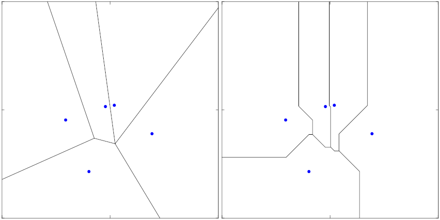
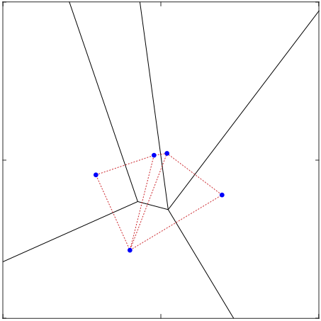

The literature on spatial competition began with Hotelling's (1929) paper. Hotelling proposes a line market where consumers are uniformly distributed along the line and firms produce identical goods. Consumers inelastically demand one unit from the firm with the lowest price. The price is composed of the *mill price* and *transportation cost*. Each firm charges a *mill price*, ie. the price for one unit purchased at the doorsteps of the firm. And customers bear a cost by going to the firm to shop. This *transport cost* is linear in the distance between the customer and the firm. Two firms decide where to locate and which *mill price* to charge. Firms first simultaneously choose their location, and thereafter simultaneously decide on their prices. There are two opposing forces that come into play; If the firm locates close to its competitor, it will attract more consumers. Meanwhile locating closer also lead to more fierce price competition from its competitor.

If *mill prices* are fixed and equal then there is no price competition and both firms locate at the centre of the market and split the market equally. The agglomeration of firms has been coined *the principle of minimal differentiation*[^1]. The average distance travelled by consumers is one-fourth the length of the line. This is socially suboptimal. The social optimal location is where the market is split in two equal halves, with a firm located at the centre in each of these halves. This reduces the average distance travelled by consumers to one-eighth of the length of the line. 

[^1]: *The principle of minimal differentiation* was coined by Boulding (1955).

An error lead Hotelling to conclude that the model with price competition would also exhibit *the principle of minimal differentiation*. But when two firms are located in close proximity near the centre, price competition drives down prices to a level where it is no longer optimal for firms to located in the middle half of the line. The paper by d'Aspremont, Gabszewicz, and Thisse (1979) shows this and that no equilibrium exists in the model laid out by Hotelling. Instead they modify *transportation cost* to be quadratic in the distance between the customer and the firm, rather than linear. With this modification a unique equilibrium exist, but where firms locate at either ends of the line, ie. *maximal differentiation*. This shows how the *the principle of minimal differentiation* breaks down when price competition is introduced. Unfortunately it is just one of many examples of how sensitive the conclusions from the Hotelling model is to changes in the setup. 

Below I will review some of the literature on the Hoteling model and more generally spatial competition models. I will present the reader with papers that relax the assumptions and generalise the Hotelling model. Biscaia and Mota (2013) find 352 published journal articles since 1979 that reference ‘Hotelling’ or ‘spatial competition’. The sheer volume of papers on the topic makes it a colossal task to provide an exhaustive review. This literature review is not exhaustive, but selective and focused on the papers deemed relevant for this particular paper. The following set of papers provide an exhaustive review of the topic; The early developments and historical development of the spatial competition literature is reviewed by Eiselt and Marianov (2011, chapter 1) and Smith, Laporte, and Harper (2009). Biscaia and Mota (2013) contain a bibliometric analysis of the literature. Eiselt (2011) provide a reissue of Hotelling’s original paper with comments and references to later contributions. Graitson (1982), Brenner (2001), Eiselt, Laporte and Thisse (1993) provide literature reviews focused on the Hotelling model. While Kilkenny and Thisse (1999) and ReVelle and Eiselt (2005) give a more general review of spatial competition models. Daskin (2008) provide a review of discrete spatial competition models. Sequential location models are reviewed by Eiselt and Laporte (1996) and Kress and Pesch (2012). And the review by Plastria (2001) focuses on the optimisation approaches to competitive location models.

## Multiple firms and two-dimensional space

Eaton and Lipsey (1975) considers both the line market and two-dimensional space. They assume that firms charge a fixed price, and they investigate the equilibrium with _N_ number of firms in the market. Where the number of firms is exogenously determined.

Eaton and Lipsey (1975) prove analytically that no equilibrium solution exists when three firms have similar prices. In the line market the two firms at each perimeter will move towards the centre of the line, reducing the market of the third firm. Eventually this forces the firm at the centre to leap-frog to the outside. This process continues with the two outer firms again moving towards the centre of the line. This has been referred to as the *dancing equilibria* although it does not fulfil the requirements of an equilibrium (Eiselt, 2011). In the line market with four firms, two firms will locate at one-fourth the length, and two firms will locate a three-fourths the length of the line. Similarly in the case of five firms, two firms are located at one-fifth the length, two at four-fifths the length, and the fifth firm will locate at the centre. The equilibrium ceases to be unique for six or more firms, instead it is a range of equilibria. If there is an odd number of firms, then one firm will be located at the centre of the line. The firms on the perimeters are paired. While the remaining interior firms may be paired, or may be separated by some distance. However no firm will have a total market area that is less than the largest *half-market* of any firm. The *half-market* refers to the two market areas on either side of the firm. Eaton and Lipsey (1975) conjecture that the *principle of minimum differentiation* should perhaps be replaced by *the principle of local clustering*, since pairs of firms choose to locate in close proximity to one another. Eaton and Lipsey (1975) also consider multimodal and asymmetric distributions of consumers along the line. Here they prove that an equilibrium requires that the number of firms in the market does not exceed twice the number of modes or peaks in the consumer density function. Ie. if the distribution of consumers is bimodal (two modes), then no equilibrium exists with four or more firms in the market. 

The results above from Eaton and Lipsey (1975) rely on the assumption that firms behave without foresight -- an assumption they call *zero conjectural variance*. Eaton and Lipsey (1975) drop this assumption to analyse how firms with foresight choose to locate. To do this they assume that firms adopt a *minimax strategy* where firms anticipate the entry of a new firm into the market. This leads firms to minimise the size of their largest *half-market*. When a firm locates at the centre of its own market, rather than at the perimeters, it minimises its exposure to new firms entering the market. With this assumption firms never locate in pairs as described above. Instead, for any number of firms, there exists a unique equilibrium where firms are evenly spaced along the line. These equilibria are socially optimal as they minimise the average distance to consumers. And so *the principle of local clustering* no longer holds when firms use a *minimax strategy*. Note that the *minimax strategy* does not consider whether or not entry is a rational strategy for new firms, and thus it leads to an inadequate equilibrium concept.

Shaked (1975) prove analytically that no equilibrium exists for three firms locating in the plane. Eaton and Lipsey (1975, p. 40) note that it is not obvious how three or more firms will choose to locate in two-dimensional space, and write that *"using conventional analytical techniques the problem is very complex, perhaps intractable"*. Instead they use simulation techniques and once again assume that firms behave without foresight. In their simulation consumers are uniformly distributed on a disc, rather than a plane. With any number of firms between 3 and 17, they show that a local equilibrium exists for the firm, where all firms are evenly spaced along a circle with the same centre as the disc, and with a radius that is less than the radius of the disc. However this is not a global equilibrium, and the circular configuration immediately breaks up, since one firm will choose to pair up with one of its neighbours rather than remain fixed on the circle. The same is true with less than 9 firms in the market, where one firm is located at the centre, and the remaining firms are evenly spaced in a circular configuration. With 9 or more firms in the market, the firm at the centre is in a global equilibrium, but the firms on the circle are only in a local equilibrium. In addition they show that no equilibrium exists for firms located in a hexagonal pattern, square pattern or rectangular pattern. The firms at the perimeter of the market will pair up with neighbours, breaking these patterns. In sum they suspect that no equilibrium solution exists for three or more firms in two-dimensional space. Shaked (1975) proved their suspicion in the case with three firms. But it remains an open question with more than 3 firms in the market.

The general result — from the 85 years of research since Hotelling published his paper — is that conclusions and equilibrium are non-robust across alternative model specifications. Researchers have generalised the model, but most results are falsified when assumptions are modified. And even minor modification may remove any equilibrium constellations.

## Location problems

The Hotelling model belongs to a wider set of *competitive location models*, which again falls into the more general realm of *location problems*. The difficulty of finding optimal solutions is not restricted to the Hotelling model. It shows up in many other location problems -- even in problems without any kind of competition among the firms or agents. This subsection takes a more general look at location problems and optimal solution.

The location problem aimed at finding the location of the firm that minimises the sum of distances to all its consumers is called the *minisum problem*. The minisum problem on the continuous plane is known as *the Weber problem* (Eiselt and Marianov, 2011 chapter 1). And the *multistore Weber problem* is when the firm has multiple facilities and the aim is to find the locations on the plane that minimise the sum of distances from each facility to the consumers (Eiselt and Marianov, 2011 chapter 15). The *multistore Weber problem* is difficult since it consists of two subproblems -- an allocation problem and a location problem -- that have to be solved simultaneously. It has been proven that the computational difficulty in solving the *multistore Weber problem* is *NP-hard*[^NP-hard], and thus heuristic approaches are required for large problems (Eiselt and Marianov, 2011, p. 336). Heuristic methods find good solutions, but do not guarantee that the solution is optimal.

A relative to the *minisum problem* is the *minimax problem*. In this problem the objective is to minimise the longest distance between the firm and its consumers (similar to a *minimax strategy*). On the continuous plane this problem is known as the *continuous 1-centre*. And more generally, when the firm has multiple facilities, the *continuous p-centre*. This problem minimises the longest distance between _p_ facilities and their consumers (Eiselt and Marianov, 2011 chapter 4). These problems resemble *set covering problems*. More specifically, when there is positive demand everywhere in the space, then the *continuous p-centre* is equivalent to the problem of covering an area with _p_ circles with the minimum possible radius, also known as *circle covering*. Masuyama, Ibaraki and Hasegawa (1981) show that the problem is NP-Complete[^NP-complete].

Thus finding the optimal solution is difficult even when disregarding the competitive aspects, where firms through their location decision compete with one another for customers.

[^NP-hard]: In the field of computational complexity theory a distinction is made between problems that can be solved in *polynomial time*, and those problems that cannot. A problem is said to be “easy” and “feasible” when it can be solved in polynomial time. A solution to an *NP-hard* problem may not be verifiable in polynomial time. *NP-hard* problems are at least as difficult as *NP problems*, and a solution to an *NP problem* can be verified in polynomial time. (Ahuja, Magnanti and Orlin, 1988, Appendix B).

[^NP-complete]: An NP-complete problem is both an *NP problem* and *NP-hard problem*. That is the solution can be verified in polynomial time, but no efficient method exists that can find the solution to these problems.

## Voronoi diagram

The *Voronoi diagram* is a geometrical construction used to characterise allocation and studied for more than 175 years in different fields (Eiselt and Marianov, 2011 chapter 19). This subsection reviews the properties of Voronoi diagrams and related concepts that spring from the research on Voronoi diagrams. The Voronoi diagram consists of several Voronoi sets. Each Voronoi set has an associated *seed*, and each set contains all the points that are closer to the associated *seed* than any of the other *seeds*. We can construct a Voronoi diagram from the location of firms, if consumers shop at the nearest firm (which is the case in fixed-price two-dimensional Hotelling model). The *seed* is the location of the firm and the Voronoi set corresponds to the market of the firm. The Voronoi set contains all of the customers that are located closer to the firm than any of the other firms. See example of Voronoi diagram with five seeds in figure _[##]_. There are several different ways of measuring distance. The most commonly used are the Euclidean distance metric and the Manhattan metric[^metric]. The choice of distance metric influences the structure of the Voronoi diagram. And methods for constructing Voronoi diagrams that rely on one distance metric, do not easily generalise to other distance metrics — in particular methods that construct Voronoi diagrams incrementally. This limitation will come into play later in the paper, when we discuss the optimal location of a new firm locating in a market with existing competing firms.

[^metric]: The Manhattan metric measures the distance between point A and B as: $d^{(1)}_{AB} = \left| {a_1 - b_1} \right| + \left| {a_2 - b_2} \right|$. While the Euclidean metric is $d^{(2)}_{AB} = \sqrt{(a_1 - b_1)^2 + (a_2 - b_2)^2}$. More generally the distance is measured as $d^{(p)}_{AB} = \left({\left| {a_1 - b_1} \right|}^p + {\left| {a_2 - b_2} \right|}^2 \right)^{\frac{1}{p}}$ with the value of the parameter $p$ chosen for the purpose at hand.

The mean point of a Voronoi set is referred to as the *centroid*. This point minimises the sum of distances to all points within the Voronoi set. When a firm locates at the *centroid* of its market, it constitutes a local socially optimal location. The *centroidal Voronoi tessellation* (CVT) is a special case of the Voronoi diagram where each *seed* is located at the centroid of its respective set. If all firms locate at their respective *centroid* it creates a *centroidal Voronoi tessellation*. This is a global socially optimal solution, since it minimises the average distance between consumers and firms (Laver and Sergenti, 2011). Any *centroidal Voronoi tessellations* is optimal, but not necessarily unique. Given for instance 2 firms in a square space there are several CVTs; the firms could locate left-right splitting the market in half vertically, the firms could locate up-down such that they split the market in half horizontally, and so on. In each case the average distance to firms is minimised and the location of firms constitutes a social optimum. The Lloyd’s algorithm generates a *centroidal Voronoi tessellation* from any generic Voronoi diagram. At every iteration, the algorithm moves the *seeds* to the centroid of their current Voronoi set. Using this iterative process any Voronoi diagram converges to a *centroidal Voronoi tessellation*. One of the decision rules used in this paper, is in fact an implementation of the Lloyd’s algorithm. And so when we compare the results from this baseline decision rule to the other decision rules, we are comparing with the social optimum location of firms.

The dual of the Voronoi diagram is the *Delaunay tessellation* (Eiselt and Marianov, 2011 chapter 19). The *Delaunay tessellation* links *seeds* with adjacent Voronoi sets and the length of each of these link is the distance between the pair of *seeds*, see figure _[##]_. Reformulated in terms of firms, the Delaunay tessellation is a network that links firms with a common market boundary (ie. direct competitors). In figure _[##]_ the firm located furthest left and furthest right are not linked since they do not share a market boundary. The two firms are not in direct competition with one another over any of the customers. However both firms are linked to the firm at the bottom.

The *Voronoi game* also originates from the study of Voronoi diagrams. This competitive location model shares features with the Hotelling model. In the Voronoi game two firms place _n_ number of facilities each and consumers shop at the nearest facility. The game is sequential so firms take turns and place one facility each turn. The game ends after _2n_ turns when both firms have placed all their facilities, and the winner is the firm with a majority of consumers. In the continuous line market the follower has a winning strategy that captures $\frac{1}{2+\epsilon}$ of the market, however the leader has a strategy that can make $\epsilon$ arbitrarily small (Ahm, Cheng and Cheong 2001). The two-dimensional Voronoi game is significantly more difficult to solve. In a one-round version of the Voronoi game — where each firm places all its _n_ facilities in its first turn — the follower still has a winning strategy, but the leader cannot make $\epsilon$ arbitrarily small, if consumers are distributed over a square area (Eiselt and Marianov 2011, chapter 9). On the other hand, if consumers are distributed over a rectangular area that is sufficiently oblong, then the leader has a winning strategy (Fekete and Meijer 2005). Fekete and Meijer (2005) furthermore show that the follower’s problem is NP-hard in the two-dimensional one-round game.

## Hinterlands and vertical product differentiation

The choice of space influences results. As seen above when moving from one-dimensional to two-dimensional space it changes the equilibrium, and sometimes removes the equilibrium altogether. Similarly the shape of the space (eg. disc, square, rectangular) and whether the space is bounded or unbounded affects the results. Certain combinations of shape and boundary creates *hinterlands*, ie. remote regions or sparsely populated regions. Competing firms will find it less attractive to locate in these regions. And as a result the papers that consider spaces without naturally occurring hinterlands -- such as the one-dimensional circular market -- find that firms locate more evenly across the entire space (Eaton and Lipsey 1975, Salop 1979).

Competitive location models are often described in terms of geographical location. However these models are also applicable when studying product differentiation, eg. manufactures competing with one another when choosing product characteristics such as size, colour, and the shape of their respective products. When the model is formulated in terms of geographical location, then the ideal point of the consumers is his or her location. Every consumer would ideally want a firm to locate at his or her doorsteps, so the consumer avoids transportation costs altogether. In terms of product differentiation the ideal point is the consumer’s preferred product characteristics. The ideal points are distributed over the space, and so the consumers have heterogeneous preferences regarding products or firms. The models discussed so far strictly relate to *horizontal product differentiation*. Thus even when all firms charge the same price, firms are always able to achieve positive demand, through differentiation. There are niches that guarantee the firm a positive demand. This is not the case with *vertical product differentiation*, such as product quality. With *vertical product differentiation* the preferences of consumers are homogenous, ie. all consumers prefer high quality products to low quality products. If all firms charge the same price, then the firm with the highest product quality will capture the entire market. No niches exists. The two-dimensional Hotelling model assume *horizontal production differentiation* along both dimensions. An alternative model is the Launhardt model (Ferreia and Thisse 1996). The model includes both *horizontal* and *vertical product differentiation*. It can be seen as an extension of the Hotelling model[^Launhardt] in that firms choose location, but the firms have different delivery prices. The delivery prices is an easy way to incorporate *vertical product differentiation* into the model. The delivery price is part of the *transportation cost* paid by consumers. Consumers still shop at firm with the lowest total price (*mill price* and *transportation costs*), thus all consumers prefer low delivery prices over high delivery prices. The Launhardt model is in a sense two dimensional. The dimension along which firms locate assumes *horizontal product differentiation*, while the delivery price dimension assumes *vertical product differentiation*.

[^Launhardt]: Although the Launhardt model can be seen as an extension of the Hotelling, the paper by Launhardt was published 44 years before Hotelling published his paper.

## Foresight

Prescott and Visscher (1977) criticise the Hotelling model for its assumption of costless relocation. The Hotelling model implicitly assume that firms can always relocated at a future point in time at very low cost, and therefore firms, when they choose their location, do not need to take account of future entry into the market. Instead they propose a sequential location model, where it is prohibitively expensive to relocate, and where firms therefore use foresight when choosing their location *once-and-for-all*. Given rational expectations, firms can deduce the optimal solution by reasoning backwards from the final stage of the problem, thereby determining the sequence of optimal actions for every firm in each stage. Ie. each firm chooses the profit maximising location subject to the location of firms already in the market, and subject to the rules that future rational entrants will use. Let _N_ denote the exogenously determined number of firms in the market. The model is solved using backwards induction, ie. the last firm entering the market will choose the location that maximises its profit given the position of all other firms already located in the market. The second last firm (firm number _N-1_) uses the position of all _N-2_ firms already located and the best response of the last entering firm when choosing its location. Firm number _N-2_ use the position of the first _N-3_ firms and the best response of firm number _N-1_ and _N_, and so forth. This continues all the way to the first firm. This process of reasoning from a set of premises, until one reaches the logical conclusion is known *deductive reasoning*.

However Arthur (2014, chapter 11) is highly sceptical of this approach. Noting that there may be simple cases where every firm can figure out what to do, and where this approach produces the correct equilibrium predictions. But in more complicated scenarios or large problems with many firms the backwards induction approach is likely to break down. The approach requires sequential location and assumes *common knowledge* and *common knowledge of rationality*. That is each firm knows the preferences of all other firms, and each firm knows that all other firms knows the preferences of all firms, in an infinite regress. In addition each firm knows that all other firms behave rationally, and each firm knows that all other firms knows that all firms will behave rational, also in an infinite regress. To solve the model it is common to assume that firms are homogenous, both in terms of expectations and available information. Furthermore the optimal location must be unique. If any firm is uncertain about the preference or rationality of another firm, then the pure-strategy equilibrium solution breaks down. In essence when a firm has to choose its own location, the location of other firms is unknown. The firm can use the predicted location of the other firms. But the location outcome that each firm is trying to predict, depends on predictions that the firm and other firms form. *"Predictions are forming a world those predictions are trying to forecast"* (Arthur 2014, p.175). This self-referential loop leads to logical indeterminacy, and thus without some coordination device or without assuming homogenous firms, the maximisation problem is ill defined and cannot be solved deductively. No logical conclusion exists rendering *deductive reasoning* void. Nonetheless firms still make decisions even when faced with such ill defined problem. Firms might possibly use heuristics or rules of thumb. Arthur (2014, chapter 11) discusses these issues in terms of a competitive location model, but does not propose a new location model that incorporates or overcomes the these limitations. Instead Arthur (2014, chapter 11) looks at a model on asset pricing with many similarities, but which is easier to solve since each investors only need to predict a single outcome — the stock price. In the location model each firm needs to predict _N-1_ outcomes, ie. the location of all other firms. 

In the *Santa Fe Artificial Stock Market* discussed by Arthur (2014, chapter 11, chapter 3) investors are heterogeneous both in terms of information and the expectation models they use to predict the stock price. Investors holds several hypotheses on the expected stock price[^stock-price], all of which are based on the recent history of the stock price. They act on the hypothesis that suit the current state of the market and that has provided the most reliable predictions in the past. In each period when the actual stock price is reveal investors update the accuracy of their hypothesis. They continuously discard poorly performing hypotheses and form new hypotheses. Arthur (2014) refers to this as *inductive reasoning*, ie. deriving principles or conclusions from observation and viewing conclusions as *probable*, rather than *certain*. Investors act on the hypothesis viewed most probable to hold true, and update hypothesis in response to new  information or observations that falsifies currently held hypothesis. In their decision process investors use *inductive reasoning* as opposed to *deductive reasoning*.

[^stock-price]: More precisely, Investors try and predict a linear combination of stock price and dividend. Dividend follows a stochastic autoregressive process, $AR(1)$, which is unknown to investors. And the stock price is given by the market clearing price after investors have chosen between the risky stock and a risk-free bond with a fixed rate _r_. Investors have a constant absolute risk averse utility function.

More specifically, the Santa Fe Artificial Stock Market model is an agent-based model, where the investors are agents. Investors hold _M_ number of hypothesis, each with a corresponding linear forecasting model. Each hypothesis is a condition/forecast rule, such that if the current state of the market matches the conditions in the hypotheses, then the hypotheses is said to be *active*. Of all the active hypothesis, the investor then uses the linear forecasting model from the hypotheses that has the best accuracy. Thus investors are able to recognise patterns in state of the market, and act using their most reliable hypotheses. The state of the market is summarised by a 12-bit array. Each bit corresponds to a scenario and takes the value 0 or 1 indicating whether the scenario is true or false. They use scenarios such as the *“the price has risen in the last 3 periods”* or *”the current price is not larger than 16 times the dividend divided by fixed rate, r”*. The combination of these 12-bits yield more than 4.000 different states of the market. 

Learning is a necessity once fully rational agents are replaced by agents with bounded rationality. Bounded rational agents do not act irrational, but act as best according to their knowledge and skills, and learning gives agents the potential to gradually discover optimal actions. Two types of learning exists in economics (Ehrentreich 2008 chapter 4). With *rational-based learning* agents act optimally given their available information and when new evidence arrives they update their prior opinion in a rational fashion. Bayesian learning is one example of *rational-based learning* where agents hold several hypotheses. The probability of a given event occurring is conditional on the associated hypothesis. When agents observe a given event, they increase the probability of the hypothesis for which the event is most likely. In this way agents rationally update their prior opinion. The other type of learning is *biologically inspired learning*. This type of learning mimics natural evolutionary selection processes, and is highly effective in terms of creating well-adapt “species” or strategies in an ever-changing environment. Rather than updating existing hypothesis, agents develop new hypotheses by mutating and recombining existing hypothesis. These processes are known as *mutation* and *crossover* respectively. Mutation creates new hypotheses based on the existing hypotheses through experimentation and unintended mistakes. While crossover creates new hypotheses by combining randomly selected bits and pieces of existing hypothesis. To increase the performance both *mutation* and *crossover* are often coupled with selection, such that new hypothesis are based on the best preforming existing hypothesis. Genetic algorithms are used to model *biologically inspired learning*. Arthur (2014, chapter 3) uses a genetic algorithm to create new hypothesis through *mutation* and *crossover*.

Arthur (2014, chapter 3) finds that the model is able to capture   both the *rational expectations regime* and what they call a *complex regime*. In the former the model reproduces the equilibrium found analytically by assuming rational expectations and homogenous agents. That is the equilibrium where the stock price is the fundamental value, ie. the sum of all future dividend in present value terms. There is no herd effects, technical trading remains unprofitable, and trading volume is low. The model produces the rational expectation regime when investors discover new hypotheses at a slow rate. While the model produces the *complex regime* when using a faster exploration rate of new hypotheses. In the complex regime it is profitable for investors to engage in technical trading, since the herd effect produces bubbles and crashes in the stock price, and the trading volume is high. This paper incorporates inductive reasoning into the competitive location model, using a modified version of the above described model. Section _[##]_ provides further details on the model and details on the modification need to incorporate *inductive reasoning* into the location model.

## Agent-based modelling

Agent-based models are build from the bottom up, in the sense that the model consist of many autonomous and interacting agents. Each agent has strictly local motives and through the interaction of all the agents emerges the macro-behaviour of the system (Ehrentreich 2008, chapter 2). Agents are often heterogeneous and thus the macro-behaviour is hard to predict from the local motives of agents alone. Agent-based models are typically solved on a computer by setting up the decision rules of agents and observing the system as the interaction of agents play out. Although researchers use computers to run agent-based models this is not the same as solving traditional models through numerical simulation. Instead one should view the introduction of agent-based models into economics as a response to *”the inappropriateness of traditional methods”*, in particular the assumptions of representative agents and rational expectations (Ehrentreich 2008, chapter 2, p. 7). Models assuming representative agents are incapable of generating  emergent phenomena, such as the *complex regime* described above where one observes herd effects and technical trading. While fully rational agents with perfect information are deprived of free choice — the only available choice is the rational course of action. While this limits the number of possible outcomes of the model making it easier to solve, it does so at the expense of what might have been more appropriate and realistic assumptions. Both assumptions are widely used in order to solve traditional models, while neither are necessary in Agent-based models. Agent-based models are thus particularly well suited when studying problems with heterogeneous agents or bounded rationality. Furthermore agent-based models are a generalisation of equilibrium economics, as seen above with the Santa Fe Artificial Stock Market model, where standard equilibrium behaviour is a special case among a much broader set of complex behaviours. Agent-based models can provide researchers with answers to problems that would be intractable using conventional analytical techniques. However as noted by Laver and Sergeant (2011, p. viii) *“rigorously designed and analysed computational experiments, however exhaustive, will never be substitutes for flawless and elegant classical formal proofs”*. 

Laver and Sergenti (2011) construct an agent-based model. Their model investigates the competitive location behaviour of political parties competing for voters on a two dimensional policy space. Political parties choose a policy position and the voters vote for the party whose policy is closest to the voter’s ideal policy. Their model shares many similarities with the two-dimensional Hotelling model with multiple firms. However to study multiparty competition they assume that the political parties use heuristics or rules of thumb to determine their location at each iteration. They run the model for several hundred iterations. They have five types of political parties with the following decision rules:

* __Sticker:__ A party that sticks to its ideological ideal policy point no matter what.
* __Aggregator:__ A party that constantly moves towards the centre of its current voter base.
* __Predator:__ A party that moves towards its most successful competitor, trying to replicate its success.
* __Hunter:__ A party that continues to move in the same direction, if the previous move proved fruitful, and otherwise heads in the opposite direction.
* __Explorer:__ A party that surveys several directions and then move along the most lucrative direction.

The last two decision rules attempts to maximise the share of votes directly. While the other decisions rules may maximise the   vote share of the political party, but this would happen indirectly. Furthermore note that none of these decision rules considers the simultaneous move of competing parties. They all implicitly assume that the other parties stick to their current policy position. Hence there is no foresight and thus the decision rules are stripped of any and all strategic considerations.

Laver and Sergenti (2011) considers is continuous and unbounded space. They obtain this space by assuming that voters’ ideal policy points are drawn randomly from two bivariate normal distributions. By varying the relative size and means of the bivariate distributions they are able to analyse the location behaviour of political parties when consumers are distribute symmetric around a single peak, and when the distribution of consumers is asymmetric with two peaks. They can account for the effect of both a symmetric unimodal distribution and an asymmetric multimodal distribution of voters. To simplify their analysis they rotate the space such that the mean ideal points of the two distributions only differ along one dimension. They call this the *main axis of policy disagreement* between their two subpopulations of voters.

In the baseline models they investigate, the number of political parties is exogenously given and all parties use the same decision rule. They use these baseline models to analyse the location behaviour in each of the decision rules, and to gasp the differences between decision rules. The baseline model where all parties use the *aggregator*-rule is an implementation of the Lloyd’s algorithm, and thus the policy position of parties converge to the socially optimal location, where the average distance to the ideal points of all voters is minimised. In the model where all parties use the *hunter*-rule — and thus continuously try to increase their vote share — they find that parties choose policy positions that are closer to the mean ideal point of all voters than the socially optimal positions. The *hunter*-parties do not agglomerate at the peaks of the voter’s ideal points, but choose a position that lies at a distance to the peaks. The party achieves short-run gains by locating close or at the peak of voter’s ideal points, however the response by competing parties quickly erodes these gains, leading to the long-run policy positions that lie at a distance to the peaks. Their extended model includes entry and exit of political parties and political parties with different decision rules compete with one another for voters. The decision rule of each new political party is randomly drawn with equal probability. The entry of new political parties resembles a citizen-candidate model. Citizens or voters that feel increasingly underrepresented by the current political parties form new parties. Political parties exit when they repeatedly fall below a given threshold share of voters. They compare the competitive advantages of the decision rules by measuring the average vote share and the longevity of each decision rule. *Hunter*-parties capture the largest share of voters and live longest when pitted against *sticker*-parties and *aggregator*-parties, and when the speed at which the *hunter*-parties moves sufficiently balances the exploration of new position and exploration of its current policy position. However the *hunter*-rule is not robust as both the *explore*-rule and *predator*-rule outperforms it, when all five decision rules are pitted against one another. 

Fowler and Laver (2008) use a similar model, but run a tournament in which decision rules submitted by other researchers are pitted against one another. Researchers knew that Fowler and Laver (2008) pre-entered the *sticker*, *aggregator*, *hunter* and *predator* rules. Furthermore they assume that elections are held every twentieth iteration. The nineteen intervening periods are considered as campaign period. Parties can freely explore different policy positions in campaign periods. And only the policy positions and votes captured in an election period influence the exit and entry decision of parties. Decision rules were prohibited from using information on the distribution of voters ideal points. The decision rules submitted fall into the following categories:

* **Tweaks of pre-entered rules:** Decision rules based on the four pre-entered decision rules, with slight modification.
* **Centre-seekers:** Decision rules that attempt to discover the peak or centre of voters’ ideal points, and position the party at the centre.
* **Inter-electoral explorers:** Decision rules that take advantage of the campaign period to try out different policy positions, and settling at the most prosperous of these positions.
* **Parasites:** Decision rules that try and replicate the success of other political parties, fore instance by choosing a policy position close to largest political party.
* **Satisfiers/survivors:** Decision rules that are content with a given share of the votes, or rules that only move once their vote share approaches the threshold level.

Fowler and Laver (2008) find that *centre-seeker* rules generally underperform and argue (as above) that the short-run gains by locating at the centre of voters’ ideal points critically endangers the long-run survival of the party, because of the response from other political parties. *Parasite* rules are highly disruptive to the political party that *hosts* the *parasite*, but rarely outperform the other rules, since they typically end up capturing half of the *hosts* market. The *inter-electoral explorers* and *satisfier/survivor* rules the party faces the above mentioned trade-off between exploration of new positions and the exploration of its current policy position. The tournament winner was a satisfying parasite rule name *KQ-Strat* and submitted by Kevin Quinn. Political parties using this rule jittered very slightly and randomly when above the threshold level, and when below the threshold level moved towards a randomly selected competing party that was above the threshold level. A large number of the submitted rules preformed worse than the pre-entered *sticker*-rule, and only 7 out of the 25 submitted rules preformed better than the pre-entered *hunter*-rule. None of the decision rules use foresight per se. They all implicitly assume that competing parties stay fixed, exempt perhaps the *fool-proof* rule by Jim Adams which moves the policy of the party one-fifth the average policy shift of all competing parties. While the rational for the rule is not included in Fowler and Laver (2008), one could argue that parties with this rule anticipate a backlash to the policy shift of all competing firms, and thus moving one-fifth[^onefifth] the average shift is a reasonable action given this expectation. However the *fool-proof* rule preforms worse than the *sticker* rule.
 
[^onefifth]: The one-fifth move seems to have originated in a paper by Adams and Somer-Topcu (2009). The paper is an empirical investigation of the policy response of parties to policy shifts among competing political parties. They find a statistical significant shift between 0.149 and 0.196 in response to the average policy shift of competing parties.

## Recap

This literature review has gone through the different location behaviours that firms use in competitive location models without prices. In the analytical models, the simplest behaviour is firms locating without foresight (*zero conjectural variation*). With the *minimax strategy* firms foresee the entry of new firms (or the relocation of existing firms), in a manner that will cause maximum damage to the market of the firm. The firm therefore locates to minimise this damage. However the *minimax strategy* does not consider whether or not the entry is a rational strategy for new firms, and thus it leads to an inadequate equilibrium concept. The rational expectations approach does consider this, but requires a sequential setup and very restrictive assumptions. The agent-based model on asset pricing provides a path where these assumptions are relaxed while maintaining the simultaneous setup. Namely agents that use *inductive reasoning* to make predictions and update their hypotheses in response to new information. The agent-based model from the literature on political science show how to go about analysing the two-dimensional Hotelling firm with multiple firms, and thus picks up where the analytical approach falls short of finding equilibria. In this agent-based model many decision rules that rely on rules of thumb have been constructed and battle tested in tournaments. However no one has so fare considered decision rules with foresight. This paper will build upon this model by Laver and Sergenti (2011) but introduce agents that use *inductive reasoning* as a way to reintroduce foresight into the competitive location model. The literature review has also repeatedly highlighted the difficulties in solving location models, even those without any competitive aspects. 