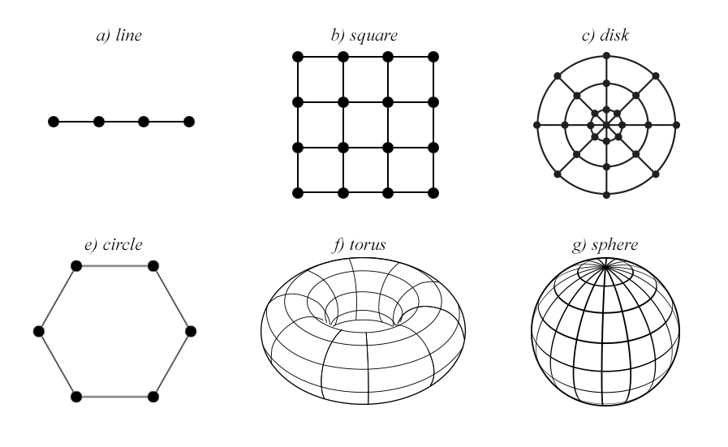

# A Complex Systems Approach to the Location Behaviour of Firms
_By Jonas K. Sekamane, 28. august 2015._

Hotelling (1929) introduced a model analysing the location problem (or product differentiation) of duopolies. The model discovered *the principle of minimum differentiation*. Vickrey (1964) extended the Hoteling line market to a circular market with multiple firms. This model shows how the boundaries of the market influences the solution. Eaton and Lipsey (1975) have proven analytically that no equilibrium solution exists when three firms have similar price. In the line market the two firms at each perimeter will move towards the centre, reducing the market of the third firm. Eventually this forces the firm at the centre to leap-frog to the outside. This process continues with the two outer firms again moving towards the centre. Eaton and Lipsey (1975, p. 40) note that it is not obvious how three or more firms will choose to locate in two-dimensional space, and write that *"using conventional analytical techniques the problem is very complex, perhaps intractable"*. Instead they use simulation techniques. They suspect that no equilibrium solution exists for three or more firms. And conjecture that *the principle of minimum differentiation* should perhaps be replaced by *the principle of local clustering*, since pairs of firms choose to locate in close proximity to one another. Using Agent-based modelling Laver and Sergenti (2011) constructs a multi-party model that investigates how political parties choose to locate in two-dimensional space. They also include entry/exit of political parties.

My paper will continue this line of inquiry into the competitive location behaviour of firms. I will investigate how multiple firms choose to locate in 1D and 2D spaces. I will investigate how market boundaries influence the outcome. I will attempt to explain entry/exit in the market through the location behaviour of firms and the market structures.

### Location behaviour of firms (agents)

My paper analyses the non-price competitive location behaviour of firms under the assumption that the firms main objective is to maximise their market share. 

*Decision rule*

Each firm choose the location that maximises its market share, given the location of the other firms. In this multi-agent choice problem all firms choose location simultaneously. Thus when a firm has to choose its own location, the location of other firms is unknown. I investigate the location behaviour of firms using Agent-Based Modelling, where firms are agents. I assume that firms behave as **naïve agents**. I.e. The agent is *status quo* bias. The agent chooses location such that it maximises its market share, but the agent assumes that other firms stay at their current location. Additionally I consider firms that follow a **minimax strategy**. They choose the location that both maximises their market share and minimises their market loss in case of a new firms entering the market. If a firm locates at the center of its market, rather than at the perimeters, it minimises its exposure to new firms entering the market. 

*There may not be any equilibrium solution for three or more firms. ... Nonetheless these cases are still worthwhile studying.*

### Entry/Exit

The basic model has an exogenous number of firms. I will extended this model to include firm entry/exit from the market. I would like to investigate if specific market structures lead to a specific number of firms competing in the market. Fore instance, why do we not observe the above mentioned leap-froging behaviour in the real world? It might be an inherently unstable construction to have three firms in the line market. Perhaps the third firm goes bankrupt and leaves the market, or perhaps a fourth firm will see an untapped potential in the market and enter.

Osborne (2015) suspects that, in a sequential location game (quite similar to Hotelling's line market) only the first and the last firm will choose to enter the market, and will locate at the center of the market. He proves this conjecture analytically for the case of 2, 3 and 4 firms.

### How market structures affect firm location behaviour

Besides investigating how market size and number of firms affect the firm location, I will also investigate how the market boundaries and how market hinterlands affect these results.

- *Uniform distributions*:
      - 1D: The line
      - 2D: The bipartite square lattice
			- 2D: The disc
- *Uniform distributions without boundaries*
      - 1D: The circle
      - 2D: The bipartite square lattice with periodic boundaries (torus)
      - 2D: The sphere 

*Why is this interesting? How do you thing the market structure will affect the entry/exit*

### Limiting the scope of the paper

The paper will be purely theoretical and the analysis framed in terms of geographical location, but many of the results may generalise to other forms of differentiation, such as the product differentiation of firms or the policy differentiation of political parties.

The paper will abstract from price competition, and exclusively consider location differentiation. Price competition greatly increases the complexity of the model, and will therefore be beyond the scope of this paper. Furthermore firms can and do change prices more frequently than they change location. So price completion and location competition work on different time scales. And it is not clear how the different time scales should be incorporated in a unified model.

### Time schedule

* **24. Sep.:** Finished literature review.
* **11. Dec.:** Finalised the model.
* **23. Dec.:** Finished sections on methodology, model, result.
* **29. Jan.:** Finished writing/paper
* **8. Feb.:** Start proof reading final paper
* **19. Feb.:** Hand-in final paper