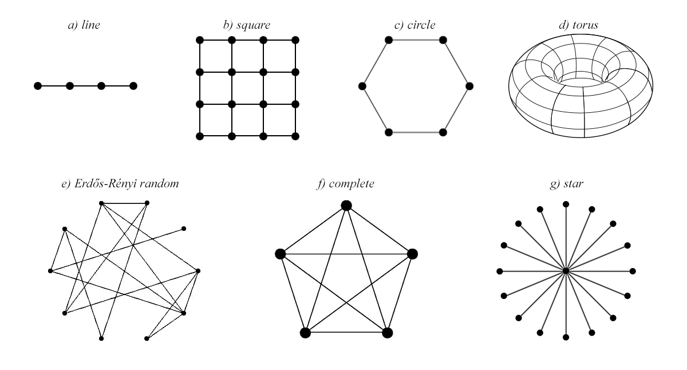

# A Complex Systems Approach to the Location Behaviour of Firms
_By Jonas K. Sekamane, 28. august 2015._

Hotelling (1929) introduced a model analysing the location problem (or product differentiation) of duopolies. The model discovered *the principle of minimum differentiation*. Vickrey (1964) extended the Hoteling line market to a circular market with multiple firms. This model shows how the boundaries of the market influences the solution. Eaton and Lipsey (1975) have proven analytically that no equilibrium solution exists when three firms have similar price. In the line market the two firms at each perimeter will move towards the centre, reducing the market of the third firm. Eventually this forces the firm at the centre to leap-frog to the outside. This process continues with the two outer firms again moving towards the centre. Eaton and Lipsey (1975, p. 40) note that it is not obvious how three or more firms will choose to locate in two-dimensional space, and write that *"using conventional analytical techniques the problem is very complex, perhaps intractable"*. Instead they use simulation techniques. They suspect that no equilibrium solution exists for three or more firms. And conjecture that *the principle of minimum differentiation* should perhaps be replaced by *the principle of local clustering*, since pairs of firms choose to locate in close proximity to one another. Using Agent-based modelling Laver and Sergenti (2011) constructs a multi-party model that investigates how political parties choose to locate in two-dimensional space. They also include entry/exit of political parties.

My paper will continue this line of inquiry into the competitive location behaviour of firms. I will investigate how multiple firms choose to locate in 1D and 2D spaces. I will investigate how market boundaries influence the outcome. I will furthermore look at location behaviour on networks. And examine if and how the structure of the network alters behaviour. I will extend the model in an attempt to explain entry/exit in the market through the location behaviour of firms and the market structures.

### Location behaviour of firms (agents)

My paper analyses the location behaviour of firms under the assumption that firms have a single objective; maximising market share. 

Each firm choose the location that maximises its market share, given the location of the other firms. In this multi-agent choice problem all firms choose location simultaneously. Thus when a firm has to choose its own location, the location of other firms is unknown. The firm can instead use the predicted location of the other firms. But the location outcome that each firm is trying to predict, depends on predictions that the firm and other firms form. *"Predictions are forming a world those predictions are trying to forecast"* (Arthur 2014, p.175). This self-referential loop leads to logical indeterminacy, and thus the maximisation problem is ill defined and cannot be solved deductively.
 
Instead of assuming that firms are homogenous or that their expectations are symmetric, I investigate the location behaviour  of firms using Agent-Based Modelling, where firms are agents. I will have two baseline behaviours, that I compare to a more sophisticated location behaviour. I will not mix these behaviours in the same model. In each model all firms will be of the same type, and comparing the models reveals how the type of behaviour influences the result.
 
* The **zero-intelligence agent** is characterised by simply choosing its location at random. And possibly under the constraint that the chosen location does not impose a loss to the firm.
* The **naïve agent** is *status quo* bias. The agent chooses location such that it maximises its market share, but the agent assumes that other firms stay at their current location.

These two baseline behaviours are compare to:

* The **agent with inductive rationality**. This agents forms several hypotheses on how other firms choose their location. The firm holds several hypotheses at once, and acts on the hypothesis that worked best in the past. Each hypothesis attempts to predict the movement of the other agents based on their movement history and the structure of the market. The firm still chooses its own location such that it maximises market share, but subject to the predicted movements of other firms generated by its most reliable hypothesis. In addition the firm gradually discards poorly performing hypotheses and forms new hypotheses.

It is clear to see that the latter type of behaviour creates an evolving dynamic system. The process creates an ecology of beliefs. The most reliable hypothesis of one firm might be successful and dominate for some time, until another firm in response develops a new successful hypothesis. This ecology of hypotheses may converge to standard equilibrium beliefs, but more likely it will continue to develop without end. 

There may not be any equilibrium solution for three or more firms. Perhaps because deductive reasoning breaks down in these cases. Nonetheless these cases are still worthwhile studying. And what constitutes a solution to the problem might instead be patterns of behaviour or specific ecologies of beliefs.

### How market structures affect firm location behaviour

Besides investigating how market size and number of firms affect the firm location, I will also investigate how different market structures affect these results -- in particular the differences in connectivity of customers.

- *Uniform connectivity / distributions*:
      - 1D: The line
      - 2D: The bipartite square lattice
- *The uniform distributions without boundaries*
      - 1D: The circle
      - 2D: The bipartite square lattice with periodic boundaries (torus)
- *Binomial connectivity / distribution* 
      - The Erdős-Rényi random graph
* *Extreme connectivity cases*
      - The complete graph -- every node is linked to every other node
      - The star graph -- one node is linked to all other nodes

### Extension

Once the model with exogenous number of firms is fully functional, I would like to extended it to also include firm entry/exit from the market. I would like to investigate if specific market structures lead to a specific number of firms competing in the market. And if so, which particular behaviours enables it. Fore instance, why do we not observe the above mentioned leap-frog behaviour in the real world? It might be an inherently unstable construction to have three firms in the line market. Perhaps the third firm goes bankrupt and leaves the market, or perhaps a fourth firm will see an untapped potential in the market and enter.

### Limiting the scope of the paper

The paper will be purely theoretical and the analysis framed in terms of geographical location, but many of the results may generalise to other forms of differentiation, such as the product differentiation of firms or the policy differentiation of political parties.

The paper will abstract from price competition, and exclusively consider location differentiation. Price competition greatly increases the complexity of the model, and will therefore be beyond the scope of this paper. Furthermore firms can and do change prices more frequently than they change location. So price completion and location competition work on different time scales. And it is not clear how the different time scales should be incorporated in a unified model.

### Time schedule

* **24. Sep.:** Finished literature review.
* **11. Dec.:** Finalised the model.
* **23. Dec.:** Finished sections on methodology, model, result.
* **29. Jan.:** Finished writing/paper
* **8. Feb.:** Start proof reading final paper
* **19. Feb.:** Hand-in final paper